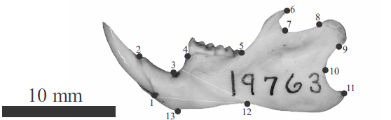

\clearpage
\newpage

# Digitalização de landmarks

## Criação de arquivo .tps com as imagens bi-dimensionais
Esse roteiro é para a manipulação de imagens digitais (2D) e a digitalização de marcos anatômicos (landmarks) nas imagens usando [softwares TPS](https://www.sbmorphometrics.org/). As imagens, previamente capturadas de maneira padronizada, devem estar individualizadas, todas em uma mesma pasta no computador.

No TPSUtil, selecione a operação ‘Build tps file from images’. Clique em ‘Input’ e selecione a pasta (selecione qualquer imagem dentro da pasta) contendo as fotos. No nosso caso, a pasta se chama ‘Atividade 1 – Imagens’. Clique em ‘Output’ e atribua um nome para o arquivo (use mandibula.tps). Clique em ‘Setup’. Todas as imagens da pasta estarão listadas. É possível conferir os nomes dos arquivos e modificar a ordem ou deletar imagens se necessário. Clique em ‘Create’ para criar o arquivo .tps com a lista de imagens. Vá até o mesmo diretório (pasta) com as imagens e verifique o arquivo mandibula.tps (abra com o bloco de notas).

## Digitalização de landmarks no TPSDig2
No TPSDig2, para carregar as imagens clique em ‘File>Input source>File’. Selecione o arquivo .tps contendo a lista de imagens, no nosso caso ‘mandibula.tps’. Após clicar em ‘Abrir’, a primeira foto do arquivo será exibida. As setas vermelhas na barra de ferramentas permitem navegar pelas fotos, que serão exibidas uma por vez. A barra de ferramentas também permite ajustar o zoom das imagens, e inúmeras outras configurações de nitidez da imagem e cores/tamanho dos landmarks.

Um passo importante é definir a escala da imagem. Para isso, clique em ‘Options>Image tools’. Na aba ‘Measure’ defina o comprimento de referência e a unidade que desejar para o comprimento. Clique em ‘Set scale’, minimize a aba de ferramentas, vá até a escala de referência na imagem (no nosso caso, o papel milimetrado) e defina, com dois pontos (cliques), o mesmo comprimento atribuído na barra de ferramentas. Volte para a aba ‘Measure’ e clique em ‘Ok’. A calibração estará definida para esta imagem (o fator de escala será o valor de referência dividido pelo número de pixels necessários para obter a referência). Futuros valores de tamanho do centroide para esta imagem estarão na unidade definida como referência (e.g., cm, mm, etc.). O procedimento precisa ser repetido para cada imagem.

Para digitalizar os landmarks, i.e., atribuir uma coodenada x,y para cada um, selecione a ferramenta ‘Digitize landmarks’ no menu ‘Modes’ ou clicando na figura com o formato de alvo na barra de ferramentas. Atribua os landmarks clicando na imagem, na posição desejada. Os landmarks vão aparecer em sequência numérica a partir do 1, e em todas as imagens a sequência de digitalização dos landmarks (a ordem) deve ser a mesma (e.g., o landmark 8 estará na mesma posição anatômica em todas as imagens).

Após o término da digitalização clique em ‘File>Save data’ e salve os dados. É extremamente recomendável repetir o salvamento após a digitalização de cada imagem; use o mesmo nome e clique em ‘Overwrite’ para que os dados atualizados sejam gravados sobre os antigos, gerando um único arquivo ao final. Vá até a pasta de trabalho e visualize o arquivo abrindo-o com o bloco de notas.

Para a atividade, atribua os landmarks conforme a imagem abaixo:
```{r, echo=FALSE, fig.cap='Landmarks na mandibula de um roedor sigmodontíneo.', out.width='80%', fig.asp=.75, fig.align='center', fig.alt='Landmarks na mandibula de um roedor sigmodontíneo'}

```

Descrição dos landmarks:
L1: Borda anterior do alvéolo incisivo; L2: Extremo anterior superior da borda do alvéolo incisive; L3: Posição de maior inflexão do diastema; L4: Borda anterior do álveolo no primeiro molar; L5: Interseção entre a linha de molars e o processo coronóide em vista lateral; L6: Ponta do processo coronóide; L7: Ponto de máxima curvatura entre o processo coronóide e o condilar; L8: Margem dorsal da borda anterior da supercífie articular do processo condilar; L9: Borda ventral da superfície articular do processo condilar; L10: Ponto de máxima curvatura entre o processo condilar e o angular; L11: Ponta do processo angular; L12: Interseção entre o corpo da mandíbula e a crista massetérica; L13: Limite ventral da sínfise mandibular.

## Digitalização de landmarks em 3D
O software MeshLab permite a digitalização de landmarks em superfícies, além de outras operações. Após abrir o software, selecione ‘File>Import Mesh’ e carregue o arquivo chamado ‘exemplo3d.ply’ de dentro da pasta ‘R Dados’.

Para digitalizar landmarks na superfície clique em ‘Edit>PickPoints’ ou no ícone PP. Ao clicar com o botão esquerdo do mouse (pode demorar um pouco), as coordenadas são capturadas. Após o término da digitalização é possível salvar um arquivo em formato xml (.pp) com as coordenadas em 3D, que poderá ser aberto no R para análises posteriores.

\newpage