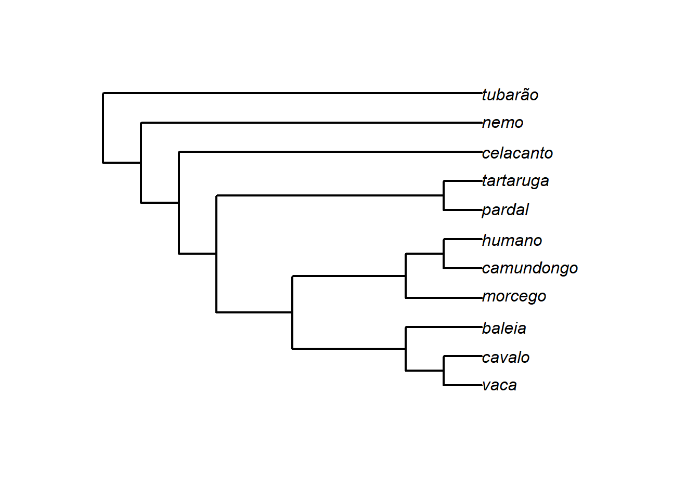
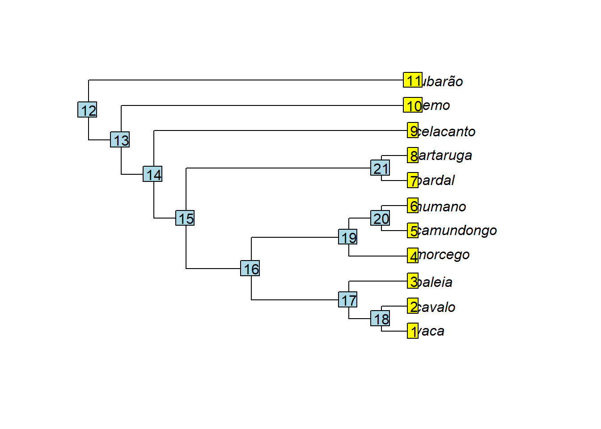

---
output:
  pdf_document: default
  html_document: default
editor_options: 
  markdown: 
    wrap: sentence
---

# Uma breve introdução ao R

O R pode ser instalado a partir do website: <https://www.r-project.org/> Nós vamos usar também o RStudio: <https://www.rstudio.com/>

O R é um ambiente para análise computacional e produção de gráficos baseado em linguagem de programação.
Hoje, o R é o programa predominante em ecologia e evolução, em larga medida porque é e adaptável para várias necessidades, e existe uma comunidade grande de indivíduos dispostos a fornecer ajuda.
No contexto da biometria e de análises filogenéticas comparativas, o R tem sido a área primária de desenvolvimento de novos métodos.

Aqui, você vai encontrar um breve tutorial sobre o R para conseguir realizar as atividades práticas da disciplina.
No entanto, há material muito mais completo disponível.
Existem vários bons livros e cursos gratuitos de R e de estatística disponibilizados na web.
Tire proveito deles!
Por exemplo: - [Curso de Programação em R, prof. Bruno Vilela](https://www.youtube.com/playlist?list=PL3U7PUKvYnzAZAEoFcjGLVkIML2ZGGl6t) - [Livro Análises Ecológicas no R](https://analises-ecologicas.com/) - [Curso de Estatística para Pesquisa Científica, prof. Thiago Rangel](http://estat.bio.br/)

## Definindo um diretório de trabalho

É conveniente criar uma pasta única com todos os arquivos das aulas práticas.
Nós vamos informar ao R para carregar os dados a partir desta pasta.
Isso pode ser feito no RStudio com o menu: Session\>Set Working Directory\>Choose Directory.
Ou com o código setwd().

## Roteiros (scripts)

Um script é um bloco de texto que pode ser editado em qualquer editor de texto comum (ex: bloco de notas), ou com o editor de texto do próprio R ou RStudio.
Você vai escrever os códigos dentro do script, e depois enviar para o console do R - selecione a linha ou parte do código a ser enviada ao console do R e pressione 'Run' ou use crtl+r ou ctrl+Enter.
Ao salvar o script você mantém um registro do código utilizado.
Se você quiser adicionar comentários ao código basta adicionar o sinal \# na frente do comentário.
Uma ótima alternativa ao script comum é utilizar o R Markdown, onde é possível diferenciar facilmente códigos e textos explicativos.

## Funcionamento básico do R

Objetos e funções são os principais componentes do R.
Objetos são variáveis como dados ou resultados.
Eles podem estar formatados de diferentes maneiras, formando estruturas diferentes.
Por exemplo, vetores, matrizes, 'dataframes', listas, etc. são todos exemplos de estruturas de objetos.
Funções são tipos especiais de objetos que usam um ou mais argumentos para fazer alguma coisa dentro do R.

::: {.alert .alert-success role="alert" style="color: black;"}
Objetos são como proteínas e funções são como enzimas.
Os aminoácidos são números ou letras.
:::

Compilados de funções são organizados dentro de pacotes criados por diversos autores.

O R funciona através de comandos, que são normalmente acompanhados de funções ou operações (+,-,\*,etc).
Um comando retorna um objeto na tela, ou armazena o objeto na memória quando um nome é atribuído com o operador \<- ou =.


```r
2+5
#> [1] 7
x<-2+5
x
#> [1] 7
```

Cuidado, os objetos distinguem letras maiúsculas de minúsculas.


```r
x<-1
X<-10
x
#> [1] 1
X
#> [1] 10
```

## Tipos de objeto no R

O R classifica objetos em tipos/classes dependendo de sua estrutura.
Vamos encontrar frequentemente alguns tipos de objetos mais comuns, como vector, factor, matrix, data.frame, array e list.


```r
# Vetores:
x<-c(1,2,3,4,5)
x<-1:5
x
#> [1] 1 2 3 4 5
class(x)
#> [1] "integer"
length(x)
#> [1] 5
# A função which é útil para selecionar alguns dados de um vetor
which(x>3)
#> [1] 4 5
which(x>=3)
#> [1] 3 4 5
```


```r
# Fatores possuem níveis
f<-c("Sp1","Sp1","Sp2","Sp3","Sp3")
f
#> [1] "Sp1" "Sp1" "Sp2" "Sp3" "Sp3"
f<-factor(f)
f
#> [1] Sp1 Sp1 Sp2 Sp3 Sp3
#> Levels: Sp1 Sp2 Sp3
table(f)
#> f
#> Sp1 Sp2 Sp3 
#>   2   1   2
class(f)
#> [1] "factor"
```

Os objetos podem conter nomes internos, o que é bastante útil com dados biológicos já que eles podem fornecer rótulos para os dados, ex: espécies ou localidades.


```r
names(x)=f
x
#> Sp1 Sp1 Sp2 Sp3 Sp3 
#>   1   2   3   4   5
```


```r
# Matrizes
m<-matrix(1:9,3,3) # dados, n-linhas, n-colunas
m
#>      [,1] [,2] [,3]
#> [1,]    1    4    7
#> [2,]    2    5    8
#> [3,]    3    6    9
class(m)
#> [1] "matrix" "array"
m[,2] # a segunda coluna
#> [1] 4 5 6
m[3,] # a terceira linha
#> [1] 3 6 9
```


```r
# Data frames suportam vários tipos de dados distintos
d<-data.frame(f,x)
d
#>     f x
#> 1 Sp1 1
#> 2 Sp1 2
#> 3 Sp2 3
#> 4 Sp3 4
#> 5 Sp3 5
class(d)
#> [1] "data.frame"
```


```r
# Lista é uma estrutura geral que pode carregar vários tipos de dados, incluindo, por ex. árvores filogenéticas
l<-list(f,x,m,d)
l
#> [[1]]
#> [1] Sp1 Sp1 Sp2 Sp3 Sp3
#> Levels: Sp1 Sp2 Sp3
#> 
#> [[2]]
#> Sp1 Sp1 Sp2 Sp3 Sp3 
#>   1   2   3   4   5 
#> 
#> [[3]]
#>      [,1] [,2] [,3]
#> [1,]    1    4    7
#> [2,]    2    5    8
#> [3,]    3    6    9
#> 
#> [[4]]
#>     f x
#> 1 Sp1 1
#> 2 Sp1 2
#> 3 Sp2 3
#> 4 Sp3 4
#> 5 Sp3 5
l[[4]] # quarto elemento da lista
#>     f x
#> 1 Sp1 1
#> 2 Sp1 2
#> 3 Sp2 3
#> 4 Sp3 4
#> 5 Sp3 5
```

A função ls() lista todos os objetos criados na seção.
Você também pode conferir os objetos na aba Environment, ao lado.


```r
ls()
```

Todas as funções no R possuem uma página de ajuda descrevendo a função.
A ajuda pode ser acessada com ?
seguido do nome da função.


```r
?mean
#> starting httpd help server ... done
?matrix
```

::: {.alert .alert-danger role="alert" style="color: black;"}
Um dos aspectos importantes negligenciados por iniciantes no R são as páginas de ajuda!
Sempre confira a ajuda da função que está tentando aplicar usando o operador ?
antes do nome da função.
Por exemplo, ?m
ean.
Preste atenção aos argumentos que a função usa, e quais tipos/estrutura de objetos são aceitos como argumentos.
Estude a página de ajuda e entenda como ela funciona.
:::

Algumas operações são úteis para reproduzir códigos/funções várias vezes.
O *for* loop repete uma determinada operação por um número fixo de vezes.
Por exemplo, para repetir a mesma operação em todas as filogenias de um conjunto de dados.


```r
# For loop para calcular a média de atributos, ex: colunas de uma matriz
X<-matrix(1:16,4,4)
X
#>      [,1] [,2] [,3] [,4]
#> [1,]    1    5    9   13
#> [2,]    2    6   10   14
#> [3,]    3    7   11   15
#> [4,]    4    8   12   16
# vetor vazio para salvar os resultados
medias<-vector(mode="numeric",length(ncol(X)))
medias
#> [1] 0
# loop
for(i in 1:ncol(X)){ 
 medias[i]<-mean(X[,i])
}
# resultado
medias
#> [1]  2.5  6.5 10.5 14.5
```

## Pacotes no R

Os pacotes contêm compilados de funções que realizam tarefas sobre um determinado tema.
Esses pacotes, criados por autores diversos, estão disponíveis para serem baixados e carregados no R.
Os pacotes são baixados uma única vez no computador, porém, precisam ser carregados no console do R toda vez que se iniciar o R.

## Pacotes para morfometria geométrica

Um dos pacotes mais completos para morfometria geométrica é o *geomorph*.
Vamos instalar esse pacote e carregar no R.
Os pacotes podem ser instalados através de uma linha de comando ou clicando no botão Install da aba Packages.


```r
install.packages("geomorph")
library(geomorph)
```

O *geomorph* é constantemente atualizado.
Por isso, é recomendável checar frequentemente por atualizações nas funções.
Com o comando ??
seguido do nome do pacote (??geomorph) é possível acessar um resumo do pacote e de todas as suas funções.

## Objetos importantes para morfometria geométrica

Via de regra, dados obtidos via morfometria geométrica vão estar em um de 2 formatos no R: como **3D array** ou como **matrix**.
No formato array, análogo ao formato .tps, cada indivíduo aparece de maneira individualizada e sequencial dentro do objeto; para cada indivíduo as linhas correspondem aos landmarks e as colunas às coordenadas x e y (e z se dados em 3D) de cada landmark.
No formato matrix todos os indivíduos aparecem de uma única vez na matriz; as linhas correspondem aos indivíduos e as colunas correspondem às coordenadas dos landmarks de maneira sequencial: a coluna 1 corresponde ao landmark x1 de cada indivíduo (coordenada x do landmark 1), a coluna 2 = y1, coluna 3 = x2, coluna 4 = y2, coluna 5 = x3 etc.


```r
# Matrix 
m<-matrix(1:12,3,4) # dados, n-linhas, n-colunas 
m # 3 indivíduos, 2 landmarks com coordenadas x,y 
#>      [,1] [,2] [,3] [,4]
#> [1,]    1    4    7   10
#> [2,]    2    5    8   11
#> [3,]    3    6    9   12
# Array 
n<-array(m,c(4,2,3)) #dados, dimensões(p,k,n) (p=pontos,k=dimensões,n=amostra) 
n # 3 indivíduos, 2 landmarks com coordenadas x,y 
#> , , 1
#> 
#>      [,1] [,2]
#> [1,]    1    5
#> [2,]    2    6
#> [3,]    3    7
#> [4,]    4    8
#> 
#> , , 2
#> 
#>      [,1] [,2]
#> [1,]    9    1
#> [2,]   10    2
#> [3,]   11    3
#> [4,]   12    4
#> 
#> , , 3
#> 
#>      [,1] [,2]
#> [1,]    5    9
#> [2,]    6   10
#> [3,]    7   11
#> [4,]    8   12
n[,,1] # indivíduo número 1
#>      [,1] [,2]
#> [1,]    1    5
#> [2,]    2    6
#> [3,]    3    7
#> [4,]    4    8
```

## Pacotes filogenéticos no R

Existem muitos pacote lidando com métodos filogenéticos no R.
Alguns que serão usados para manipular e representar graficamente árvores filogenéticas serão instalados abaixo.
O pacote *ape* é o pacote central mais importante, já que propõe a classe *phylo*, que é utilizada pela grande maioria dos demais pacotes.


```r
# Instalando pacotes: 
install.packages("ape") 
install.packages("phytools") 
install.packages("geiger")
```

## O objeto *phylo*

Árvores filogenéticas são lidas no R como um objeto *list* de classe *phylo*.


```r
# Carregar ape 
require(ape) 
#> Carregando pacotes exigidos: ape
# Construindo uma árvore newick via texto 
texto<-"(((((((vaca, cavalo),baleia),(morcego,(camundongo,humano))),(pardal,tartaruga)),celacanto),nemo),tubarão);"
# Função read.tree lê o arquivo contendo a árvore 
arvore<-read.tree(text=texto)
```

Podemos representar a árvore graficamente, bem como estudar sua estrutura.


```r
# Representando a árvore graficamente 
plot(arvore,edge.width=2) 
```



```r

# Estrutura da árvore 
arvore 
#> 
#> Phylogenetic tree with 11 tips and 10 internal nodes.
#> 
#> Tip labels:
#>   vaca, cavalo, baleia, morcego, camundongo, humano, ...
#> 
#> Rooted; no branch lengths.
str(arvore) 
#> List of 3
#>  $ edge     : int [1:20, 1:2] 12 13 14 15 16 17 18 18 17 16 ...
#>  $ Nnode    : int 10
#>  $ tip.label: chr [1:11] "vaca" "cavalo" "baleia" "morcego" ...
#>  - attr(*, "class")= chr "phylo"
#>  - attr(*, "order")= chr "cladewise"

# Decompondo a árvore 
class(arvore) 
#> [1] "phylo"
plot(arvore) 
tiplabels() 
nodelabels() 
```



```r

# ramos 
arvore$edge # matriz contendo os índices do nó inicial e final para cada ramo 
#>       [,1] [,2]
#>  [1,]   12   13
#>  [2,]   13   14
#>  [3,]   14   15
#>  [4,]   15   16
#>  [5,]   16   17
#>  [6,]   17   18
#>  [7,]   18    1
#>  [8,]   18    2
#>  [9,]   17    3
#> [10,]   16   19
#> [11,]   19    4
#> [12,]   19   20
#> [13,]   20    5
#> [14,]   20    6
#> [15,]   15   21
#> [16,]   21    7
#> [17,]   21    8
#> [18,]   14    9
#> [19,]   13   10
#> [20,]   12   11
# O número de linhas em tree$edge é igual o número de ramos; cada ramo começa e termina com um par de índices (nó-nó ou nó-terminal) 

# terminais 
arvore$tip.label 
#>  [1] "vaca"       "cavalo"     "baleia"     "morcego"   
#>  [5] "camundongo" "humano"     "pardal"     "tartaruga" 
#>  [9] "celacanto"  "nemo"       "tubarão"

# nós 
arvore$Nnode 
#> [1] 10

# Um objeto "phylo" também pode conter o comprimento dos ramos: edge.length
```

## É eRrando que se aprende

A curva de aprendizado do R é bastante íngreme no início.
Quando as mensagens de erro começarem a aparecer, é importante não se desesperar.
Tente ler e interpretar as mensagens de erro.
Volte ao código e o leia com calma etapa por etapa.
Procure por erros comuns, como um nome de objeto errado, um espaço extra, uma vírgula mal colocada, etc.
Lembre-se que não estás aprendendo a "mexer num programa", estás aprendendo uma língua nova.
