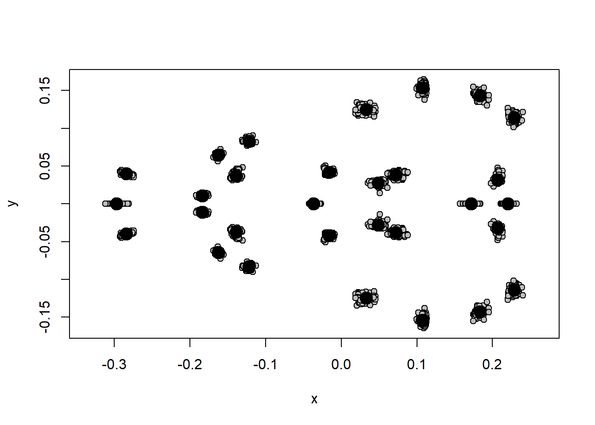
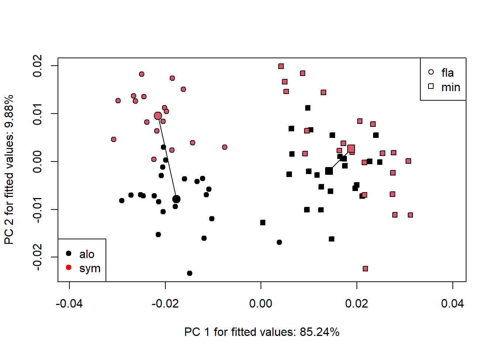

# Análise de Trajetória

Análises de trajetória fenotípica (*Phenotypic Trajectory Analysis* - PTA) descrevem mudanças de forma ao longo de um gradiente, por exemplo, ecológico. Diferente de análises multivariadas padrão (MANOVAs) que permitem avaliar diferenças de forma média, com PTA é possível também investigar diferenças nas trajetórias: localização, comprimento, orientação e forma das trajetórias.
Alguns tipos de perguntas biológicas são adequadamente respondidas com análises de trajetória.
No exemplo, vamos testar a hipótese de deslocamento de caracteres causada por competição assumida. Duas espécies de tuco-tucos vivem em regiões de alopatria (só uma das espécies é encontrada) e regiões de simpatria (as duas são encontradas). Vamos investigar se a morfologia de ambas na região de simpatria evoluiu para se tornar mais diferente uma da outra do que nas regiões de alopatria.


```r
# Carregar arquivo .tps
require(geomorph)
#> Le chargement a nécessité le package : geomorph
#> Le chargement a nécessité le package : RRPP
#> Le chargement a nécessité le package : rgl
#> Le chargement a nécessité le package : Matrix
tps<-readland.tps("dadosmg/tucodeslocamento.tps",specID = "ID", readcurves = FALSE)
dim(tps)
# GPA
# gerar matriz com os pares de landmarks simétricos
pairs.matrix<-
  matrix(c(2,3,4,5,6,7,8,9,10,11,12,13,15,16,17,18,19,20,21,22,23,24,25,26,29,30),nrow=13,ncol=2,byrow=T)
pairs.matrix
ind<-c(1:dim(tps)[3]) # vetor indivíduos
# GPA - Simetria bilateral
gpa.object<-gpagen(tps)
size<-gpa.object$Csize
b.s<-bilat.symmetry(tps,ind=ind,object.sym=TRUE,land.pairs=pairs.matrix)
shape.sym<-b.s$symm.shape # componente simétrico da forma
plotAllSpecimens(shape.sym)
```



```r

# Carregar classificadores a partir de lista externa
plan<-read.table("dadosmg/tucodeslocamento.txt",h=T)
attach(plan)
Species
Local

# Deslocamento de Caracteres
# Análises de Trajetória
modelo.traje<-procD.lm(shape.sym~Species*Local)
trajetoria<-trajectory.analysis(modelo.traje,groups = Species,traj.pts = Local)

# Diferenças de magnitude (comprimento das trajetórias)
summary(trajetoria,attribute="MD")

# Diferenças de ângulo (correlação entre trajetórias)
summary(trajetoria, attribute="TC", angle.type = "deg")

# Visualização
# Plot - Símbolos=Espécies; Cores=Local (preto=1, vermelho=2)
{TP<-plot(trajetoria,pch=as.numeric(as.factor(Species))+20,bg=as.numeric(as.factor(Local)))
add.trajectories(TP, traj.pch = c(21, 22),
                 start.bg = 1, end.bg = 2)
legend("topright", levels(as.factor(Species)), pch = c(21, 22))
legend("bottomleft", levels(as.factor(Local)), pch = 19,
       col = c("black","red"))}
```




