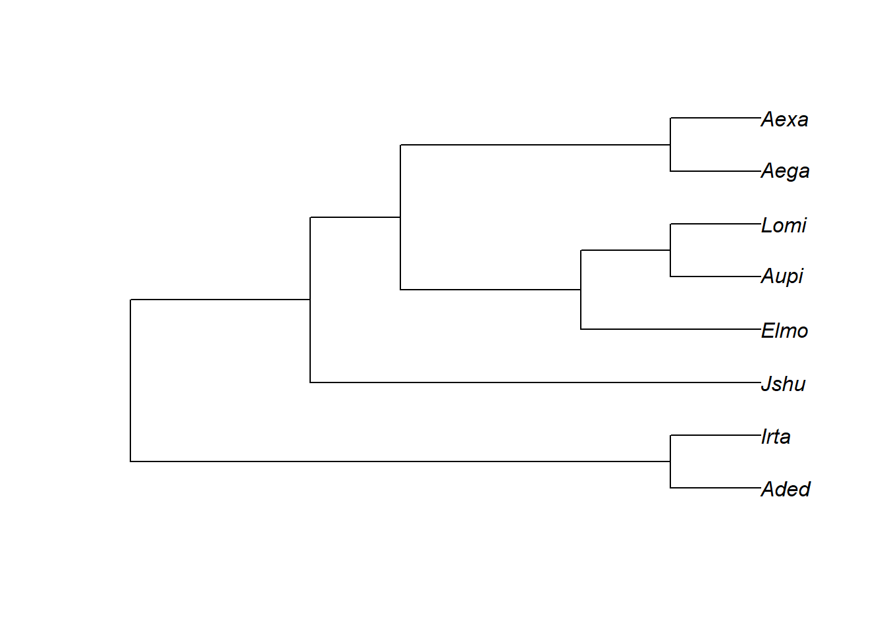

## Morfometria geométrica e filogenias

Quando as morfologias são de espécies diferentes, os dados não são independentes, já que as espécies são conectadas por uma árvore filogenética. A não-independência filogenética precisa ser levada em consideração em análises de correlação. Pra além disso, podemos entender muito sobre padrões e processos evolutivos da morfologia quando temos dados morfológicos de diferentes espécies e hipóteses filogenéticas. O capítulo deste manual sobre Macroevolução explora muitas perguntas/análises que podem ser feitas em um contexto comparativo.
Aqui, os exemplos vão apresentar algumas análises comparativas no contexto de morfometria geométrica.

Para textos abrangentes sobre macroevolução e métodos filogenéticos comparativos no contexto de morfometria geométrica, veja:
Zelditch et al. 2012 Geometric Morphometrics for Biologists, Elsevier.
Monteiro 2013 Hystrix, doi: 10.4404/hystrix-24.1-6282.
Adams & Collyer 2018 Syst Biol doi: 10.1093/sysbio/syx055.

Para literatura geral, veja as referência no capítulo sobre Macroevolução deste manual.

Vamos carregar dados morfológicos obtidos por morfometria geométrica e uma hipótese filogenética para explorar algumas análises filogenéticas comparativas.

```r
require(geomorph)
#> Carregando pacotes exigidos: geomorph
#> Carregando pacotes exigidos: RRPP
#> Carregando pacotes exigidos: rgl
#> Carregando pacotes exigidos: Matrix
# Carregar arquivo tps da mandíbula
tps<-readland.tps("dadosmg/mandibula.dig_curso.pls.tps",specID = "ID", readcurves = FALSE)
gpa<-gpagen(tps)
shape<-gpa$coords
size<-gpa$Csize
ref.mand<-mshape(shape)

# Carregar classificadores a partir de lista externa
plan<-read.table("dadosmg/Planilha_PLS.txt",h=T)
plan
species<-as.factor(plan[,2])
species

# Calcular forma média por espécie
shape.2d<-two.d.array(shape)
shape.2d.means<-rowsum(shape.2d,species)/as.vector(table(species))
shape.means<-arrayspecs(shape.2d.means,dim(shape)[1],dim(shape)[2])

size.means<-rowsum(size,species)/as.vector(table(species))
```

Hipótese filogenética.

```r
require(ape)
#> Carregando pacotes exigidos: ape
tree<-read.nexus("dadosmg/nexus.tree.sig.nex")

plot(tree)
```



```r
tree<-compute.brlen(tree,1) # definir comprimento dos ramos = 1
```

### Filomorfoespaço
Podemos representar de maneira gráfica a filogenia no espaço de forma criado com uma análise de componentes principais.


Filomorfoespaço 3D.


### PCA filogenética


### Sinal filogenético multivariado


### Análise filogenética generalizada por quadrados mínimos (PGLS multivariada)


### Exercício - Morfometria e filogenias
Carregue o arquivo .tps ‘Roedores_Digitalizados.tps’ contendo coordenadas
digitalizadas na mandíbula de 143 indivíduos de 19 espécies de roedores. Carregue
também a informação taxonômica de cada indivíduo (‘Roedores_classificador.txt’), e
uma hipótese filogenética para as 19 espécies (‘Roedores_tree_nexus.nex’). Existe um
arquivo adicional que informa a força da mordida média de cada uma das 19 espécies
(‘Roedores_BiteForce.txt’).
Investigue a força do sinal filogenético para o tamanho e a forma do crânio, e descubra
se existe relação entre a força da mordida e a forma (e tamanho) do crânio.


