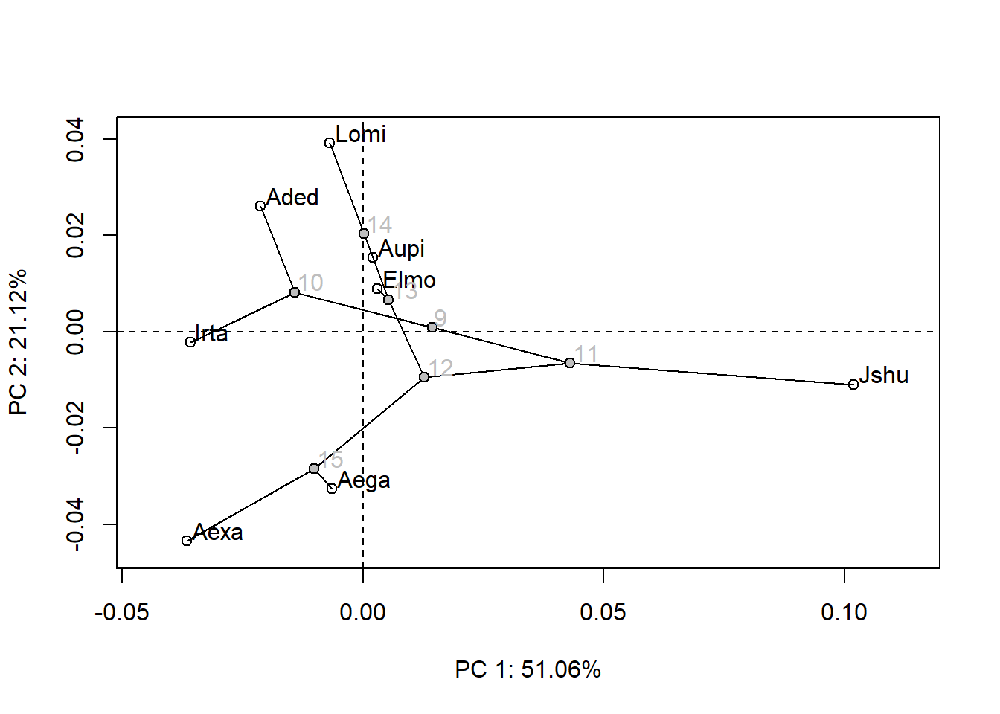
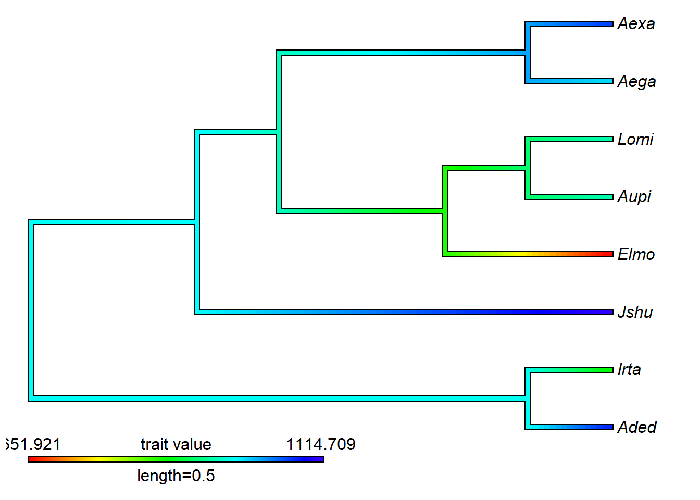

# Morfometria geométrica e filogenias

Quando as morfologias são de espécies diferentes, os dados não são independentes, já que as espécies são conectadas por uma árvore filogenética.
A não-independência filogenética precisa ser levada em consideração em análises de correlação.
Pra além disso, podemos entender muito sobre padrões e processos evolutivos da morfologia quando temos dados morfológicos de diferentes espécies e hipóteses filogenéticas.
A parte deste manual sobre Macroevolução explora muitas perguntas/análises que podem ser feitas em um contexto comparativo.
Aqui, os exemplos vão apresentar algumas análises comparativas no contexto de morfometria geométrica.

Para textos abrangentes sobre macroevolução e métodos filogenéticos comparativos no contexto de morfometria geométrica, veja: @zelditch2012; @monteiro2013; @adams&collyer2018.

Para literatura geral, e muitas outras opções analíticas, veja o material e as referências na parte sobre Macroevolução deste manual.

Vamos carregar dados morfológicos obtidos por morfometria geométrica e uma hipótese filogenética para explorar algumas análises filogenéticas comparativas.


```r
require(geomorph)
#> Carregando pacotes exigidos: geomorph
#> Carregando pacotes exigidos: RRPP
#> Carregando pacotes exigidos: rgl
#> Carregando pacotes exigidos: Matrix
# Carregar dados de forma média por espécie em formato de matriz
tps<-readland.tps("dadosmg/mandibula.dig_curso.pls.tps",specID = "ID", readcurves = FALSE)
gpa<-gpagen(tps)
shape<-gpa$coords
size<-gpa$Csize
ref.mand<-mshape(shape)

# Carregar classificadores a partir de lista externa
plan<-read.table("dadosmg/Planilha_PLS.txt",h=T)
plan
species<-as.factor(plan[,2])
species

# Calcular forma média por espécie
shape.2d<-two.d.array(shape)
shape.2d.means<-rowsum(shape.2d,species)/as.vector(table(species))
shape.means<-arrayspecs(shape.2d.means,dim(shape)[1],dim(shape)[2])

size.means<-rowsum(size,species)/as.vector(table(species))
```

Hipótese filogenética.


```r
require(ape)
#> Carregando pacotes exigidos: ape
tree<-read.nexus("dadosmg/nexus.tree.sig.nex")

plot(tree)
```


```r
tree<-compute.brlen(tree,1) # definir comprimento dos ramos = 1
```

## Filomorfoespaço

Podemos representar de maneira gráfica a filogenia no espaço de forma criado com uma análise de componentes principais.
Essa é a PCA padrão, inalterada, com a projeção da filogenia e estimativa de formas ancestrais.


```r
PCA<-gm.prcomp(shape.means,phy=tree)
summary(PCA)
plot(PCA,phylo=TRUE)
```



Filomorfoespaço 3D.


```r
require(phytools)
#> Carregando pacotes exigidos: phytools
#> Carregando pacotes exigidos: maps
#phylomorphospace3d(tree,PCA$x[,1:3])
```

A visualização de formas pode ser feita ao longo dos eixos, como na PCA tradicional, bem como podem ser visualizadas as formas ancestrais estimadas, formas médias de espécies atuais, etc.


```r
ref<-mshape(shape.means)
ancestral.shapes<-arrayspecs(PCA$ancestors,13,2)
# Forma ancestral contra a média
plotRefToTarget(ref,ancestral.shapes[,,1],method="TPS")
```


```r
# Forma ancestral contra espécie atual
plotRefToTarget(ancestral.shapes[,,1],shape.means[,,"Aexa"],method="TPS")
```


Visualizar tamanho ao longo da filogenia.


```r
size.means1<-as.vector(size.means)
names(size.means1)=rownames(size.means)
tree1<-compute.brlen(tree,method="Grafen") # make ultrametric
# cores
contMap(tree1,size.means1)
```



```r
# dots
dotTree(tree1,size.means1,length=10)
```


```r
# barras
plotTree.barplot(tree1,size.means1)
```


## PCA filogenética

A PCA filogenética *sensu* @revell2009.


```r
phyloPCA<-gm.prcomp(shape.means,phy=tree,GLS=TRUE)
summary(phyloPCA)
plot(phyloPCA,phylo=TRUE)
```


## Sinal filogenético multivariado

Sinal filogenético é um padrão que mostra se espécies mais próximas filogeneticamente têm morfologias mais similares do que espécies mais distantes filogeneticamente.
Existem vários métodos para o cálculo de sinal filogenético, o mais comum é a estatística K [@blomberg2003; @adams2014].
K=1 indica que espécies próximas são tão parecidas quanto prevê o modelo Browniano K\<1 indica sinal filogenético menor do que esperado pelo modelo Browniano K\>1 indica sinal filogenético maior do que esperado pelo modelo Browniano


```r
# Sinal Filogenético para forma do crânio
sinal.k<-physignal(shape.means,tree,iter=999)
sinal.k
#> 
#> Call:
#> physignal(A = shape.means, phy = tree, iter = 999) 
#> 
#> 
#> 
#> Observed Phylogenetic Signal (K): 0.6146
#> 
#> P-value: 0.158
#> 
#> Based on 1000 random permutations
#> 
#>  Use physignal.z to estimate effect size.
# Sinal Filogenético para tamanho do crânio
sinal.k.size<-physignal(size.means,tree,iter=999)
sinal.k.size
#> 
#> Call:
#> physignal(A = size.means, phy = tree, iter = 999) 
#> 
#> 
#> 
#> Observed Phylogenetic Signal (K): 0.5612
#> 
#> P-value: 0.416
#> 
#> Based on 1000 random permutations
#> 
#>  Use physignal.z to estimate effect size.
```

## Análise filogenética generalizada por quadrados mínimos (PGLS multivariada)


```r
# Variáveis hipotéticas para usar como exemplo
nomes<-c("Aded","Aega","Aexa","Aupi","Elmo","Irta","Jshu","Lomi")
temp<-c(12.15,22,16.02,10.42,8.21,8.39,25,7.86)
alt<-c(2951,300,1931,3222,753.96,719.94,700,866.65)
names(temp)<-nomes
names(alt)<-nomes

gdf<-geomorph.data.frame(shape.means=shape.means,temp=temp,tree=tree)
fit.pgls<-procD.pgls(shape.means~temp,tree,data=gdf)
#> 
#> Please be aware that printing progress slows down the analysis (perhaps slightly).
#> 
#> Preliminary Model Fit...
#> 
#> Sums of Squares calculations: 1000 permutations.
#> 
  |                                                        
  |                                                  |   0%
  |                                                        
  |                                                  |   1%
  |                                                        
  |=                                                 |   1%
  |                                                        
  |=                                                 |   2%
  |                                                        
  |=                                                 |   3%
  |                                                        
  |==                                                |   3%
  |                                                        
  |==                                                |   4%
  |                                                        
  |==                                                |   5%
  |                                                        
  |===                                               |   5%
  |                                                        
  |===                                               |   6%
  |                                                        
  |===                                               |   7%
  |                                                        
  |====                                              |   7%
  |                                                        
  |====                                              |   8%
  |                                                        
  |====                                              |   9%
  |                                                        
  |=====                                             |   9%
  |                                                        
  |=====                                             |  10%
  |                                                        
  |=====                                             |  11%
  |                                                        
  |======                                            |  11%
  |                                                        
  |======                                            |  12%
  |                                                        
  |======                                            |  13%
  |                                                        
  |=======                                           |  13%
  |                                                        
  |=======                                           |  14%
  |                                                        
  |=======                                           |  15%
  |                                                        
  |========                                          |  15%
  |                                                        
  |========                                          |  16%
  |                                                        
  |========                                          |  17%
  |                                                        
  |=========                                         |  17%
  |                                                        
  |=========                                         |  18%
  |                                                        
  |=========                                         |  19%
  |                                                        
  |==========                                        |  19%
  |                                                        
  |==========                                        |  20%
  |                                                        
  |==========                                        |  21%
  |                                                        
  |===========                                       |  21%
  |                                                        
  |===========                                       |  22%
  |                                                        
  |===========                                       |  23%
  |                                                        
  |============                                      |  23%
  |                                                        
  |============                                      |  24%
  |                                                        
  |============                                      |  25%
  |                                                        
  |=============                                     |  25%
  |                                                        
  |=============                                     |  26%
  |                                                        
  |=============                                     |  27%
  |                                                        
  |==============                                    |  27%
  |                                                        
  |==============                                    |  28%
  |                                                        
  |==============                                    |  29%
  |                                                        
  |===============                                   |  29%
  |                                                        
  |===============                                   |  30%
  |                                                        
  |===============                                   |  31%
  |                                                        
  |================                                  |  31%
  |                                                        
  |================                                  |  32%
  |                                                        
  |================                                  |  33%
  |                                                        
  |=================                                 |  33%
  |                                                        
  |=================                                 |  34%
  |                                                        
  |=================                                 |  35%
  |                                                        
  |==================                                |  35%
  |                                                        
  |==================                                |  36%
  |                                                        
  |==================                                |  37%
  |                                                        
  |===================                               |  37%
  |                                                        
  |===================                               |  38%
  |                                                        
  |===================                               |  39%
  |                                                        
  |====================                              |  39%
  |                                                        
  |====================                              |  40%
  |                                                        
  |====================                              |  41%
  |                                                        
  |=====================                             |  41%
  |                                                        
  |=====================                             |  42%
  |                                                        
  |=====================                             |  43%
  |                                                        
  |======================                            |  43%
  |                                                        
  |======================                            |  44%
  |                                                        
  |======================                            |  45%
  |                                                        
  |=======================                           |  45%
  |                                                        
  |=======================                           |  46%
  |                                                        
  |=======================                           |  47%
  |                                                        
  |========================                          |  47%
  |                                                        
  |========================                          |  48%
  |                                                        
  |========================                          |  49%
  |                                                        
  |=========================                         |  49%
  |                                                        
  |=========================                         |  50%
  |                                                        
  |=========================                         |  51%
  |                                                        
  |==========================                        |  51%
  |                                                        
  |==========================                        |  52%
  |                                                        
  |==========================                        |  53%
  |                                                        
  |===========================                       |  53%
  |                                                        
  |===========================                       |  54%
  |                                                        
  |===========================                       |  55%
  |                                                        
  |============================                      |  55%
  |                                                        
  |============================                      |  56%
  |                                                        
  |============================                      |  57%
  |                                                        
  |=============================                     |  57%
  |                                                        
  |=============================                     |  58%
  |                                                        
  |=============================                     |  59%
  |                                                        
  |==============================                    |  59%
  |                                                        
  |==============================                    |  60%
  |                                                        
  |==============================                    |  61%
  |                                                        
  |===============================                   |  61%
  |                                                        
  |===============================                   |  62%
  |                                                        
  |===============================                   |  63%
  |                                                        
  |================================                  |  63%
  |                                                        
  |================================                  |  64%
  |                                                        
  |================================                  |  65%
  |                                                        
  |=================================                 |  65%
  |                                                        
  |=================================                 |  66%
  |                                                        
  |=================================                 |  67%
  |                                                        
  |==================================                |  67%
  |                                                        
  |==================================                |  68%
  |                                                        
  |==================================                |  69%
  |                                                        
  |===================================               |  69%
  |                                                        
  |===================================               |  70%
  |                                                        
  |===================================               |  71%
  |                                                        
  |====================================              |  71%
  |                                                        
  |====================================              |  72%
  |                                                        
  |====================================              |  73%
  |                                                        
  |=====================================             |  73%
  |                                                        
  |=====================================             |  74%
  |                                                        
  |=====================================             |  75%
  |                                                        
  |======================================            |  75%
  |                                                        
  |======================================            |  76%
  |                                                        
  |======================================            |  77%
  |                                                        
  |=======================================           |  77%
  |                                                        
  |=======================================           |  78%
  |                                                        
  |=======================================           |  79%
  |                                                        
  |========================================          |  79%
  |                                                        
  |========================================          |  80%
  |                                                        
  |========================================          |  81%
  |                                                        
  |=========================================         |  81%
  |                                                        
  |=========================================         |  82%
  |                                                        
  |=========================================         |  83%
  |                                                        
  |==========================================        |  83%
  |                                                        
  |==========================================        |  84%
  |                                                        
  |==========================================        |  85%
  |                                                        
  |===========================================       |  85%
  |                                                        
  |===========================================       |  86%
  |                                                        
  |===========================================       |  87%
  |                                                        
  |============================================      |  87%
  |                                                        
  |============================================      |  88%
  |                                                        
  |============================================      |  89%
  |                                                        
  |=============================================     |  89%
  |                                                        
  |=============================================     |  90%
  |                                                        
  |=============================================     |  91%
  |                                                        
  |==============================================    |  91%
  |                                                        
  |==============================================    |  92%
  |                                                        
  |==============================================    |  93%
  |                                                        
  |===============================================   |  93%
  |                                                        
  |===============================================   |  94%
  |                                                        
  |===============================================   |  95%
  |                                                        
  |================================================  |  95%
  |                                                        
  |================================================  |  96%
  |                                                        
  |================================================  |  97%
  |                                                        
  |================================================= |  97%
  |                                                        
  |================================================= |  98%
  |                                                        
  |================================================= |  99%
  |                                                        
  |==================================================|  99%
  |                                                        
  |==================================================| 100%
summary(fit.pgls)
#> 
#> Analysis of Variance, using Residual Randomization
#> Permutation procedure: Randomization of null model residuals 
#> Number of permutations: 1000 
#> Estimation method: Generalized Least-Squares (via OLS projection) 
#> Sums of Squares and Cross-products: Type I 
#> Effect sizes (Z) based on F distributions
#> 
#>           Df       SS       MS     Rsq      F       Z
#> temp       1 0.072892 0.072892 0.26685 2.1839 0.93768
#> Residuals  6 0.200262 0.033377 0.73315               
#> Total      7 0.273153                                
#>           Pr(>F)
#> temp       0.202
#> Residuals       
#> Total           
#> 
#> Call: procD.lm(f1 = shape.means ~ temp, iter = iter, seed = seed, RRPP = TRUE,  
#>     SS.type = SS.type, effect.type = effect.type, int.first = int.first,  
#>     Cov = Cov, data = data, print.progress = print.progress)
```

## Contrastes filogenéticos independentes


```r
pic.size<-pic(size.means1,tree)
pic.temp<-pic(temp,tree)
fit.pic<-lm(pic.size~pic.temp+0) # regressão pela origem, a direção da subtração foi arbitrária no cálculo dos PICs
summary.aov(fit.pic) # mesmo resultado da PGLS
plot(pic.size~pic.temp)
```


## Exercício - Morfometria e filogenias

Carregue o arquivo .tps 'Roedores_Digitalizados.tps' contendo coordenadas digitalizadas na mandíbula de 143 indivíduos de 19 espécies de roedores.
Carregue também a informação taxonômica de cada indivíduo ('Roedores_classificador.txt'), e uma hipótese filogenética para as 19 espécies ('Roedores_tree_nexus.nex').
Existe um arquivo adicional que informa a força da mordida média de cada uma das 19 espécies ('Roedores_BiteForce.txt').
Investigue a força do sinal filogenético para o tamanho e a forma do crânio, e descubra se existe relação entre a força da mordida e a forma (e tamanho) do crânio.
