## Análise de Procrustes

O passo primário fundamental em morfometria geométrica é a análise generalizada de Procrustes, que remove os efeitos de rotação, translação e tamanho dos objetos. O resultado é uma matriz com as variáveis de forma.

### O objeto .tps no R

O arquivo .tps criado no TPSDig2 pode ser lido no R com a função readland.tps do pacote geomorph. Antes, lembre-se de colocar o arquivo .tps na pasta dadosmg e definir essa pasta como diretório de trabalho no R.


```r
# Carregar geomorph 
require(geomorph) 
#> Carregando pacotes exigidos: geomorph
#> Carregando pacotes exigidos: RRPP
#> Carregando pacotes exigidos: rgl
#> Carregando pacotes exigidos: Matrix
# Importar arquivo .tps 
# lembre-se de substituir por "nomequevocêdeu.tps"
tps<-readland.tps("dadosmg/mandibula.dig_curso.tps",specID = "ID", readcurves = FALSE) 
dim(tps) 
tps
```

Podemos visualizar os dados brutos com a função plotAllSpecimens.


```r
plotAllSpecimens(tps)
```

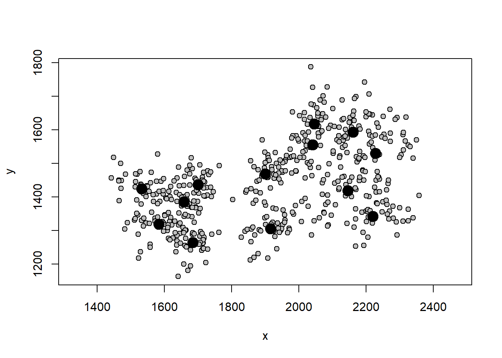

Os círculos maiores representam a posição média do landmark, e os círculos menores representam a posição de cada landmark.

Use indexação com [] para localizar certos landmarks ou indivíduos. Por exemplo.


```r
# Deletar espécimes
tps.new<-tps[,,-7] # deleta espécime n 7
# Deletar landmarks
tps.new<-tps[-5,,] # deleta landmark n 5
```

### Estimar landmarks faltantes

A função estimate.missing do pacote *geomorph* implementa dois métodos para estimar landmarks faltantes.


```r
tps.missing<-readland.tps("dadosmg/mandibula.dig_curso_missing.tps",specID="ID",readcurves=FALSE)
tps.missing
tps.estimated<-estimate.missing(tps.missing, method = "TPS")
tps.estimated

writeland.tps(tps.estimated, "dadosmg/tps.estimated.tps") # exportar arquivo tps com landmarks estimados
```

### Análise Generalizada de Procrustes

Aqui, faremos a análise de Procrustes (GPA) em dados sem simetria de objeto e atribuiremos nomes para os outputs de forma e tamanho do centróide.


```r
gpa.object<-gpagen(tps)
#> 
#> Performing GPA
#> 
  |                                                        
  |                                                  |   0%
  |                                                        
  |============                                      |  25%
  |                                                        
  |=========================                         |  50%
  |                                                        
  |==================================================| 100%
#> 
#> Making projections... Finished!
gpa.object
#> 
#> Call:
#> gpagen(A = tps) 
#> 
#> 
#> 
#> Generalized Procrustes Analysis
#> with Partial Procrustes Superimposition
#> 
#> 13 fixed landmarks
#> 0 semilandmarks (sliders)
#> 2-dimensional landmarks
#> 2 GPA iterations to converge
#> 
#> 
#> Consensus (mean) Configuration
#> 
#>                X           Y
#> 1  -0.3600904084 -0.03209176
#> 2  -0.3838537500  0.08920190
#> 3  -0.2678074781  0.01674324
#> 4  -0.2101661423  0.05684845
#> 5  -0.0001796958  0.03565707
#> 6   0.1873051760  0.14767796
#> 7   0.1660719417  0.08697077
#> 8   0.2984433258  0.09285954
#> 9   0.3486394512  0.01069463
#> 10  0.2335846883 -0.07886796
#> 11  0.2889938410 -0.17663723
#> 12 -0.0281091968 -0.13445727
#> 13 -0.2728317526 -0.11459935
shape<-gpa.object$coords
size<-gpa.object$Csize
```

Podemos visualizar a distribuição dos dados de tamanho e forma. Note a diferença no gráfico da forma antes e depois da análise de Procrustes.


```r
hist(size)
```


```r
plotAllSpecimens(shape)
```

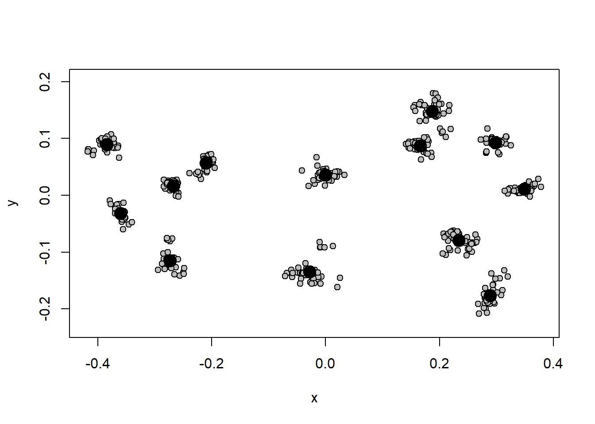

### Espaço tangente

A correlação do espaço de forma com o espaço tangente quase sempre será muito alta em dados de morfometria geométrica, justificando o uso de estatística Euclidiana.


```r
require(Morpho)
regdist(shape)
```

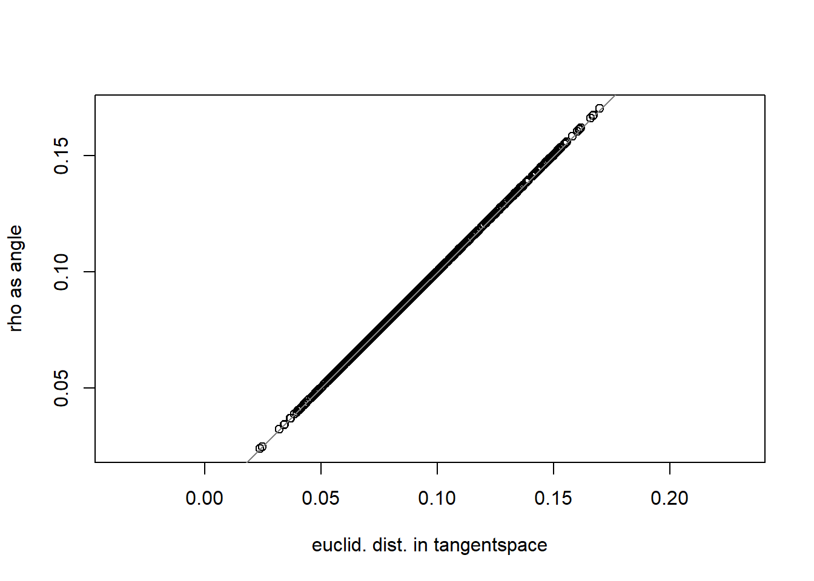

```
#> $cor
#> [1] 0.9999991
#> 
#> $procSS
#> [1] 0.1789463
#> 
#> $tanSS
#> [1] 0.1788539
#> 
#> $rhoSS
#> [1] 0.1791391
```

### Formato array e matrix

Os dados de forma estão em formato array. Podemos nos mover facilmente entre os formatos array e matrix. Ambos carregam a mesma informação, mas algumas análises/operações só aceitam um dos dois formatos.


### GPA com simetria de objeto

Quando os dados tiverem simetria e objeto, vamos informar isso ao R com uma matriz contendo os pares de landmarks simétricos e realizar uma GPA considerando a simetria.


```r
# Carregar dados
tps.sim<-readland.tps("dadosmg/Lista tuco dig 2.tps",specID = "ID", readcurves = FALSE)
dim(tps.sim)
# Matriz com landmarks simétricos
pairs.matrix<-matrix(c(2,3,5,6,7,8,10,11,12,13,14,15,16,17,18,19,20,21,23,24,25,26,27,28),nrow=12,ncol=2,byrow=T)
pairs.matrix
# Construir vetor com rótulo de indivíduos (neste caso, uma marcação por indivíduo)
ind<-c(1:dim(tps.sim)[3])
# GPA com simetria bilateral
b.s<-bilat.symmetry(tps.sim,ind=ind,object.sym=TRUE,land.pairs=pairs.matrix)

shape.sym<-b.s$symm.shape # componente simétrico da forma
plotAllSpecimens(shape.sym)
```

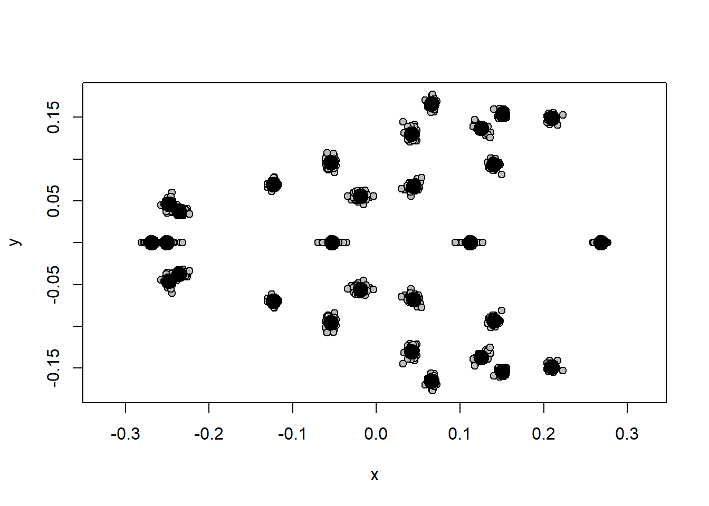

### Encontrando outliers

Podemos encontrar indivíduos muito diferentes dos demais observando sua distância em relação à forma média da amostra. Em morfometria geométrica, é comum a marcação de landmarks trocados em alguns indivíduos, o que vai gerar óbvios outliers.


```r
plotOutliers(shape)
```

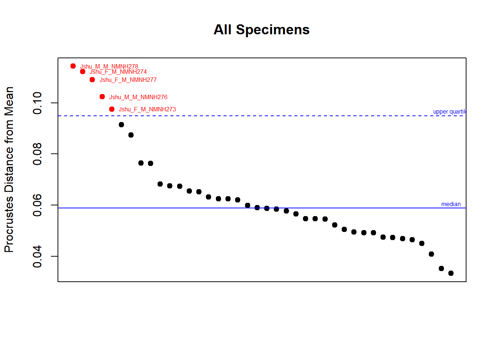

## Visualização da forma

Existem várias maneiras de visualizar mudanças de forma com dados de Morfometria Geométrica (ver Klingenberg 2013 Hystrix 24:15-14). Aliás, essa é uma das vantagens da morfometria geométrica em comparação com a morfometria tradicional. As formas mais comuns de visualização são por grids de deformação, vetores (ou lollipops), e através da construção de links entre os landmarks e extrapolação da forma via *outlines* e *surfaces*. Em qualquer caso, é importante perceber que a diferença de forma está contida apenas entre os landmarks/semilandmarks; as extrapolações de forma além dos landmarks (via grids e outlines, por exemplo) podem ser úteis para visualização, mas devem ser interpretadas com bastante cautela. É também importante perceber que a interpretação das mudanças de forma não deve considerar os landmarks individualmente, mas sim a sua mudança relativa a todos os outros landmarks.

Construção de forma média da amostra para comparação.


```r
ref<-mshape(shape)
```

Construção de links entre os landmarks.


```r
links<-matrix(c(1,2,2,3,3,4,4,5,5,6,6,7,7,8,8,9,9,10,10,11,11,12,12,13,13,1),nrow=13,ncol=2,byrow=T)
plotAllSpecimens(shape,mean=TRUE,links=links)
```

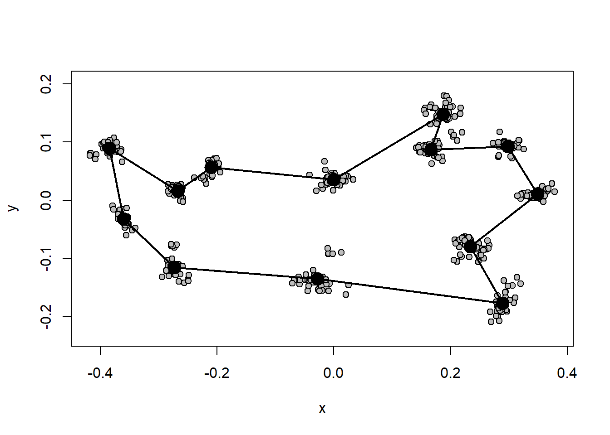

Os links entre os landmarks também podem ser definidos interativamente com a função define.links do pacote *geomorph*.

### Método de grid de deformação.


```r
# Definir cor dos landmarks e links
GP1<-gridPar(pt.bg="gray",link.col="gray",link.lty=1) # cor dos landmarks e links
# Gráfico de mudança de forma
plotRefToTarget(ref,shape[,,8],links=links,method="TPS")
```

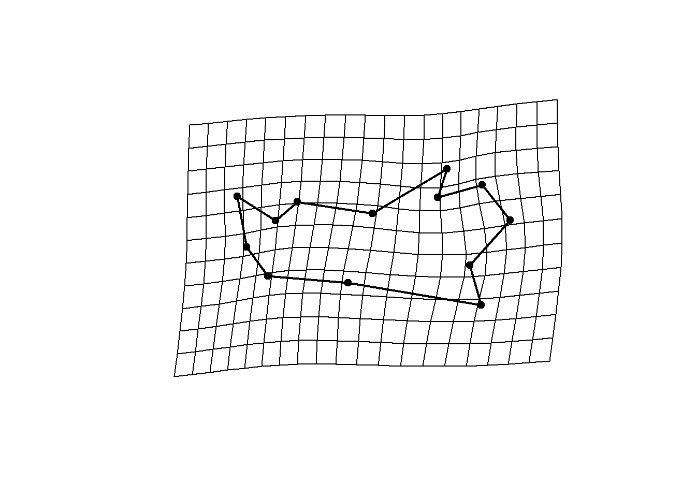

### Método de vetores.


```r
plotRefToTarget(ref,shape[,,8],links=links,method="vector")
```

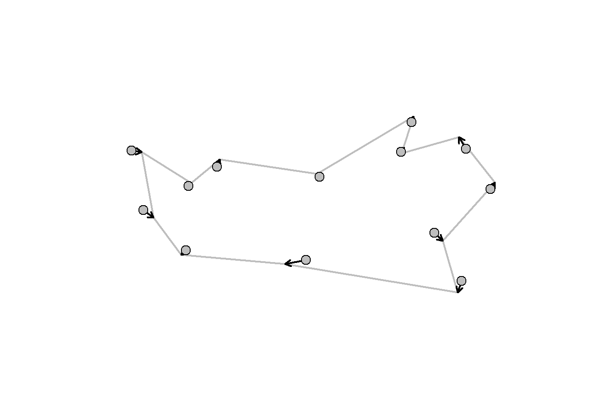

### Método de linhas.


```r
plotRefToTarget(ref,shape[,,8],links=links,method="points",gridPars=GP1)
```

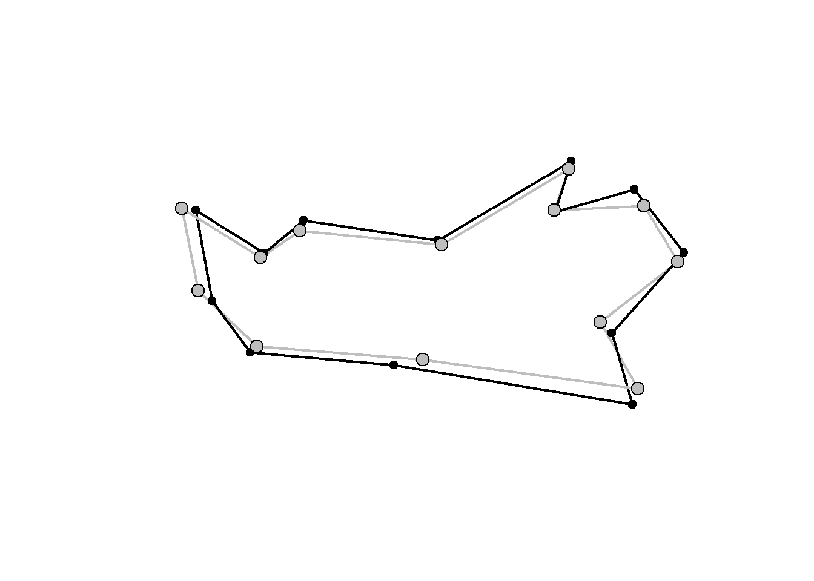

Aqui, o alvo está em preto e a referência(média) está em cinza.

### Método de outlines.


```r
# Carregando outline
outline<-warpRefOutline("dadosmg/outline.mandibula.R.tps", tps[,,11], ref)
```


```r
# Gráfico de mudança de forma
GP1<-gridPar(pt.bg="gray",tar.out.col = "red",tar.out.cex = 0.5)
plotRefToTarget(ref,shape[,,8],outline=outline$outline,method="TPS")
```

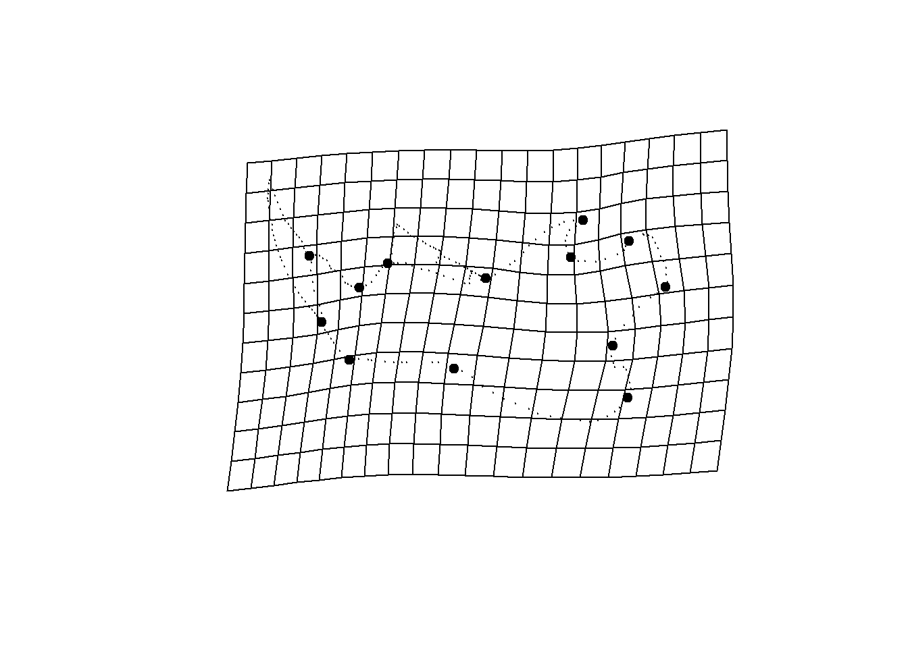

```r
plotRefToTarget(ref,shape[,,8],outline=outline$outline,method="points",gridPars=GP1)
```

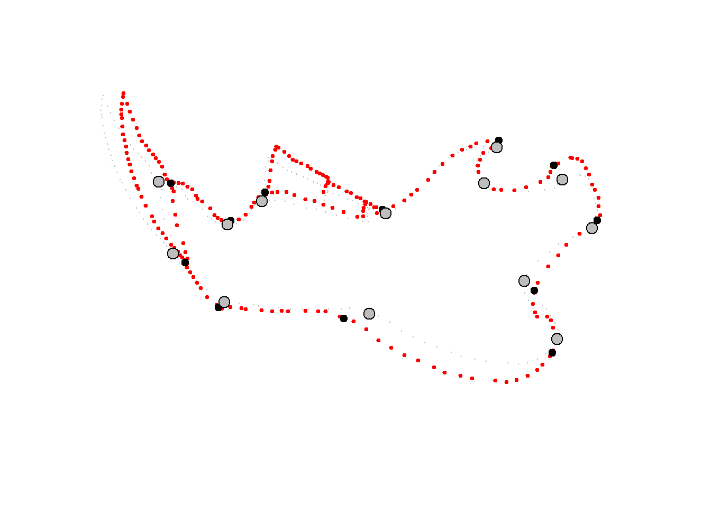

Com um número suficiente de pontos, dá-se a impressão de um desenho. Veja o exemplo do pacote *geomorph*.


```r
data("plethodon") 
Y.gpa<-gpagen(plethodon$land, print.progress = FALSE) 
ref.y<-mshape(Y.gpa$coords) 
GP4<- gridPar(tar.out.col = "red", tar.out.cex = 0.3)
plotRefToTarget(ref.y,Y.gpa$coords[,,39], gridPars=GP4, mag=3, outline=plethodon$outline, method="TPS")
```

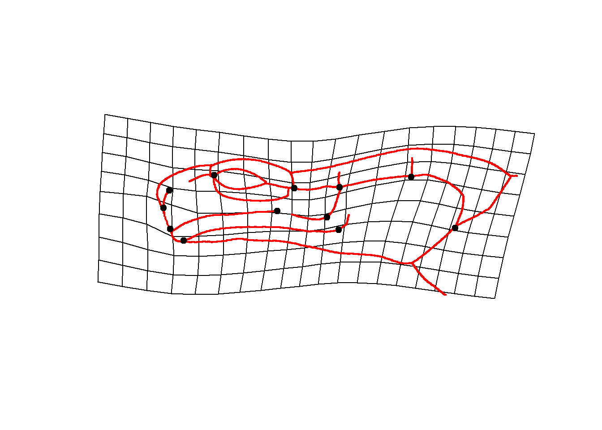

### Magnificação da forma

Às vezes quando as diferenças de forma são muito sútis, podemos aumentar as diferenças para visualizar melhor. Use com cuidado.


```r
plotRefToTarget(ref,shape[,,8],outline=outline$outline, method="points",gridPars=GP1,mag=3)
```

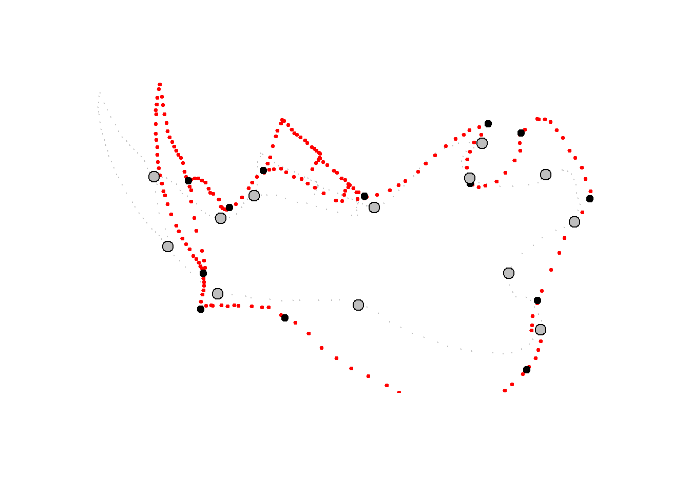
