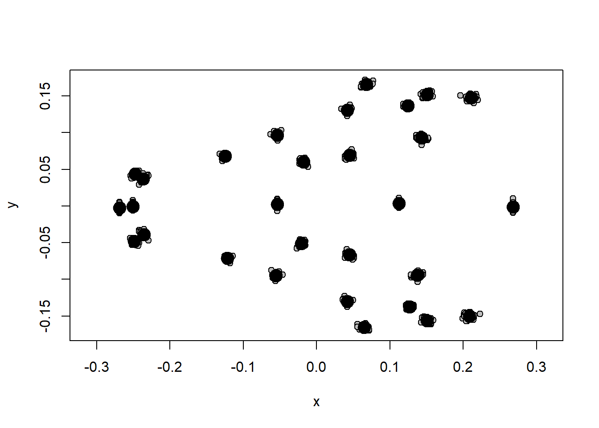
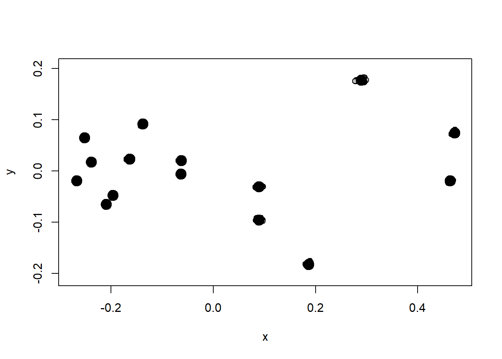
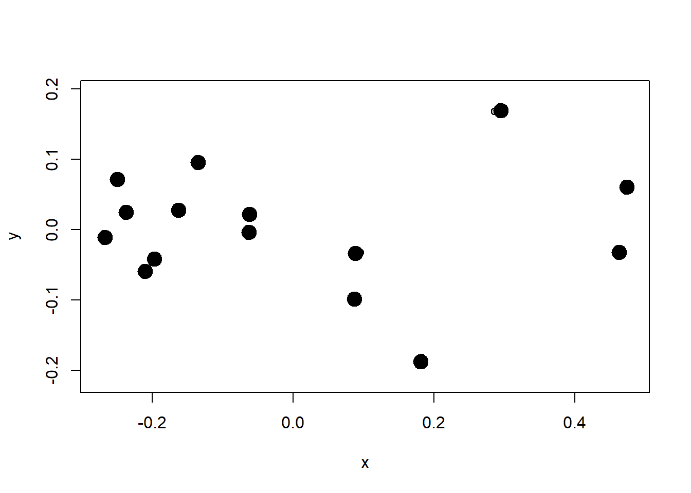
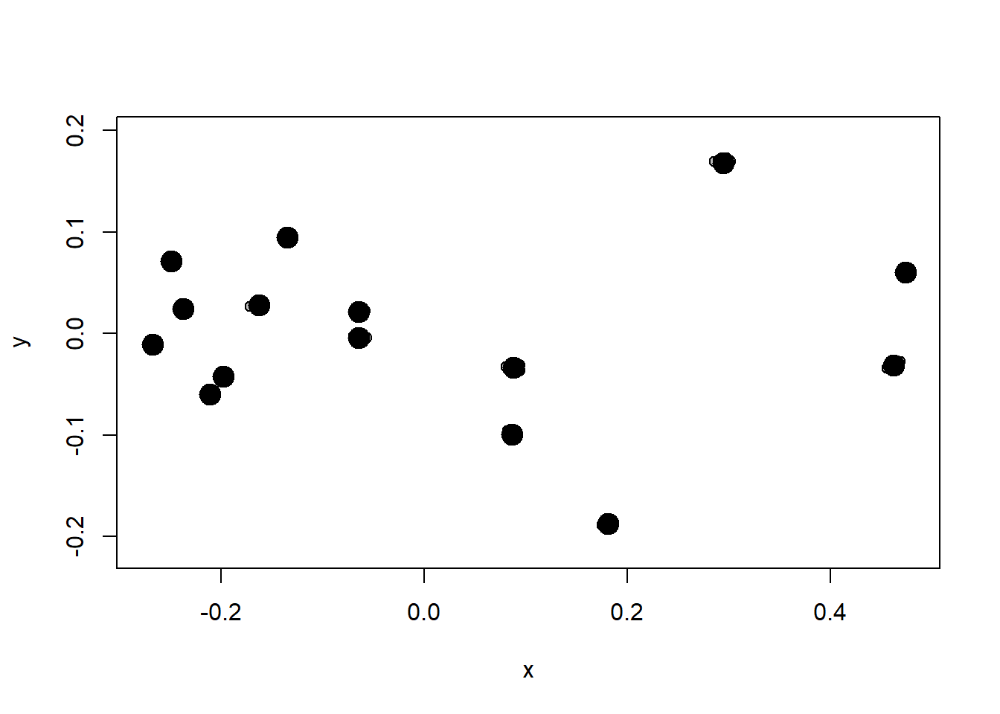

# Assimetria e quantificação de erro

Duas fontes de adicionais de variação, normalmente bem pequenas, podem ser quantificadas: a assimetria e os erros oridundos da obtenção de dados e da medição de indivíduos. A assimetria é o menor dos efeitos biológicos, e pode ser quantificada através da diferença entre os lados direito e esquerdo de estruturas com simetria bilateral, ou entre estruturas correspondentes em outras formas de simetria, como em asas de insetos ou pétalas de flores. Erros oriundos da obtenção de dados ou de medição dos espécimes (colocação de landmarks) devem também ser muito pequenos para que possam ser ignorados com confiança. Espera-se que esses erros sejam várias vezes menores do que variação entre indivíduos, e mesmo que sejam bastante menores do que a variação vinda da assimetria flutuante.

Para se aprofundar, leia: @klingenberg2002; @klingenberg2015.

## Assimetria de objeto

Estruturas biológicas com assimetria de objeto, por exemplo, os lados direito e esquerdo do crânio.


```r
# Carregar dados com landmarks no crânio de tuco-tucos
require(geomorph)
#> Le chargement a nécessité le package : geomorph
#> Le chargement a nécessité le package : RRPP
#> Le chargement a nécessité le package : rgl
#> Le chargement a nécessité le package : Matrix
tps.sim<-readland.tps("dadosmg/Lista tuco dig 2.tps",specID = "ID", readcurves = FALSE)
dim(tps.sim)
# Matriz com landmarks simétricos
pairs.matrix<-matrix(c(2,3,5,6,7,8,10,11,12,13,14,15,16,17,18,19,20,21,23,24,25,26,27,28),nrow=12,ncol=2,byrow=T)
pairs.matrix
# Construir vetor com rótulo de indivíduos (neste caso, uma marcação por indivíduo)
ind<-c(1:dim(tps.sim)[3])
# GPA com simetria bilateral
b.s<-bilat.symmetry(tps.sim,ind=ind,object.sym=TRUE,land.pairs=pairs.matrix)

# Componente assimétrico da forma
shape.asym<-b.s$asymm.shape
plotAllSpecimens(shape.asym)
```



## Assimetria de correspondência

Estruturas biológicas com simetria de correspondência, por exemplo, asas de insetos.


```r
# Carregar arquivo com landmarks em asas de *Drosophila*
fly<-read.table("dadosmg/fly wing replicates Proc.txt",h=T,row.names = 1)
head(fly)
# Transformar coordenadas em array
fly.tps<-arrayspecs(fly[,5:34],15,2) 
fly.tps 
plotAllSpecimens(fly.tps)
```



```r
# Vetor com os indivíduos da amostra
fly.ind<-fly$fly 
fly.ind
# Vetor informando quais estruturas são asas do lado direito ou do esquerdo
fly.side<-fly$side 
fly.side
# GPA com simetria de correspondência
fly.b.s<-bilat.symmetry(fly.tps,ind=fly.ind,side=fly.side)
# Componente simétrico da forma
plotAllSpecimens(fly.b.s$symm.shape) 
```



```r
# Componente assimétrico da forma
plotAllSpecimens(fly.b.s$asymm.shape)
```



## Assimetria direcional

A forma média dos lados direito e esquerdo.


```r
fly.b.s$DA.component
```

## Assimetria flutuante

O desvio específico de cada espécime e índices quantificando o desvio esperado da simetria.


```r
fly.b.s$FA.component
fly.b.s$signed.AI
```

## Quantificação de erro

A "Procrustes ANOVA" (Goodall 1991; Klingengerg & McIntyre 1998), usada para quantificar diversas fontes de erro em morfometria geométrica, é uma análise multivariada de variância onde as fontes de erro são aninhadas uma dentro da outra. Por exemplo, podemos ter os lados direito/esquerdo de cada indivíduo, mais de uma marcação de landmarks para cada indivíduo, e mais de uma obtenção de imagem para cada indivíduo. A quantificação de variação em cada nível pode ser feita e comparada. No exemplo abaixo, vamos quantificar o erro de medição através de marcações de landmarks repetidas duas vezes em cada indivíduo da amostra. Queremos obter uma medida que represente a confiabilidade da marcação de landmarks por um operador, obtida através da repetição da colocação de landmarks em imagens idênticas, por esse operador; em teoria, os landmarks deveriam estar extamente na mesma posição.


```r
# Carregar arquivo tps com todos os indivíduos marcados 2 vezes
tps.rep<-readland.tps("dadosmg/ventral.dig_curso_rep1_2.tps",specID = "ID", readcurves = FALSE) 
dim(tps.rep)
# Matriz com os pares de landmarks simétricos
pairs.matrix.rep<-matrix(c(2,3,4,5,6,7,8,9,10,11,12,13,14,15,16,17,18,24,22,28,23,29,19,25,20,26,21,27,30,31,33,34,35,36,37,38,39,40,41,42,43,44,45,46,47,48,49,50,51,52,55,56),nrow=26,ncol=2,byrow=T) 
pairs.matrix.rep
# Extração dos rótulos de indivíduos e repetições a partir do ID
categories<-strsplit(dimnames(tps.rep)[[3]], "_") # separa os nomes pelo underline
classifiers<-matrix(unlist(categories),ncol=5,byrow=T) # transforma em matriz
classifiers<-cbind(dimnames(tps.rep)[[3]],classifiers) # adiciona o ID na primeira coluna
colnames(classifiers)<-c("FileID","Species","Sex","View","Ind","Rep") # renomeia as colunas
classifiers<-as.data.frame(classifiers)
# Indivíduos
ind.rep<-classifiers$Ind # indivíduos
# Repetições
rep.rep<-classifiers$Rep # repetições

# Procrustes ANOVA - erro de medição
b.s.error<-bilat.symmetry(tps.rep,ind=ind.rep,replicate=rep.rep,object.sym=TRUE,land.pairs=pairs.matrix.rep)
```

A tabela de variância informa quanta variação está contida entre as réplicas de um mesmo indivíduo marcados duas vezes (ind:side:replicate).


```r
b.s.error$shape.anova
#>                     Df      SS        MS     Rsq       F
#> ind                 39 0.34535 0.0088550 0.92935 30.8480
#> side                 1 0.00466 0.0046638 0.01255 16.2470
#> ind:side            39 0.01120 0.0002871 0.03013  2.2096
#> ind:side:replicate  80 0.01039 0.0001299 0.02797        
#> Total              159 0.37160                          
#>                          Z Pr(>F)   
#> ind                 6.8520  0.001 **
#> side                5.2769  0.001 **
#> ind:side           13.2872  0.001 **
#> ind:side:replicate                  
#> Total                               
#> ---
#> Signif. codes:  
#> 0 '***' 0.001 '**' 0.01 '*' 0.05 '.' 0.1 ' ' 1
```

O erro de medição é pelo menos duas vezes menor do que a assimetria flutuante.

Podemos também calcular um valor de confiança da repetibilidade


```r
R1<-(((b.s.error$shape.anova$MS[1]-b.s.error$shape.anova$MS[4])/2) / ((b.s.error$shape.anova$MS[4]+((b.s.error$shape.anova$MS[1]-b.s.error$shape.anova$MS[4])/2)))) 
R1
#> [1] 0.9710822
```

## Exercício - Erro e Assimetria

Usando os dados de asas de Drosophila já carregados (arquivo "fly wing replicates Proc.txt") construa um modelo incluindo, além dos lados direto e esquerdo (assimetria) e da repetição das fotos entre indivíduos, também o fator imagem (3° coluna dos dados), que representa a repetição da captura de fotos, i.e. fotos diferentes do mesmo indivíduo. Uma maneira equivalente de representar a Procrustes ANOVA [bilat.symmetry(fly.tps,ind=fly.ind,side=fly.side,replicate=fly.rep] com modelos lineares em linguagem geomoph é usando procD.lm: procD.lm(fly.gpa\$coords\~fly.ind/fly.side+fly.side/fly.ind). Note que não é necessário usar o fator repetição explicitamente, uma vez que ele está dentro de indivíduos (compare os resíduos da primeira e da segunda função).
