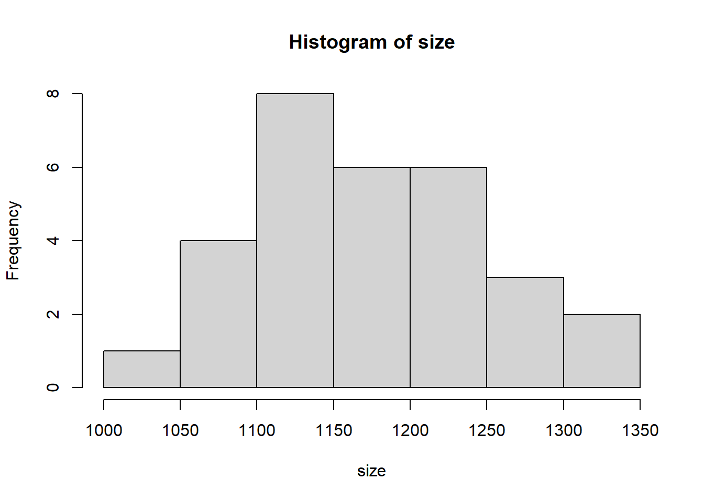
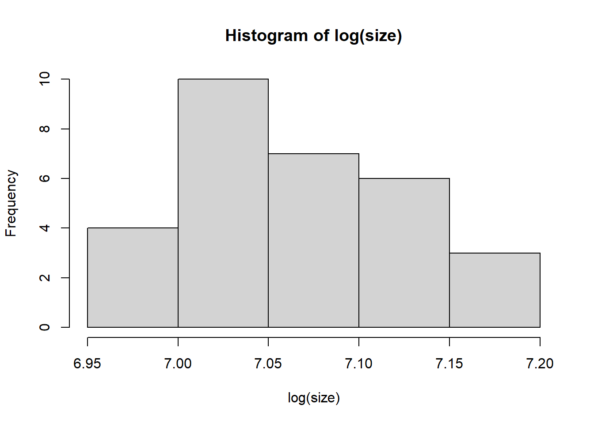
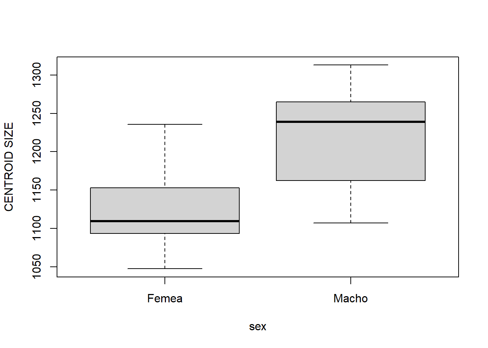
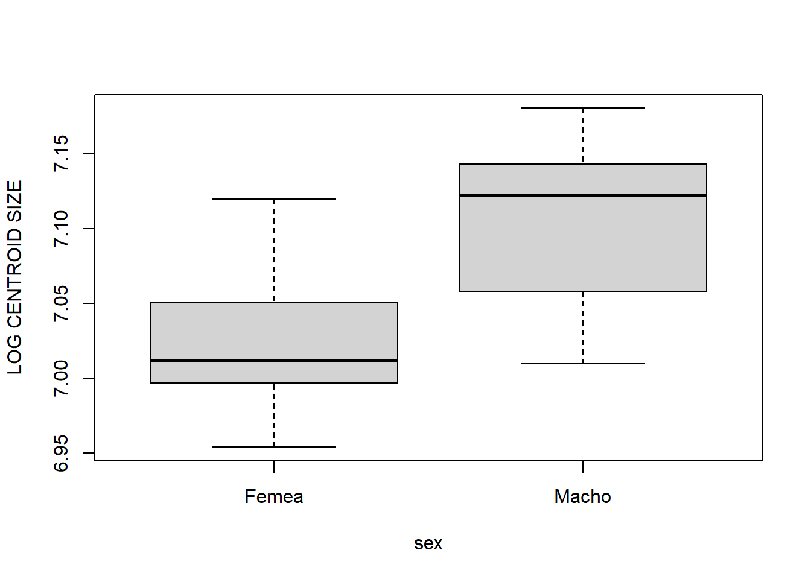
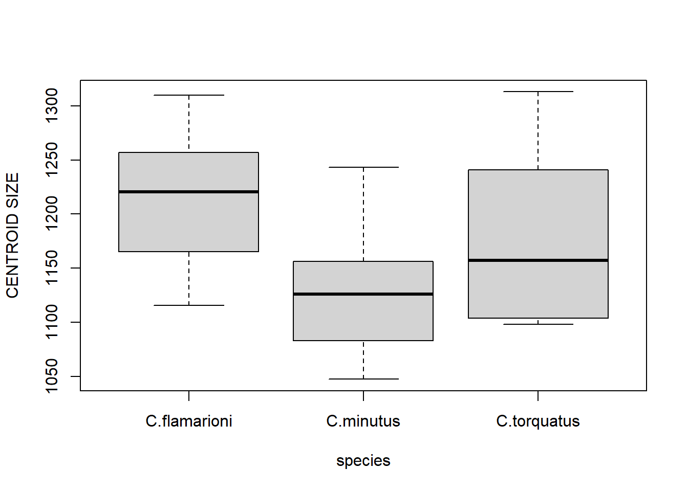
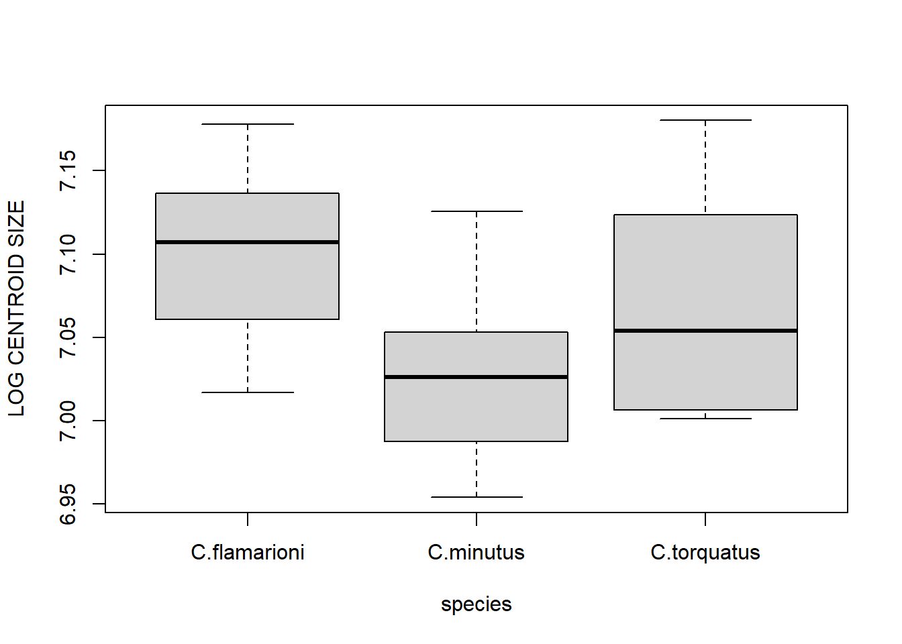
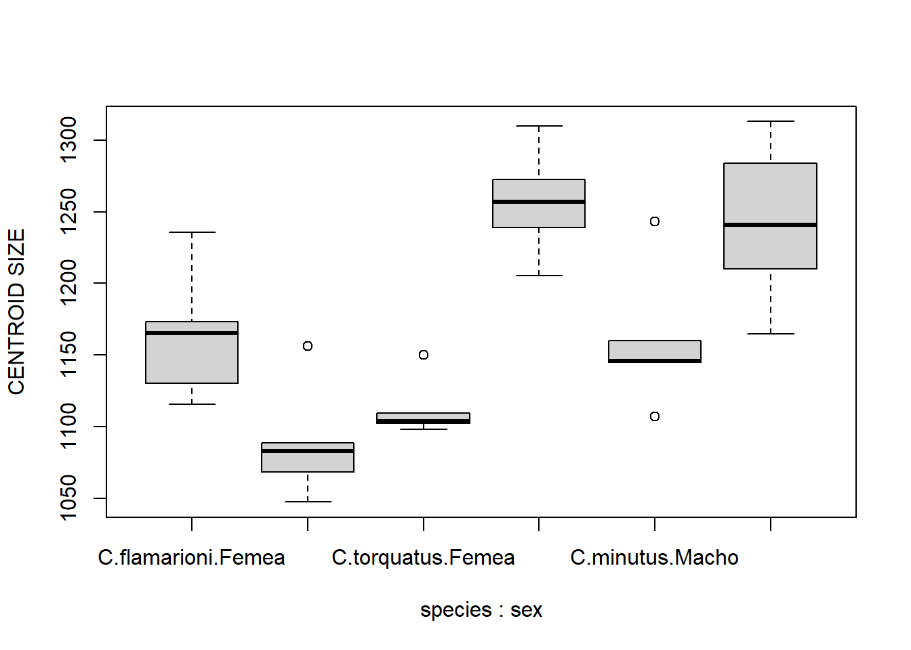
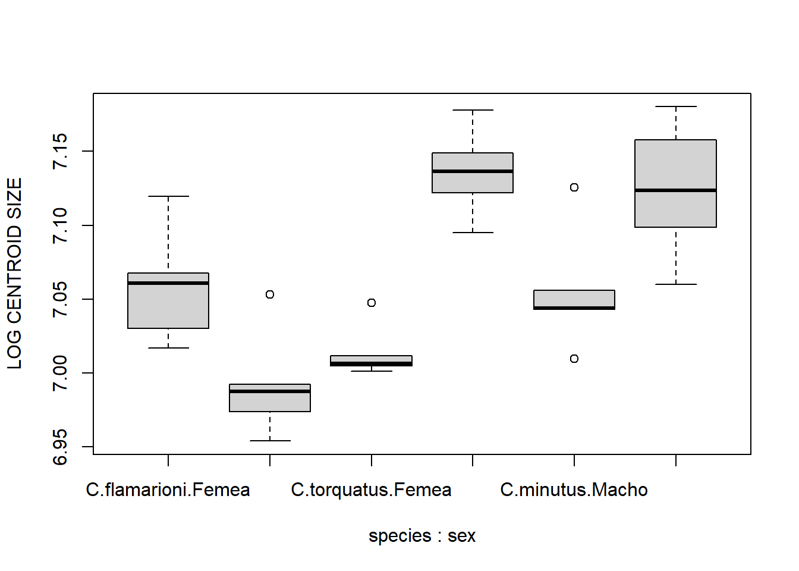

# Tamanho do Centróide
Em morfometria geométrica, o tamanho do centróide é uma medida de tamanho global da estrutura (configuração de landmarks). Ela é a raiz quadrada da soma das distâncias ao quadrado de cada landmark até o centróide da configuração de landmarks. Por definição, essa medida é matematicamente ortogonal à forma.

Vamos usar as configurações de landmarks no crânio de roedores para explorar algumas análises de variação de tamanho usando o tamanho do centróide.

```r
require(geomorph)
#> Carregando pacotes exigidos: geomorph
#> Carregando pacotes exigidos: RRPP
#> Carregando pacotes exigidos: rgl
#> Carregando pacotes exigidos: Matrix
# Carregar dados
tps<-readland.tps("dadosmg/Lista tuco dig 2.tps",specID = "ID", readcurves = FALSE)
dim(tps)

# GPA  
gpa<-gpagen(tps)

# Extrair tamanho do centróide
size<-gpa$Csize
```

Aqui está o tamanho do centróide.

```r
size

hist(size)
```



```r
hist(log(size))
```



É importante manter os dados organizados e ter uma tabela em formato excel ou similar com as informações de cada espécime na mesma ordem em que eles aparecem na lista .tps. *Organization is key!*
Podemos carregar uma tabela assim no R para explorar a variação de tamanho entre classificadores biológicos dos nossos dados.

```r
# Carregar classificadores a partir de lista externa
plan<-read.table("dadosmg/Planilha Ctenomys.txt",h=T)
plan
species<-plan[,1]
species<-as.factor(species)
sex<-plan[,2]
sex<-as.factor(sex)
sp.sex<-plan[,3]
sp.sex<-as.factor(sp.sex)
```

Variação do tamanho em função de classificadores biológicos.

```r
# Variação de tamanho entre sexos
boxplot(size~sex,ylab="CENTROID SIZE")
```



```r
boxplot(log(size)~sex,ylab="LOG CENTROID SIZE")
```



```r
# Teste t
t.test(size~sex) 
t.test(log(size)~sex)

# Variação de tamanho entre espécies
boxplot(size~species,ylab="CENTROID SIZE")
```



```r
boxplot(log(size)~species,ylab="LOG CENTROID SIZE")
```



```r
# ANOVA (Analysis of Variance)
anova<-aov(size~species) 
summary(anova)
anova<-aov(log(size)~species) 
summary(anova)
# Pairwise comparisons
TukeyHSD(anova)

# Variação de tamanho entre espécies e sexos
boxplot(size~species*sex,ylab="CENTROID SIZE")
```



```r
boxplot(log(size)~species*sex,ylab="LOG CENTROID SIZE")
```



```r
# ANOVA com interação
anova<-aov(size~sex*species)
summary(anova)
TukeyHSD(anova)
anova<-aov(log(size)~sex*species)
summary(anova)
TukeyHSD(anova)
```

Um dos usos fundamentais do tamanho do centróide em Morfometria Geométrica é a investigação de alometria, veja o subcapítulo correspondente.


