# Métodos de ordenação

Os métodos de ordenação mais usados em dados de morfometria geométrica são a Análise de Componentes Principais (PCA) e a Análise de Variáveis Canônicas (CVA). Ambos os métodos são exploratórios, e providenciam uma descrição dos dados, e não testes de hipóteses. No entanto, a CVA pode ser utilizada como uma função para discriminação de grupos, onde a porcentagem de classificação correta de espécimes dentro de grupos pode ser usada como valor de suporte ao testar a confiabilidade de grupos (ex: espécies).

Para se aprofundar, leia: 
Zeldtich et al. 2012 Geometric Morphometrics for Biologists - Elsevier, e 
Klingengerb & Monteiro 2005 Distances and directions in multidimensional shape spaces: implications for morphometric applications - Systematic Biology.

## Análise de Componentes Principais
A análise de componentes principais (Principal Component Analysis - PCA) simplifica os complexos padrões de variação e covariação de dados multivariados ao construir componentes principais independentes que resumem a maior parte da variação dos dados em poucos eixos. Assim, também é possível observar diretamente a combinação de dois ou três componentes principais em um gráfico.

Vamos fazer uma PCA com dados de morfometria geométrica.
Primeiro, vamos carregar os dados, fazer uma GPA, e carregar os classificadores.

```r
require(geomorph)
#> Carregando pacotes exigidos: geomorph
#> Carregando pacotes exigidos: RRPP
#> Carregando pacotes exigidos: rgl
#> Carregando pacotes exigidos: Matrix
# Carregar dados
tps<-readland.tps("dadosmg/Lista tuco dig 2.tps",specID = "ID", readcurves = FALSE)
dim(tps)

# Gerar matriz com pares de landmarks simétricos
pairs.matrix<-matrix(c(2,3,5,6,7,8,10,11,12,13,14,15,16,17,18,19,20,21,23,24,25,26,27,28),nrow=12,ncol=2,byrow=T)
# Vetor indivíduos
ind<-c(1:dim(tps)[3])

# GPA - Simetria bilateral 
b.s<-bilat.symmetry(tps,ind=ind,object.sym=TRUE,land.pairs=pairs.matrix)

# Matriz de forma
shape.sym<-b.s$symm.shape

# Carregar classificadores a partir de lista externa
plan<-read.table("dadosmg/Planilha Ctenomys.txt",h=T)
plan
species<-plan[,1]
species<-as.factor(species)
sex<-plan[,2]
sex<-as.factor(sex)
sp.sex<-plan[,3]
sp.sex<-as.factor(sp.sex)
```

Muitas funções realizam a Análise de Componentes Principais no R. Para dados de morfometria geométrica (MG), é melhor usar funções de pacotes desenhados especificamente para MG, já que eles reconhecem a redundância nos graus de liberdade que resultam das transformações de escala, posição e rotação feitas anteriormente na Análise Generalisada de Procrustes, e já retornam o número exato de componentes principais necessários para capturar 100% da variação da forma.
Vamos usar a PCA implementada no pacote *geomorph*.

```r
PCA<-gm.prcomp(shape.sym)
PCA # Porcentagem de explicação dos eixos
#> 
#> Ordination type: Principal Component Analysis 
#> Centering by OLS mean
#> Orthogonal projection of OLS residuals
#> Number of observations: 30 
#> Number of vectors 28 
#> 
#> Importance of Components:
#>                               Comp1        Comp2
#> Eigenvalues            0.0005691898 0.0002349919
#> Proportion of Variance 0.4018322761 0.1658977524
#> Cumulative Proportion  0.4018322761 0.5677300285
#>                               Comp3        Comp4
#> Eigenvalues            0.0001552391 9.049344e-05
#> Proportion of Variance 0.1095945175 6.388587e-02
#> Cumulative Proportion  0.6773245461 7.412104e-01
#>                               Comp5        Comp6
#> Eigenvalues            6.732315e-05 5.547785e-05
#> Proportion of Variance 4.752828e-02 3.916583e-02
#> Cumulative Proportion  7.887387e-01 8.279045e-01
#>                               Comp7        Comp8
#> Eigenvalues            4.232582e-05 3.705712e-05
#> Proportion of Variance 2.988086e-02 2.616131e-02
#> Cumulative Proportion  8.577854e-01 8.839467e-01
#>                               Comp9       Comp10
#> Eigenvalues            3.356797e-05 2.770576e-05
#> Proportion of Variance 2.369806e-02 1.955950e-02
#> Cumulative Proportion  9.076448e-01 9.272043e-01
#>                              Comp11       Comp12
#> Eigenvalues            2.221806e-05 1.731913e-05
#> Proportion of Variance 1.568534e-02 1.222683e-02
#> Cumulative Proportion  9.428896e-01 9.551164e-01
#>                              Comp13       Comp14
#> Eigenvalues            1.405341e-05 1.156877e-05
#> Proportion of Variance 9.921316e-03 8.167232e-03
#> Cumulative Proportion  9.650377e-01 9.732050e-01
#>                              Comp15       Comp16
#> Eigenvalues            1.028007e-05 8.308937e-06
#> Proportion of Variance 7.257446e-03 5.865880e-03
#> Cumulative Proportion  9.804624e-01 9.863283e-01
#>                              Comp17       Comp18
#> Eigenvalues            7.020041e-06 3.263883e-06
#> Proportion of Variance 4.955955e-03 2.304211e-03
#> Cumulative Proportion  9.912842e-01 9.935885e-01
#>                              Comp19       Comp20
#> Eigenvalues            2.679842e-06 2.081122e-06
#> Proportion of Variance 1.891894e-03 1.469214e-03
#> Cumulative Proportion  9.954804e-01 9.969496e-01
#>                              Comp21       Comp22
#> Eigenvalues            1.577657e-06 1.186452e-06
#> Proportion of Variance 1.113783e-03 8.376027e-04
#> Cumulative Proportion  9.980634e-01 9.989010e-01
#>                              Comp23       Comp24
#> Eigenvalues            9.098790e-07 4.159837e-07
#> Proportion of Variance 6.423494e-04 2.936730e-04
#> Cumulative Proportion  9.995433e-01 9.998370e-01
#>                              Comp25       Comp26
#> Eigenvalues            1.598994e-07 6.588247e-08
#> Proportion of Variance 1.128845e-04 4.651120e-05
#> Cumulative Proportion  9.999499e-01 9.999964e-01
#>                              Comp27       Comp28
#> Eigenvalues            5.138116e-09 1.613869e-19
#> Proportion of Variance 3.627368e-06 1.139347e-16
#> Cumulative Proportion  1.000000e+00 1.000000e+00

plot(PCA,axis1=1, axis2=2)
```

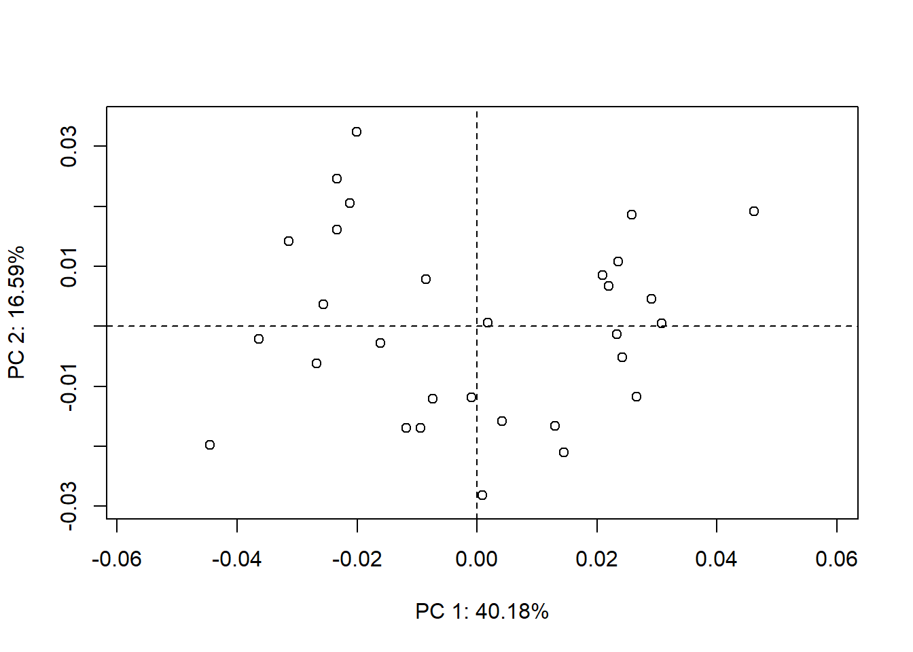

Antes de observar as mudanças de forma ao longo do gráfico da PCA, vamos criar uma forma média de referência e definir links entre os landmarks.

```r
# Forma média
ref<-mshape(shape.sym)

links.tuco<-matrix(c(1,2,1,3,2,7,3,8,7,10,8,11,10,18,11,19,14,18,15,19,10,14,11,15,18,20,19,21,20,23,21,24,23,25,24,26,25,27,26,28,27,29,28,29,4,5,4,6,6,9,5,9,1,4,4,9,9,22,22,29,7,9,8,9,10,12,11,13,9,12,9,13,12,16,13,17,16,22,17,22,16,18,17,19,16,20,17,21,22,23,22,24,23,27,24,28,23,29,24,29),nrow=50,ncol=2,byrow=T)

# Plotar espécimes contra a média
GP1<-gridPar(pt.bg="gray",link.col="gray",link.lty=1) # cor dos landmarks e links
plotRefToTarget(ref,shape.sym[,,8],links=links.tuco,method="TPS") 
```

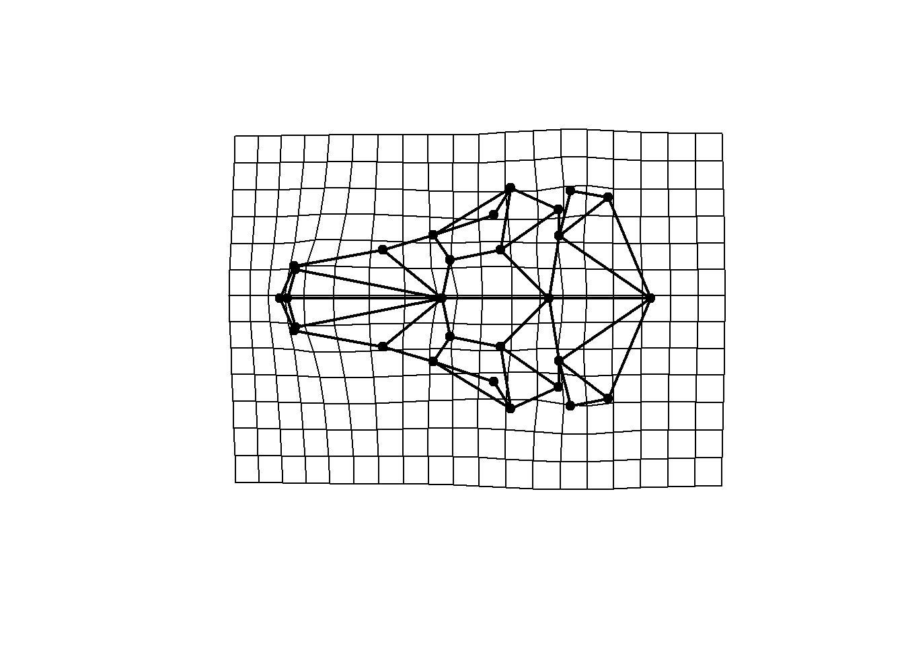

```r
plotRefToTarget(ref,shape.sym[,,8],links=links.tuco,method="vector") 
```

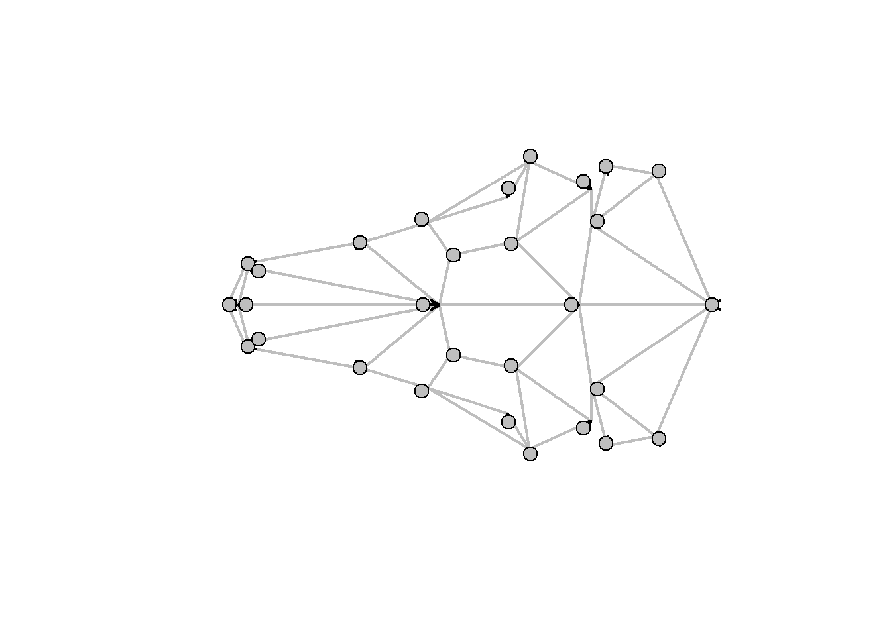

```r
plotRefToTarget(ref,shape.sym[,,8],links=links.tuco,method="points",gridPars=GP1) # alvo = em preto, referência = em cinza
```

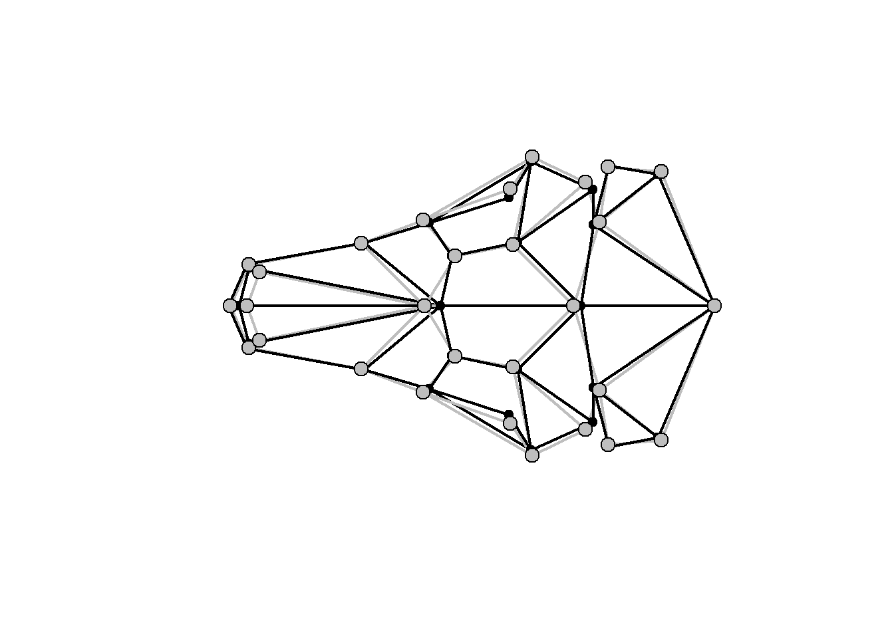

```r

plotAllSpecimens(shape.sym,mean=TRUE,links=links.tuco)
```

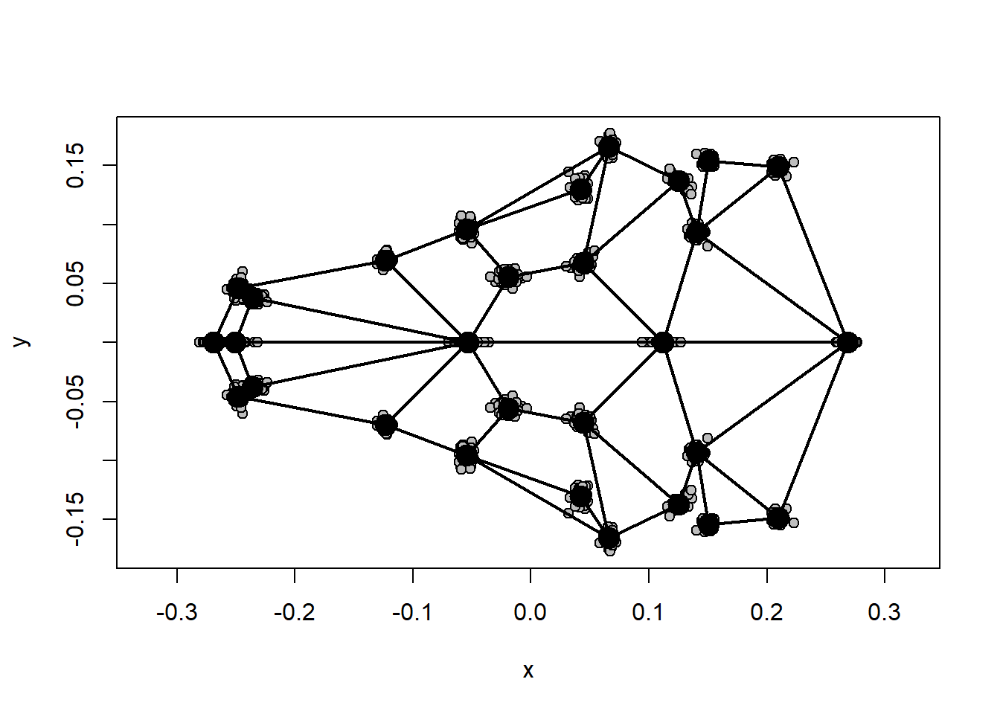


Podemos estilizar a PCA para mostrar, por exemplo, quais indivíduos pertecem a quais grupos. Além disso, é importante observar as formas associadas com porções diferentes do gráfico.

```r
# PCA Estilizada
col.group<-rainbow(length(levels(species))) # criar vetor de cores para grupos
names(col.group)<-levels(species)
col.group<-col.group[match(species,names(col.group))]
PCA<-gm.prcomp(shape.sym) # rodar a PCA
xlab<-paste("Principal Component 1 ", "(",round(PCA$pc.summary$importance[2,1]*100,1),"%)",sep="") # Criar label pro eixo 1
ylab<-paste("Principal Component 2 ", "(",round(PCA$pc.summary$importance[2,2]*100,1),"%)",sep="") # Criar label pro eixo 2
{mat<-matrix(c(4,5,0,1,1,2,1,1,3),3) # Dividir a janela do plot
layout(mat, widths=c(1,1,1), heights=c(1,1,0.6))
par(mar=c(4, 4, 1, 1))
plot(PCA$x[,1],PCA$x[,2],pch=21,cex=2,bg=col.group,xlab=xlab,ylab=ylab,asp=T)
legend(0.025,-0.015,legend=unique(species),pch=19,col=unique(col.group))
plotRefToTarget(ref,PCA$shapes$shapes.comp1$min,links=links.tuco,method="TPS",gridPars=GP1)
plotRefToTarget(ref,PCA$shapes$shapes.comp1$max,links=links.tuco,method="TPS",gridPars=GP1)
plotRefToTarget(ref,PCA$shapes$shapes.comp2$max,links=links.tuco,method="TPS",gridPars=GP1)
plotRefToTarget(ref,PCA$shapes$shapes.comp2$min,links=links.tuco,method="TPS",gridPars=GP1)}
```

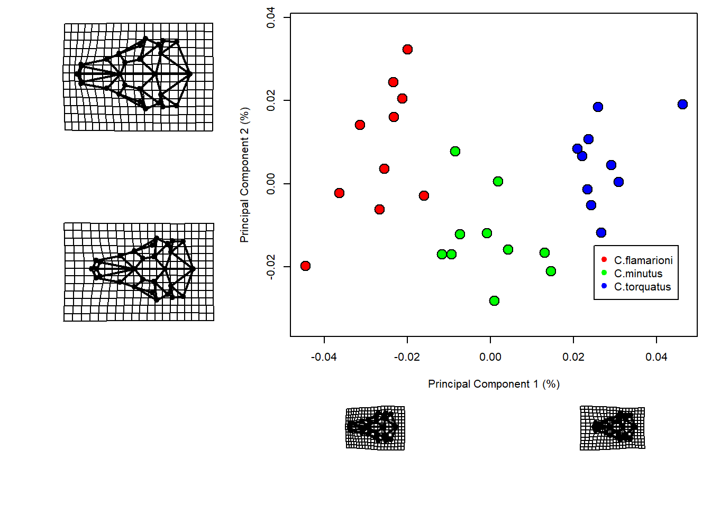

```r
par(mfrow=c(1,1)) # janela default do gr?fico  
```

É possível gerar elipses de confiança para os grupos em questão.

```r
require(vegan)
#> Carregando pacotes exigidos: vegan
#> Carregando pacotes exigidos: permute
#> Carregando pacotes exigidos: lattice
#> This is vegan 2.6-4
{plot(PCA$x[,1],PCA$x[,2],pch=21,cex=2,bg=col.group,xlab=xlab,ylab=ylab,asp=T)
ordiellipse(PCA$x,group=species, kind="sd", conf=0.95)}
```

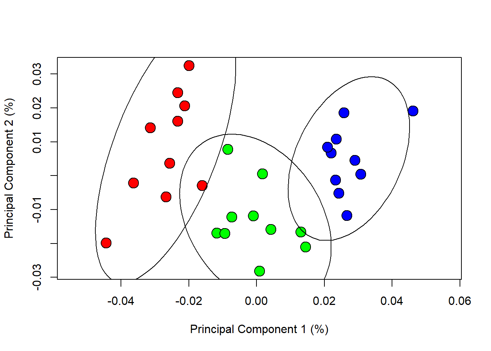

```r
{plot(PCA$x[,1],PCA$x[,2],pch=21,cex=2,bg=col.group,xlab=xlab,ylab=ylab,asp=T)
ordihull(PCA$x,group=species)}
```

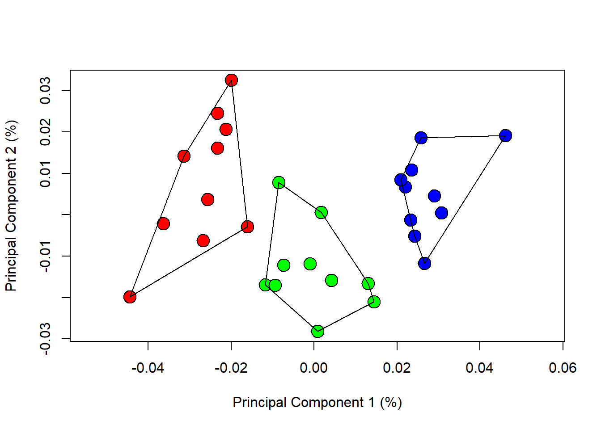

As mudanças de forma ao longo dos eixos da PCA podem ser visualizadas comparando-as com a média da amostra. Usualmente, as formas extremas de cada eixo são usadas para visualização. O *geomorph* retorna as formas extremas de maneira simplificada no output da função que faz a PCA.

```r
# Definir cores dos landmarks e links
GP1<-gridPar(pt.bg="gray",link.col="gray",link.lty=1) # cor dos landmarks e links
# Mínimos e máximos contra a média
plotRefToTarget(ref,PCA$shapes$shapes.comp1$min,links=links.tuco,method="TPS",gridPars=GP1)
```

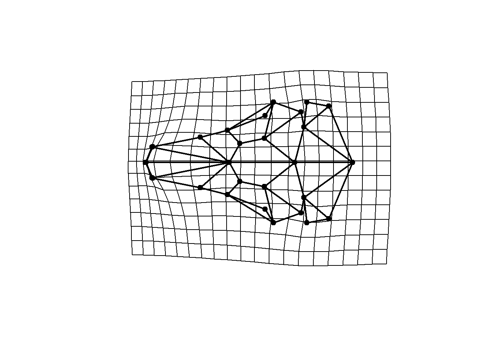

```r
plotRefToTarget(ref,PCA$shapes$shapes.comp1$max,links=links.tuco,method="TPS",gridPars=GP1)
```

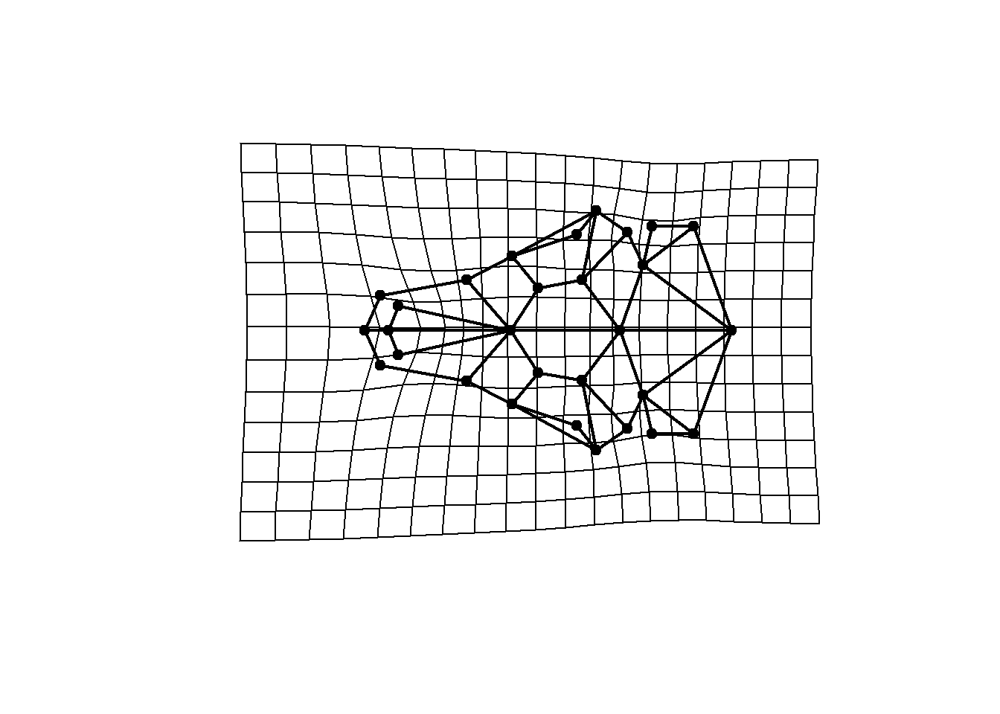

```r
# Mínimo contra máximo
plotRefToTarget(PCA$shapes$shapes.comp1$min,PCA$shapes$shapes.comp1$max,links=links.tuco,method="points",gridPars=GP1) # alvo = em preto, referência = em cinza
```

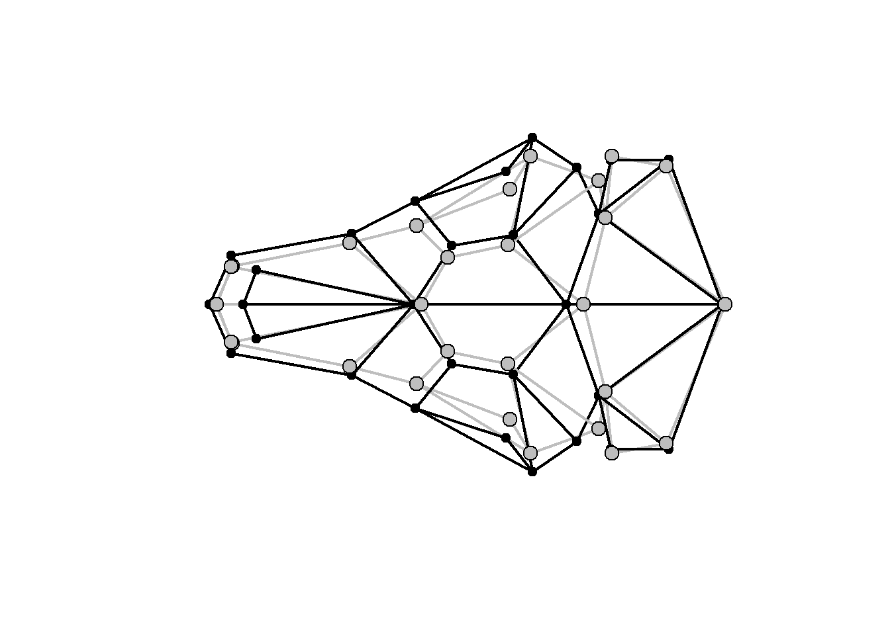


## Análise de Variação Canônica
Assim como na PCA, a Análise de Variação Canônica (Canonical Variates Analysis - CVA) também cria novas variáveis (eixos de ordenação) que são ortogonais. No entanto, a CVA descreve as diferenças *entre* as médias de *grupos*. Assim, ela pode ser usada para descrever as diferenças de forma entre quaisquer *grupos* biológicos que tenhamos. Contudo, ao contrário da PCA, que simplesmente rotaciona as coordenadas originais, a CVA realiza uma transformação (rescalonamento pela variação dentro de grupos) no sistema de coordenadas original, e por isso não deve ser interpretada livremente para representar variação de forma entre indivíduos. A CVA mostra apenas a direção em que os grupos são melhor discriminados um do outro. 

```r
require(Morpho)
#> Carregando pacotes exigidos: Morpho
#> 
#> Attaching package: 'Morpho'
#> The following object is masked from 'package:RRPP':
#> 
#>     classify
cva<-CVA(PCA$x[,1:20],groups=species,cv=TRUE) # Jackknife Cross-validation
cva$Var
#>      Canonical roots % Variance Cumulative %
#> [1,]        88.21224   82.81358     82.81358
#> [2,]        18.30681   17.18642    100.00000

{plot(cva$CVscores,bg=col.group,pch=21,cex=2,xlab=paste("CV1  (",paste(round(cva$Var[1,2],1),"%)"),sep=""),ylab=paste("CV2  (",paste(round(cva$Var[2,2],1),"%)"),sep=""))
legend(0,-2,legend=unique(species),pch=19,col=unique(col.group))

# gerar elipses de confiança
ordiellipse(cva$CVscores,group=species, kind="sd", conf=0.95)} 
```

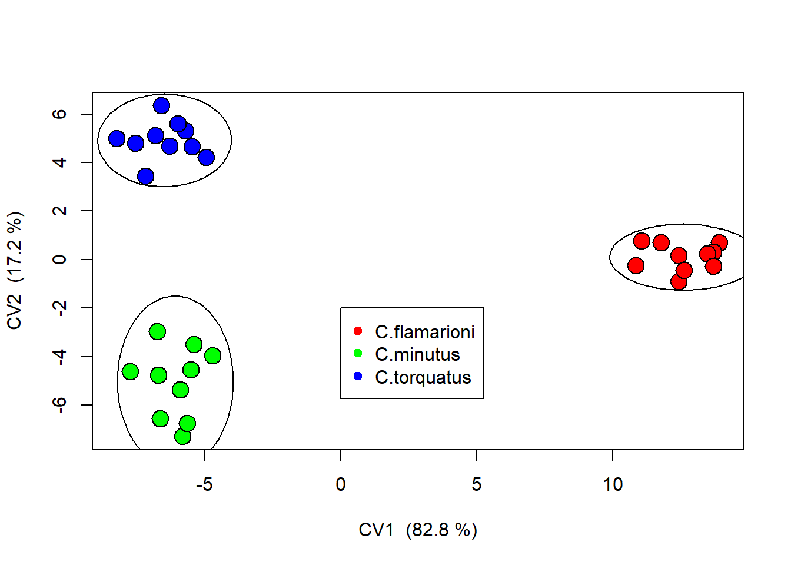

```r
# ou: ordihull(cva$CVscores,group=species)
```

Uma outra vantagem da CVA é que ela pode ser usada para estimar uma taxa de reclassificação correta de indivíduos dentro dos grupos hipotetizados. 

```r
cva<-CVA(PCA$x[,1:20],groups=species,cv=TRUE) # Jackknife Cross-validation
cva
#>  cross-validated classification results in frequencies
#>               
#>                C.flamarioni C.minutus C.torquatus
#>   C.flamarioni            9         0           1
#>   C.minutus               0         7           3
#>   C.torquatus             0         0          10
#> 
#> 
#>  cross-validated classification result in %
#>               
#>                C.flamarioni C.minutus C.torquatus
#>   C.flamarioni           90         0          10
#>   C.minutus               0        70          30
#>   C.torquatus             0         0         100
#> 
#> 
#>  overall classification accuracy: 86.66667 %
#> 
#>  Kappa statistic: 0.8
tab<-table(species,cva$class)
lda.p<-diag(tab)/summary(species)*100
lda.p # proporção de classificação correta para cada grupo
#> C.flamarioni    C.minutus  C.torquatus 
#>           90           70          100
```

Visualização da forma ao longo dos eixos da CVA.

```r
# Mudança de forma ao longo do CV1 (positivo 15, negativo -10) e CV2
cv1max<- 15*cva$CVvis[,1]+cva$Grandm
cv1max <- restoreShapes(cv1max,PCA$x[,1:20],ref)
cv1min<- -10*cva$CVvis[,1]+cva$Grandm
cv1min <- restoreShapes(cv1min,PCA$x[,1:20],ref)
cv2max<- 6*cva$CVvis[,2]+cva$Grandm
cv2max <- restoreShapes(cv2max,PCA$x[,1:20],ref)
cv2min<- -6*cva$CVvis[,2]+cva$Grandm
cv2min <- restoreShapes(cv2min,PCA$x[,1:20],ref)
plotRefToTarget(cv1min,cv1max,links=links.tuco,method="points") 
```

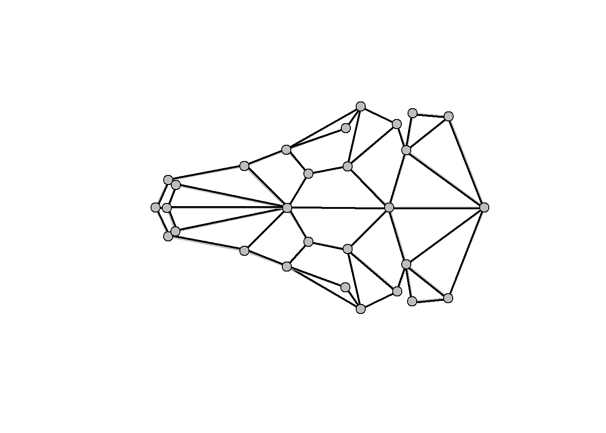

```r
plotRefToTarget(cv2min,cv2max,links=links.tuco,method="points") 
```

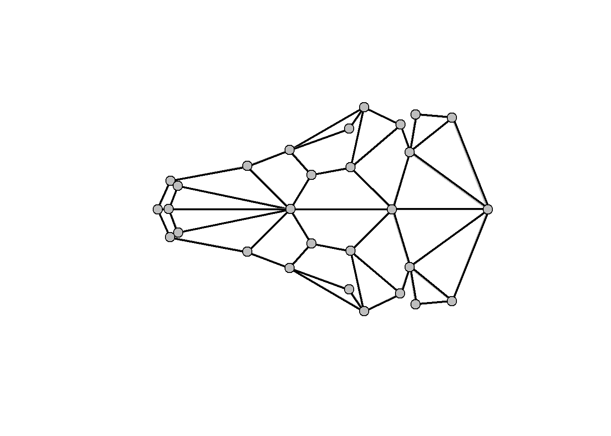

Veja também os modelos linares para discriminação de grupos no subcapítulo correspondente.


## Exercício – Análise de Componentes Principais
Usando os mesmos dados deste exercício, faça uma PCA com a função própria do pacote *geomorph*, e uma PCA com a função 'prcomp’. Qual a diferença entre as duas PCAs? Como a diferença pode ser explicada?


