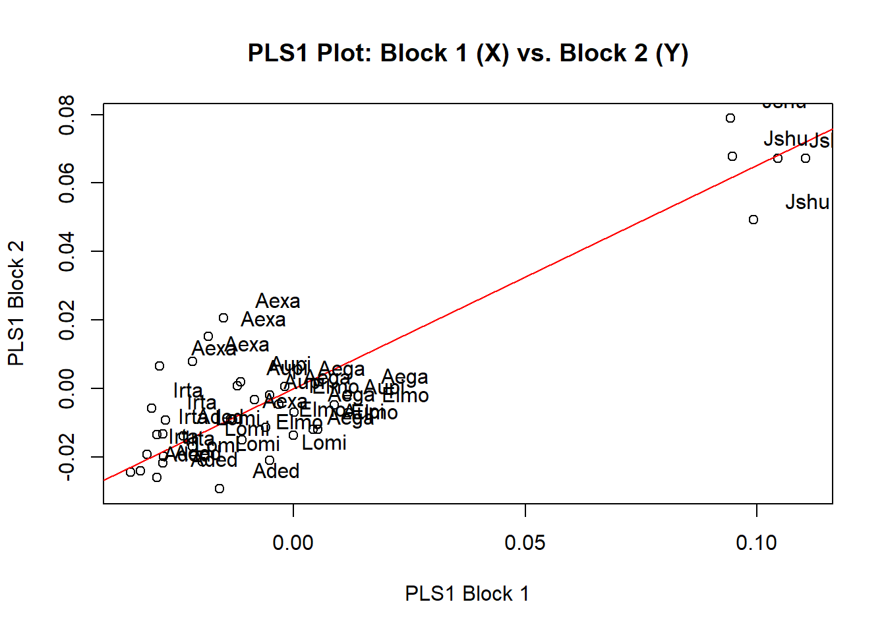
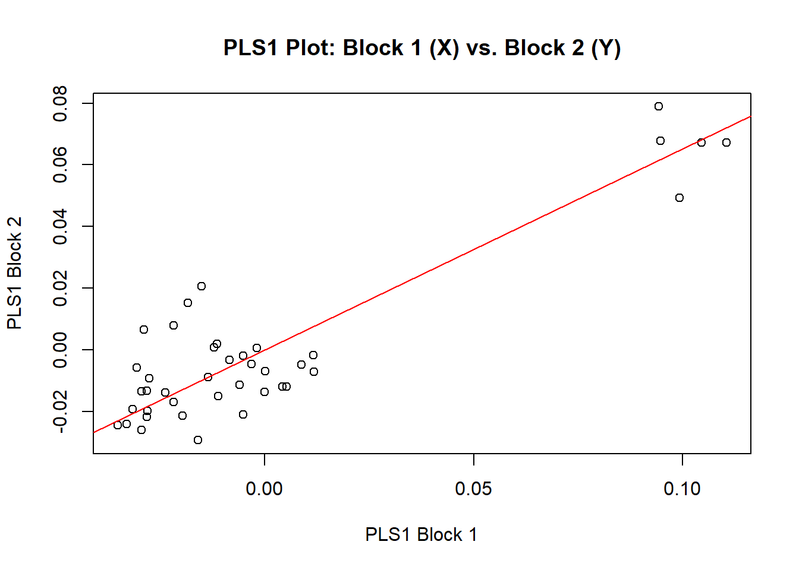
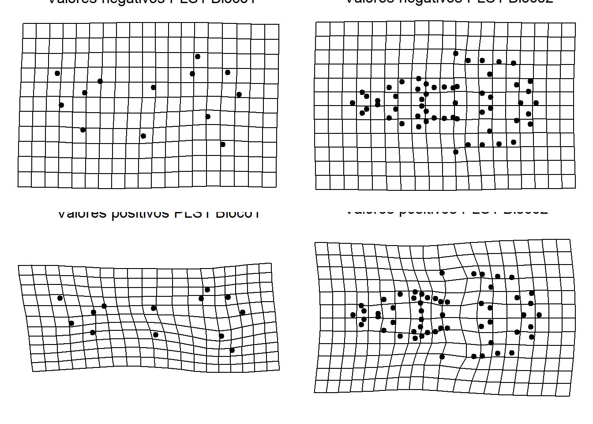

# Partial Least Squares

Partial Least Squares (PLS) é um método que explora padrões de covariação entre dois ou mais blocos de variáveis. De modo similar à PCA/CVA, a PLS cria eixos ortogonais que, neste caso, explicam a covariância entre blocos. Em análises de MG, um dos blocos normalmente é a forma. O(s) bloco(s) adicional pode ser composto, por exemplo, por um grupo de variáveis climáticas, geográficas e/ou bióticas ou por outros descritores fenotípicos. Além disso, as variáveis dentro dos blocos não precisam ser independentes uma da outra, e o número de variáveis pode exceder o número de observações. Os blocos de variáveis podem conter variáveis de diversas naturezas (contínuas, categóricas). É importante que a ordem de entrada dos dados corresponda entre os dois blocos.

No exemplo, vamos explorar a covariação entre a forma do crânio e a forma da mandíbula de roedores sigmodontíneos.

Carregar dados.

```r
require(geomorph)
#> Carregando pacotes exigidos: geomorph
#> Carregando pacotes exigidos: RRPP
#> Carregando pacotes exigidos: rgl
#> Carregando pacotes exigidos: Matrix
# Carregar arquivo tps com a vista ventral do crânio
tps.v<-readland.tps("dadosmg/ventral.dig_curso.pls.tps",specID = "ID", readcurves = FALSE)
# Matriz com os pares de landmarks simétricos
pairs.matrix<-
matrix(c(2,3,4,5,6,7,8,9,10,11,12,13,14,15,16,17,18,24,22,28,23,29,19,25,20,26,21,27,30,31,33,34,35,36,37,38,39,40,41,42,43,44,45,46,47,48,49,50,51,52,55,56),nrow=26,ncol=2,byrow=T)
ind.v<-c(1:dim(tps.v)[3]) # vetor indivíduos
# GPA - Simetria bilateral - Extrair componente simetrico da forma
b.s<-bilat.symmetry(tps.v,ind=ind.v,object.sym=TRUE,land.pairs=pairs.matrix)
shape.v<-b.s$symm.shape # componente simétrico da forma
dimnames(shape.v)=dimnames(tps.v) #manter os nomes dos espécimes
shape.v
# Forma média ventral
ref.ventral<-mshape(shape.v)

# Carregar arquivo tps da mandíbula
tps<-readland.tps("dadosmg/mandibula.dig_curso.pls.tps",specID = "ID", readcurves = FALSE)
gpa<-gpagen(tps)
shape<-gpa$coords
size<-gpa$Csize
ref.mand<-mshape(shape)
```

Carregar classificadores a partir de lista externa.

```r
plan<-read.table("dadosmg/Planilha_PLS.txt",h=T)
plan
species.pls<-plan[,2]
species.pls
```

Partial Least Squares - PLS.

```r
pls<-two.b.pls(shape,shape.v,iter=999)
#> 
#> Random PLS calculations: 1000 permutations.
#> 
  |                                                        
  |                                                  |   0%
  |                                                        
  |                                                  |   1%
  |                                                        
  |=                                                 |   1%
  |                                                        
  |=                                                 |   2%
  |                                                        
  |=                                                 |   3%
  |                                                        
  |==                                                |   3%
  |                                                        
  |==                                                |   4%
  |                                                        
  |==                                                |   5%
  |                                                        
  |===                                               |   5%
  |                                                        
  |===                                               |   6%
  |                                                        
  |===                                               |   7%
  |                                                        
  |====                                              |   7%
  |                                                        
  |====                                              |   8%
  |                                                        
  |====                                              |   9%
  |                                                        
  |=====                                             |   9%
  |                                                        
  |=====                                             |  10%
  |                                                        
  |=====                                             |  11%
  |                                                        
  |======                                            |  11%
  |                                                        
  |======                                            |  12%
  |                                                        
  |======                                            |  13%
  |                                                        
  |=======                                           |  13%
  |                                                        
  |=======                                           |  14%
  |                                                        
  |=======                                           |  15%
  |                                                        
  |========                                          |  15%
  |                                                        
  |========                                          |  16%
  |                                                        
  |========                                          |  17%
  |                                                        
  |=========                                         |  17%
  |                                                        
  |=========                                         |  18%
  |                                                        
  |=========                                         |  19%
  |                                                        
  |==========                                        |  19%
  |                                                        
  |==========                                        |  20%
  |                                                        
  |==========                                        |  21%
  |                                                        
  |===========                                       |  21%
  |                                                        
  |===========                                       |  22%
  |                                                        
  |===========                                       |  23%
  |                                                        
  |============                                      |  23%
  |                                                        
  |============                                      |  24%
  |                                                        
  |============                                      |  25%
  |                                                        
  |=============                                     |  25%
  |                                                        
  |=============                                     |  26%
  |                                                        
  |=============                                     |  27%
  |                                                        
  |==============                                    |  27%
  |                                                        
  |==============                                    |  28%
  |                                                        
  |==============                                    |  29%
  |                                                        
  |===============                                   |  29%
  |                                                        
  |===============                                   |  30%
  |                                                        
  |===============                                   |  31%
  |                                                        
  |================                                  |  31%
  |                                                        
  |================                                  |  32%
  |                                                        
  |================                                  |  33%
  |                                                        
  |=================                                 |  33%
  |                                                        
  |=================                                 |  34%
  |                                                        
  |=================                                 |  35%
  |                                                        
  |==================                                |  35%
  |                                                        
  |==================                                |  36%
  |                                                        
  |==================                                |  37%
  |                                                        
  |===================                               |  37%
  |                                                        
  |===================                               |  38%
  |                                                        
  |===================                               |  39%
  |                                                        
  |====================                              |  39%
  |                                                        
  |====================                              |  40%
  |                                                        
  |====================                              |  41%
  |                                                        
  |=====================                             |  41%
  |                                                        
  |=====================                             |  42%
  |                                                        
  |=====================                             |  43%
  |                                                        
  |======================                            |  43%
  |                                                        
  |======================                            |  44%
  |                                                        
  |======================                            |  45%
  |                                                        
  |=======================                           |  45%
  |                                                        
  |=======================                           |  46%
  |                                                        
  |=======================                           |  47%
  |                                                        
  |========================                          |  47%
  |                                                        
  |========================                          |  48%
  |                                                        
  |========================                          |  49%
  |                                                        
  |=========================                         |  49%
  |                                                        
  |=========================                         |  50%
  |                                                        
  |=========================                         |  51%
  |                                                        
  |==========================                        |  51%
  |                                                        
  |==========================                        |  52%
  |                                                        
  |==========================                        |  53%
  |                                                        
  |===========================                       |  53%
  |                                                        
  |===========================                       |  54%
  |                                                        
  |===========================                       |  55%
  |                                                        
  |============================                      |  55%
  |                                                        
  |============================                      |  56%
  |                                                        
  |============================                      |  57%
  |                                                        
  |=============================                     |  57%
  |                                                        
  |=============================                     |  58%
  |                                                        
  |=============================                     |  59%
  |                                                        
  |==============================                    |  59%
  |                                                        
  |==============================                    |  60%
  |                                                        
  |==============================                    |  61%
  |                                                        
  |===============================                   |  61%
  |                                                        
  |===============================                   |  62%
  |                                                        
  |===============================                   |  63%
  |                                                        
  |================================                  |  63%
  |                                                        
  |================================                  |  64%
  |                                                        
  |================================                  |  65%
  |                                                        
  |=================================                 |  65%
  |                                                        
  |=================================                 |  66%
  |                                                        
  |=================================                 |  67%
  |                                                        
  |==================================                |  67%
  |                                                        
  |==================================                |  68%
  |                                                        
  |==================================                |  69%
  |                                                        
  |===================================               |  69%
  |                                                        
  |===================================               |  70%
  |                                                        
  |===================================               |  71%
  |                                                        
  |====================================              |  71%
  |                                                        
  |====================================              |  72%
  |                                                        
  |====================================              |  73%
  |                                                        
  |=====================================             |  73%
  |                                                        
  |=====================================             |  74%
  |                                                        
  |=====================================             |  75%
  |                                                        
  |======================================            |  75%
  |                                                        
  |======================================            |  76%
  |                                                        
  |======================================            |  77%
  |                                                        
  |=======================================           |  77%
  |                                                        
  |=======================================           |  78%
  |                                                        
  |=======================================           |  79%
  |                                                        
  |========================================          |  79%
  |                                                        
  |========================================          |  80%
  |                                                        
  |========================================          |  81%
  |                                                        
  |=========================================         |  81%
  |                                                        
  |=========================================         |  82%
  |                                                        
  |=========================================         |  83%
  |                                                        
  |==========================================        |  83%
  |                                                        
  |==========================================        |  84%
  |                                                        
  |==========================================        |  85%
  |                                                        
  |===========================================       |  85%
  |                                                        
  |===========================================       |  86%
  |                                                        
  |===========================================       |  87%
  |                                                        
  |============================================      |  87%
  |                                                        
  |============================================      |  88%
  |                                                        
  |============================================      |  89%
  |                                                        
  |=============================================     |  89%
  |                                                        
  |=============================================     |  90%
  |                                                        
  |=============================================     |  91%
  |                                                        
  |==============================================    |  91%
  |                                                        
  |==============================================    |  92%
  |                                                        
  |==============================================    |  93%
  |                                                        
  |===============================================   |  93%
  |                                                        
  |===============================================   |  94%
  |                                                        
  |===============================================   |  95%
  |                                                        
  |================================================  |  95%
  |                                                        
  |================================================  |  96%
  |                                                        
  |================================================  |  97%
  |                                                        
  |================================================= |  97%
  |                                                        
  |================================================= |  98%
  |                                                        
  |================================================= |  99%
  |                                                        
  |==================================================|  99%
  |                                                        
  |==================================================| 100%
pls
#> 
#> Call:
#> two.b.pls(A1 = shape, A2 = shape.v, iter = 999) 
#> 
#> 
#> 
#> r-PLS: 0.897
#> 
#> Effect Size (Z): 4.257
#> 
#> P-value: 0.001
#> 
#> Based on 1000 random permutations

plot(pls,label=species.pls)
```



É possível visualizar as mudanças de forma ao longo dos eixos da PLS de diferentes maneiras.
Uma delas é usando uma função interativa do pacote *geomorph*

```r
pls.plot<-plot(pls)
```



```r
#picknplot.shape(pls.plot)
```

A maneira mais tradicional é encontrar as formas a partir dos valores nos eixos da PLS.

```r
pls<-two.b.pls(shape,shape.v,iter=999)
plot(pls,label=species.pls)

# Valores mínimos e máximos do pls plot
preds.v<-shape.predictor(shape.v,two.d.array(shape),method="PLS",
                         Vmin=min(pls$XScores[,1]),
                         Vmax=max(pls$XScores[,1])) 
preds.v

# Valores mínimos e máximos do pls2
pls2<-two.b.pls(shape.v,shape,iter=999)
plot(pls2,label=species.pls)

preds.m<-shape.predictor(shape,two.d.array(shape.v),method="PLS",
                         Mmin=min(pls2$XScores[,1]),
                         Mmax=max(pls2$XScores[,1])) 
preds.m
```

Visualização das formas mínimas e máximas dos eixos da PLS.

```r
{plot(pls,label=species.pls)
par(mfrow=c(2,2),mar=c(0.01,0.01,0.01,0.01))
plotRefToTarget(ref.mand,preds.m$Mmax)
text(0,0.4,labels="Valores negativos PLS1 Bloco1",cex=1.3)
plotRefToTarget(ref.ventral,preds.v$Vmin)
text(0,0.25,labels="Valores negativos PLS1 Bloco2",cex=1.3)
plotRefToTarget(ref.mand,preds.m$Mmin)
text(0,0.4,labels="Valores positivos PLS1 Bloco1",cex=1.3)
plotRefToTarget(ref.ventral,preds.v$Vmax)
text(0,0.25,labels="Valores positivos PLS1 Bloco2",cex=1.3)}
```



```r
par(mfrow=c(1,1))
```


