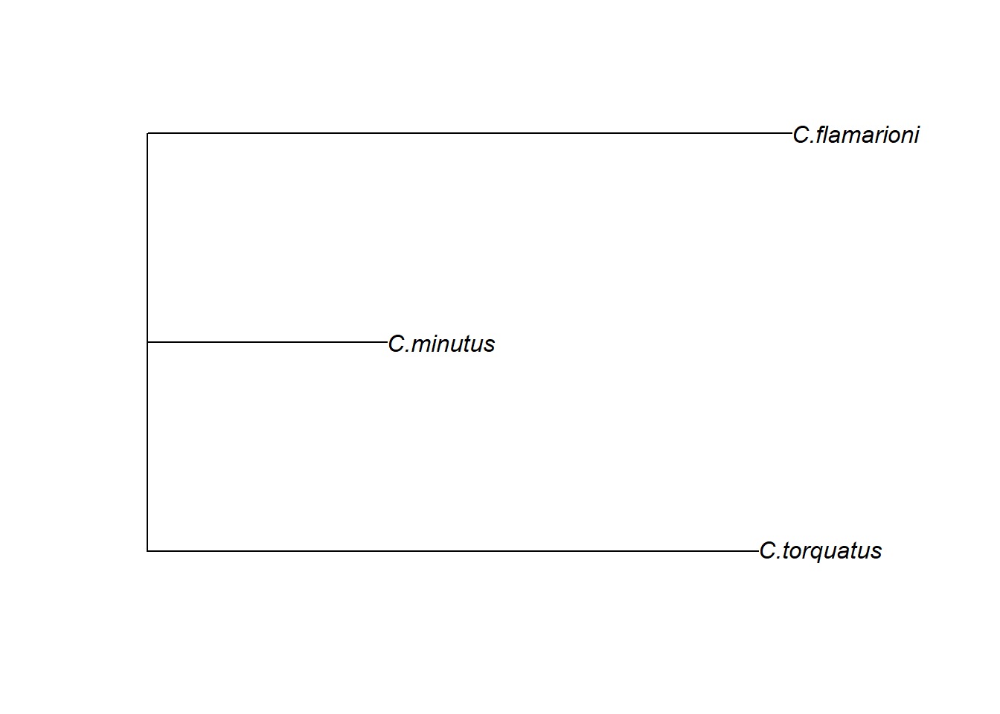

# Modelos lineares para discriminação de grupos

Uma classe ampla de modelos preditivos está abarcada pelo nome de Modelos Lineares Generalizados, incluindo regressão múltipla e análises de variância/covariância. Uma vasta gama de modelos pode ser ajustada com a função 'procD.lm' e outras do pacote *geomorph*, que usa distância de Procrustes entre espécimes para calcular tamanhos de efeito e randomização para calcular valores de *P* (de modo equivalente à MANOVA não paramétrica -- [@goodall1991; @pillar1996; @anderson2001]; assim, o número de variáveis de forma, normalmente muito alto em dados de MG, não é uma restrição ao ajuste de modelos @collyer2015. Podemos usar esses modelos baseados em distância para responder diversas questões quando a variável resposta é composta por variáveis de forma. Aqui, vamos aplicá-los no contexto de discriminação de grupos, quando a variável preditora é categórica.

## MANOVA

Vamos testar se existem diferenças de forma entre espécies de tuco-tucos.


```r
require(geomorph)
#> Carregando pacotes exigidos: geomorph
#> Carregando pacotes exigidos: RRPP
#> Carregando pacotes exigidos: rgl
#> Carregando pacotes exigidos: Matrix
# Carregar dados
tps<-readland.tps("dadosmg/Lista tuco dig 2.tps",specID = "ID", readcurves = FALSE)
dim(tps)

# Gerar matriz com pares de landmarks simétricos
pairs.matrix<-matrix(c(2,3,5,6,7,8,10,11,12,13,14,15,16,17,18,19,20,21,23,24,25,26,27,28),nrow=12,ncol=2,byrow=T)
# Vetor indivíduos
ind<-c(1:dim(tps)[3])

# GPA - Simetria bilateral 
b.s<-bilat.symmetry(tps,ind=ind,object.sym=TRUE,land.pairs=pairs.matrix)

# Matriz de forma
shape.sym<-b.s$symm.shape

# Carregar classificadores a partir de lista externa
plan<-read.table("dadosmg/Planilha Ctenomys.txt",h=T)
plan
species<-plan[,1]
species<-as.factor(species)
sex<-plan[,2]
sex<-as.factor(sex)
sp.sex<-plan[,3]
sp.sex<-as.factor(sp.sex)
```

MANOVA.


```r
# MANOVA (Multivariate Analysis of Variance)
manova<-procD.lm(shape.sym~species, iter=999, RRPP= TRUE)
summary(manova)
#> 
#> Analysis of Variance, using Residual Randomization
#> Permutation procedure: Randomization of null model residuals 
#> Number of permutations: 1000 
#> Estimation method: Ordinary Least Squares 
#> Sums of Squares and Cross-products: Type I 
#> Effect sizes (Z) based on F distributions
#> 
#>           Df       SS        MS     Rsq      F      Z
#> species    2 0.019283 0.0096414 0.46942 11.944 4.7202
#> Residuals 27 0.021795 0.0008072 0.53058              
#> Total     29 0.041078                                
#>           Pr(>F)   
#> species    0.001 **
#> Residuals          
#> Total              
#> ---
#> Signif. codes:  
#> 0 '***' 0.001 '**' 0.01 '*' 0.05 '.' 0.1 ' ' 1
#> 
#> Call: procD.lm(f1 = shape.sym ~ species, iter = 999, RRPP = TRUE)

manova.sex<-procD.lm(shape.sym~sex, iter=999, RRPP= TRUE)
summary(manova.sex)
#> 
#> Analysis of Variance, using Residual Randomization
#> Permutation procedure: Randomization of null model residuals 
#> Number of permutations: 1000 
#> Estimation method: Ordinary Least Squares 
#> Sums of Squares and Cross-products: Type I 
#> Effect sizes (Z) based on F distributions
#> 
#>           Df       SS        MS     Rsq      F      Z
#> sex        1 0.002892 0.0028915 0.07039 2.1202 1.4855
#> Residuals 28 0.038187 0.0013638 0.92961              
#> Total     29 0.041078                                
#>           Pr(>F)  
#> sex        0.077 .
#> Residuals         
#> Total             
#> ---
#> Signif. codes:  
#> 0 '***' 0.001 '**' 0.01 '*' 0.05 '.' 0.1 ' ' 1
#> 
#> Call: procD.lm(f1 = shape.sym ~ sex, iter = 999, RRPP = TRUE)

manova.completa<-procD.lm(shape.sym~species*sex, iter=999, RRPP= TRUE)
summary(manova.completa)
#> 
#> Analysis of Variance, using Residual Randomization
#> Permutation procedure: Randomization of null model residuals 
#> Number of permutations: 1000 
#> Estimation method: Ordinary Least Squares 
#> Sums of Squares and Cross-products: Type I 
#> Effect sizes (Z) based on F distributions
#> 
#>             Df       SS        MS     Rsq       F      Z
#> species      2 0.019283 0.0096414 0.46942 13.9065 4.9897
#> sex          1 0.002892 0.0028915 0.07039  4.1707 3.5268
#> species:sex  2 0.002264 0.0011322 0.05512  1.6331 1.7627
#> Residuals   24 0.016639 0.0006933 0.40506               
#> Total       29 0.041078                                 
#>             Pr(>F)   
#> species      0.001 **
#> sex          0.001 **
#> species:sex  0.036 * 
#> Residuals            
#> Total                
#> ---
#> Signif. codes:  
#> 0 '***' 0.001 '**' 0.01 '*' 0.05 '.' 0.1 ' ' 1
#> 
#> Call: procD.lm(f1 = shape.sym ~ species * sex, iter = 999, RRPP = TRUE)

# MANOVA Wilks's lambda
PCA<-gm.prcomp(shape.sym)
manova.w<-manova(PCA$x[,1:26]~species)
summary(manova.w,test="Wilks")
#>           Df      Wilks approx F num Df den Df  Pr(>F)  
#> species    2 7.9746e-05    8.537     52      4 0.02414 *
#> Residuals 27                                            
#> ---
#> Signif. codes:  
#> 0 '***' 0.001 '**' 0.01 '*' 0.05 '.' 0.1 ' ' 1

manova.w.sex<-manova(PCA$x[,1:26]~sex)
summary(manova.w.sex,test="Wilks")
#>           Df    Wilks approx F num Df den Df  Pr(>F)  
#> sex        1 0.021083   5.3575     26      3 0.09549 .
#> Residuals 28                                          
#> ---
#> Signif. codes:  
#> 0 '***' 0.001 '**' 0.01 '*' 0.05 '.' 0.1 ' ' 1
```

Além da resposta geral, é interessante obter comparações par a par.


```r
# Pairwise comparisons
require(RRPP)
manova.pairwise<-pairwise(manova,groups=species)
summary(manova.pairwise)
#> 
#> Pairwise comparisons
#> 
#> Groups: C.flamarioni C.minutus C.torquatus 
#> 
#> RRPP: 1000 permutations
#> 
#> LS means:
#> Vectors hidden (use show.vectors = TRUE to view)
#> 
#> Pairwise distances between means, plus statistics
#>                                   d  UCL (95%)        Z
#> C.flamarioni:C.minutus   0.03831876 0.02502431 3.065210
#> C.flamarioni:C.torquatus 0.05438892 0.02542406 4.093932
#> C.minutus:C.torquatus    0.03685612 0.02512571 2.914480
#>                          Pr > d
#> C.flamarioni:C.minutus    0.003
#> C.flamarioni:C.torquatus  0.001
#> C.minutus:C.torquatus     0.001
```

Manova par a par "manual".


```r
# Manova par a par
gdf.1<- geomorph.data.frame(coords=shape.sym[,,which(species=="C.flamarioni"|species=="C.minutus")],species=species[species=="C.flamarioni" | species=="C.minutus"])
manova.par1<-procD.lm(coords~species, iter=999, data = gdf.1)
manova.par1
summary(manova.par1)
gdf.2<-
  geomorph.data.frame(coords=shape.sym[,,which(species=="C.flamarioni"|species=="C.torquatus")],species=species[species=="C.flamarioni" | species=="C.torquatus"])
manova.par2<-procD.lm(coords~species, iter=999, data = gdf.2)
manova.par2
summary(manova.par2)
gdf.3<-
  geomorph.data.frame(coords=shape.sym[,,which(species=="C.minutus"|species=="C.torquatus")],species=species[species=="C.minutus" | species=="C.torquatus"])
manova.par3<-procD.lm(coords~species, iter=999, data = gdf.3)
manova.par3
summary(manova.par3)
```

## Fenograma

Dependendo da pergunta de estudo, fenogramas podem ser úteis para visualizar os padrões de diferenciação de forma em um formato de árvore de distâncias morfológicas. Aqui, vamos criar um fenograma com distâncias de Procrustes e agrupamento de Neighbot-Joining.


```r
obj<-summary(manova.pairwise)
obj$pairwise.tables$D
means.dist<-obj$pairwise.tables$D
require(ape)
#> Carregando pacotes exigidos: ape
fen<-nj(means.dist)
plot(fen)
```



```r
plot(fen,type="unrooted")
```


