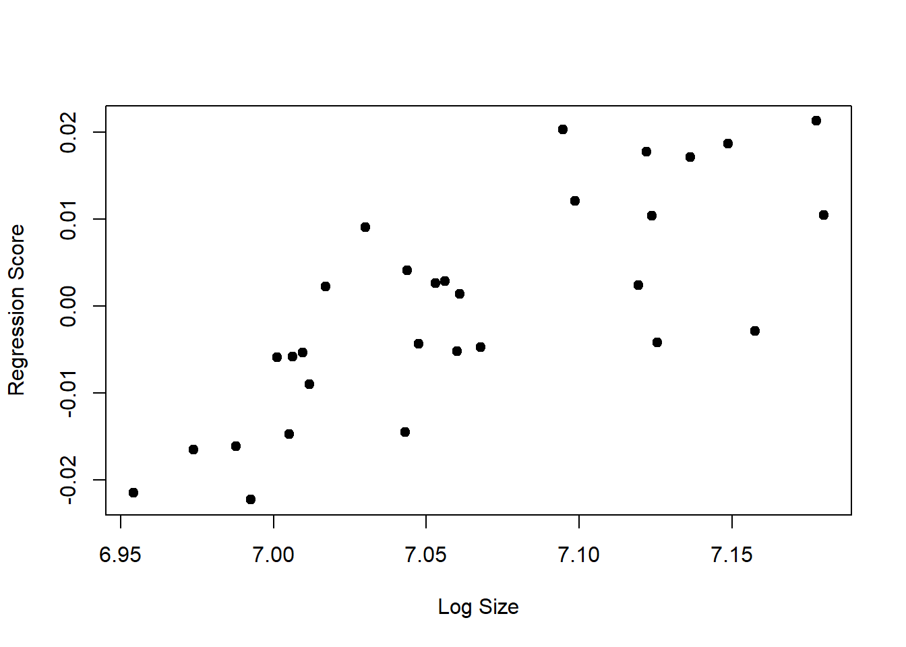
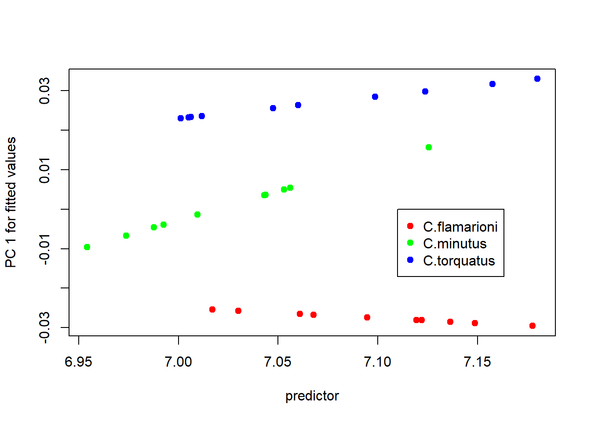

# Alometria

De acordo com a escola Gould-Mosimann, alometria é covariação entre tamanho e forma. Esse conceito faz sentido em Morfometria Geométrica (MG), já que há uma distinção formal entre tamanho e forma. Assim, podemos testar se existe uma associação entre forma e tamanho, ou seja, alometria, ou se não existe tal associação, ou seja, isometria. Em MG, isso é tradicionalmente feito através de uma regressão multivariada da forma sobre o tamanho do centróide.

A alometria é classicamente dividida em três níveis: *estática* (dentro de uma amostra homogênea, ex: adultos de uma população), *ontogenética* (ao longo do desenvolvimento, ex: indivíduos de diferentes idades em uma população) e *evolutiva* (entre várias espécies). A forma e a magnitude das relações alométricas dentro e entre grupos oferecem oportunidades interessantes para entender processos biológicos. Em alguns casos, pode-se também estar interessado em correção de tamanho/alometria nos dados, casos estes onde é fundamental investigar se há uma tendência alométrica comum aos dados (ou seja, quando as relações alométricas não diferem entre grupos).

Para textos abrangentes sobre alometria, veja: @zelditch2012; @klingenberg2016.

## Alometria simples

Vamos investigar se a forma e o tamanho do crânio de tuco-tucos estão associados.


```r
require(geomorph)
#> Carregando pacotes exigidos: geomorph
#> Carregando pacotes exigidos: RRPP
#> Carregando pacotes exigidos: rgl
#> Carregando pacotes exigidos: Matrix
# Carregar dados
tps<-readland.tps("dadosmg/Lista tuco dig 2.tps",specID = "ID", readcurves = FALSE)
dim(tps)

# Gerar matriz com pares de landmarks simétricos
pairs.matrix<-matrix(c(2,3,5,6,7,8,10,11,12,13,14,15,16,17,18,19,20,21,23,24,25,26,27,28),nrow=12,ncol=2,byrow=T)
# Vetor indivíduos
ind<-c(1:dim(tps)[3])

# GPA - Extrair tamanho do centróide
gpa<-gpagen(tps)
size<-gpa$Csize

# GPA - Simetria bilateral 
b.s<-bilat.symmetry(tps,ind=ind,object.sym=TRUE,land.pairs=pairs.matrix)

# Matriz de forma
shape.sym<-b.s$symm.shape

# Carregar classificadores a partir de lista externa
plan<-read.table("dadosmg/Planilha Ctenomys.txt",h=T)
plan
species<-plan[,1]
species<-as.factor(species)
sex<-plan[,2]
sex<-as.factor(sex)
sp.sex<-plan[,3]
sp.sex<-as.factor(sp.sex)
```

Usaremos um modelo linear multivariado para testar a associação entre tamanho e forma. Também podemos visualizar a relação entre tamanho e forma em um espaço bivariado. Pra isso, precisamos resumir a variação de forma em um único vetor, o que pode ser feito de algumas maneiras. A maneira mais interessante é usar *regresion scores* (Drake & Klingenberg 2008) que retornam uma variável de forma que tem covariação máxima com o tamanho do centróide.


```r
# Alometria simples
alometria<-procD.lm(shape.sym~log(size),iter=999)
summary(alometria)
#> 
#> Analysis of Variance, using Residual Randomization
#> Permutation procedure: Randomization of null model residuals 
#> Number of permutations: 1000 
#> Estimation method: Ordinary Least Squares 
#> Sums of Squares and Cross-products: Type I 
#> Effect sizes (Z) based on F distributions
#> 
#>           Df       SS        MS     Rsq      F      Z
#> log(size)  1 0.002667 0.0026672 0.06493 1.9443 1.4121
#> Residuals 28 0.038411 0.0013718 0.93507              
#> Total     29 0.041078                                
#>           Pr(>F)  
#> log(size)  0.082 .
#> Residuals         
#> Total             
#> ---
#> Signif. codes:  
#> 0 '***' 0.001 '**' 0.01 '*' 0.05 '.' 0.1 ' ' 1
#> 
#> Call: procD.lm(f1 = shape.sym ~ log(size), iter = 999)
plot(alometria,type="regression",predictor=log(size),
     reg.type = "RegScore", pch=19, xlab="Log Size")
```



Finalmente, mas não menos importante, vamos visualizar as diferenças de forma entre valores diferentes de tamanho.


```r
plot.alometria<-plot(alometria,type="regression",predictor=log(size),
     reg.type = "RegScore", pch=19, xlab="Log Size")
```


```r
preds<-shape.predictor(alometria$GM$fitted, x = plot.alometria$RegScore, 
                        predmin = min(plot.alometria$RegScore), 
                        predmax = max(plot.alometria$RegScore))
ref <-mshape(shape.sym)
# Menores tamanhos
plotRefToTarget(ref, preds$predmin, mag=2)
```


```r
# Maiores tamanhos
plotRefToTarget(ref, preds$predmax, mag=2)
```


## Correção de efeitos alométricos

A correção de tamanho/alometria em estudos de MG pode ser feita usando os resíduos da regressão multivariada da forma sobre o tamanho do centróide em análises posteriores. Se a amostra for composta por grupos biológicos, é importante primeiro investigar se há uma tendência alométrica comum entre os grupos.


```r
shape.resid<-
  arrayspecs(alometria$residuals,p=dim(shape.sym)[1],k=dim(shape.sym)[2]) #size adjusted residuals
adj.shape<-shape.resid+array(gpa$consensus, dim(shape.resid)) # allometry-free shapes--somar a média retorna os números para o espaço de forma original e permite a visualização de mudanças de forma

# PCA of allometry-free shape space
PCA<-gm.prcomp(adj.shape)
plot(PCA,axis1=1, axis2=2)
```


## Comparação de trajetórias alométricas entre grupos

A análise de alometria considerando grupos (e.g., espécies, habitats) pode revelar se as relações alométricas (e.g., inclinação, ângulo, e comprimento das retas) são diferentes entre os grupos. Em outras palavras, é possível testar a homogeneidade ou heterogeneidade dos *slopes*/inclinações. Se as relações alométricas diferirem, a pergunta a ser respondida é quais fatores causam as diferenças alométricas.


```r
# Teste de Homogeneidade de Slopes
alometria.HOS<-procD.lm(shape.sym~log(size)*species,iter=999)
summary(alometria.HOS)
#> 
#> Analysis of Variance, using Residual Randomization
#> Permutation procedure: Randomization of null model residuals 
#> Number of permutations: 1000 
#> Estimation method: Ordinary Least Squares 
#> Sums of Squares and Cross-products: Type I 
#> Effect sizes (Z) based on F distributions
#> 
#>                   Df       SS        MS     Rsq       F
#> log(size)          1 0.002667 0.0026672 0.06493  3.7930
#> species            2 0.019233 0.0096167 0.46821 13.6760
#> log(size):species  2 0.002301 0.0011507 0.05602  1.6364
#> Residuals         24 0.016876 0.0007032 0.41083        
#> Total             29 0.041078                          
#>                        Z Pr(>F)   
#> log(size)         2.4779  0.006 **
#> species           4.6694  0.001 **
#> log(size):species 1.7715  0.040 * 
#> Residuals                         
#> Total                             
#> ---
#> Signif. codes:  
#> 0 '***' 0.001 '**' 0.01 '*' 0.05 '.' 0.1 ' ' 1
#> 
#> Call: procD.lm(f1 = shape.sym ~ log(size) * species, iter = 999)
# Comparando com modelo nulo
alometria.nulo<-procD.lm(shape.sym~size+species,iter=999)
anova(alometria.nulo,alometria.HOS) # R2 do modelo full é a diferença entre modelos
#> 
#> Sums of Squares calculations for 1 model: 1000 permutations.
#> 
  |                                                        
  |                                                  |   0%
  |                                                        
  |                                                  |   1%
  |                                                        
  |=                                                 |   1%
  |                                                        
  |=                                                 |   2%
  |                                                        
  |=                                                 |   3%
  |                                                        
  |==                                                |   3%
  |                                                        
  |==                                                |   4%
  |                                                        
  |==                                                |   5%
  |                                                        
  |===                                               |   5%
  |                                                        
  |===                                               |   6%
  |                                                        
  |===                                               |   7%
  |                                                        
  |====                                              |   7%
  |                                                        
  |====                                              |   8%
  |                                                        
  |====                                              |   9%
  |                                                        
  |=====                                             |   9%
  |                                                        
  |=====                                             |  10%
  |                                                        
  |=====                                             |  11%
  |                                                        
  |======                                            |  11%
  |                                                        
  |======                                            |  12%
  |                                                        
  |======                                            |  13%
  |                                                        
  |=======                                           |  13%
  |                                                        
  |=======                                           |  14%
  |                                                        
  |=======                                           |  15%
  |                                                        
  |========                                          |  15%
  |                                                        
  |========                                          |  16%
  |                                                        
  |========                                          |  17%
  |                                                        
  |=========                                         |  17%
  |                                                        
  |=========                                         |  18%
  |                                                        
  |=========                                         |  19%
  |                                                        
  |==========                                        |  19%
  |                                                        
  |==========                                        |  20%
  |                                                        
  |==========                                        |  21%
  |                                                        
  |===========                                       |  21%
  |                                                        
  |===========                                       |  22%
  |                                                        
  |===========                                       |  23%
  |                                                        
  |============                                      |  23%
  |                                                        
  |============                                      |  24%
  |                                                        
  |============                                      |  25%
  |                                                        
  |=============                                     |  25%
  |                                                        
  |=============                                     |  26%
  |                                                        
  |=============                                     |  27%
  |                                                        
  |==============                                    |  27%
  |                                                        
  |==============                                    |  28%
  |                                                        
  |==============                                    |  29%
  |                                                        
  |===============                                   |  29%
  |                                                        
  |===============                                   |  30%
  |                                                        
  |===============                                   |  31%
  |                                                        
  |================                                  |  31%
  |                                                        
  |================                                  |  32%
  |                                                        
  |================                                  |  33%
  |                                                        
  |=================                                 |  33%
  |                                                        
  |=================                                 |  34%
  |                                                        
  |=================                                 |  35%
  |                                                        
  |==================                                |  35%
  |                                                        
  |==================                                |  36%
  |                                                        
  |==================                                |  37%
  |                                                        
  |===================                               |  37%
  |                                                        
  |===================                               |  38%
  |                                                        
  |===================                               |  39%
  |                                                        
  |====================                              |  39%
  |                                                        
  |====================                              |  40%
  |                                                        
  |====================                              |  41%
  |                                                        
  |=====================                             |  41%
  |                                                        
  |=====================                             |  42%
  |                                                        
  |=====================                             |  43%
  |                                                        
  |======================                            |  43%
  |                                                        
  |======================                            |  44%
  |                                                        
  |======================                            |  45%
  |                                                        
  |=======================                           |  45%
  |                                                        
  |=======================                           |  46%
  |                                                        
  |=======================                           |  47%
  |                                                        
  |========================                          |  47%
  |                                                        
  |========================                          |  48%
  |                                                        
  |========================                          |  49%
  |                                                        
  |=========================                         |  49%
  |                                                        
  |=========================                         |  50%
  |                                                        
  |=========================                         |  51%
  |                                                        
  |==========================                        |  51%
  |                                                        
  |==========================                        |  52%
  |                                                        
  |==========================                        |  53%
  |                                                        
  |===========================                       |  53%
  |                                                        
  |===========================                       |  54%
  |                                                        
  |===========================                       |  55%
  |                                                        
  |============================                      |  55%
  |                                                        
  |============================                      |  56%
  |                                                        
  |============================                      |  57%
  |                                                        
  |=============================                     |  57%
  |                                                        
  |=============================                     |  58%
  |                                                        
  |=============================                     |  59%
  |                                                        
  |==============================                    |  59%
  |                                                        
  |==============================                    |  60%
  |                                                        
  |==============================                    |  61%
  |                                                        
  |===============================                   |  61%
  |                                                        
  |===============================                   |  62%
  |                                                        
  |===============================                   |  63%
  |                                                        
  |================================                  |  63%
  |                                                        
  |================================                  |  64%
  |                                                        
  |================================                  |  65%
  |                                                        
  |=================================                 |  65%
  |                                                        
  |=================================                 |  66%
  |                                                        
  |=================================                 |  67%
  |                                                        
  |==================================                |  67%
  |                                                        
  |==================================                |  68%
  |                                                        
  |==================================                |  69%
  |                                                        
  |===================================               |  69%
  |                                                        
  |===================================               |  70%
  |                                                        
  |===================================               |  71%
  |                                                        
  |====================================              |  71%
  |                                                        
  |====================================              |  72%
  |                                                        
  |====================================              |  73%
  |                                                        
  |=====================================             |  73%
  |                                                        
  |=====================================             |  74%
  |                                                        
  |=====================================             |  75%
  |                                                        
  |======================================            |  75%
  |                                                        
  |======================================            |  76%
  |                                                        
  |======================================            |  77%
  |                                                        
  |=======================================           |  77%
  |                                                        
  |=======================================           |  78%
  |                                                        
  |=======================================           |  79%
  |                                                        
  |========================================          |  79%
  |                                                        
  |========================================          |  80%
  |                                                        
  |========================================          |  81%
  |                                                        
  |=========================================         |  81%
  |                                                        
  |=========================================         |  82%
  |                                                        
  |=========================================         |  83%
  |                                                        
  |==========================================        |  83%
  |                                                        
  |==========================================        |  84%
  |                                                        
  |==========================================        |  85%
  |                                                        
  |===========================================       |  85%
  |                                                        
  |===========================================       |  86%
  |                                                        
  |===========================================       |  87%
  |                                                        
  |============================================      |  87%
  |                                                        
  |============================================      |  88%
  |                                                        
  |============================================      |  89%
  |                                                        
  |=============================================     |  89%
  |                                                        
  |=============================================     |  90%
  |                                                        
  |=============================================     |  91%
  |                                                        
  |==============================================    |  91%
  |                                                        
  |==============================================    |  92%
  |                                                        
  |==============================================    |  93%
  |                                                        
  |===============================================   |  93%
  |                                                        
  |===============================================   |  94%
  |                                                        
  |===============================================   |  95%
  |                                                        
  |================================================  |  95%
  |                                                        
  |================================================  |  96%
  |                                                        
  |================================================  |  97%
  |                                                        
  |================================================= |  97%
  |                                                        
  |================================================= |  98%
  |                                                        
  |================================================= |  99%
  |                                                        
  |==================================================|  99%
  |                                                        
  |==================================================| 100%
#> 
#> Analysis of Variance, using Residual Randomization
#> Permutation procedure: Randomization of null model residuals 
#> Number of permutations: 1000 
#> Estimation method: Ordinary Least Squares 
#> Effect sizes (Z) based on F distributions
#> 
#>                                   ResDf Df      RSS
#> shape.sym ~ size + species (Null)    26  1 0.019228
#> shape.sym ~ log(size) * species      24  2 0.016876
#> Total                                29    0.041078
#>                                          SS        MS
#> shape.sym ~ size + species (Null)                    
#> shape.sym ~ log(size) * species   0.0023522 0.0011761
#> Total                                                
#>                                        Rsq      F      Z
#> shape.sym ~ size + species (Null) 0.000000              
#> shape.sym ~ log(size) * species   0.057263 1.6726 1.8423
#> Total                                                   
#>                                       P Pr(>F)
#> shape.sym ~ size + species (Null)             
#> shape.sym ~ log(size) * species   0.034       
#> Total
```

Visualizando trajetórias alométricas.


```r
# Definindo cores para grupos
col.group<-rainbow(length(levels(species))) # criar vetor de cores para grupos
names(col.group)<-levels(species)
col.group<-col.group[match(species,names(col.group))]

# Plot RegScore
{plotAllometry(alometria.HOS,size=size,logsz=TRUE,
              method="RegScore",pch=19,col=col.group)
legend(7.125,-0.007,legend=unique(species),pch=19,col=unique(col.group))}
```


```r

# Plot fitted values
{plotAllometry(alometria.HOS,size=size,logsz=TRUE,
              method="PredLine",pch=19,col=col.group)
legend(7.11,0.00,legend=unique(species),pch=19,col=unique(col.group))}
```



Diferenças de magnitude e orientação das retas.


```r
# Diferenças de magnitude (comprimento das retas)
allo.mancova<-pairwise(alometria.HOS,groups=species)
summary(allo.mancova)
names(allo.mancova)
summary(allo.mancova, confidence = 0.95, test.type = "DL")

# Diferenças de orientação/direção dos vetores (ângulos, vector correlation)
summary(allo.mancova,confidence = 0.95,test.type = "VC", angle.type = "deg")
```
