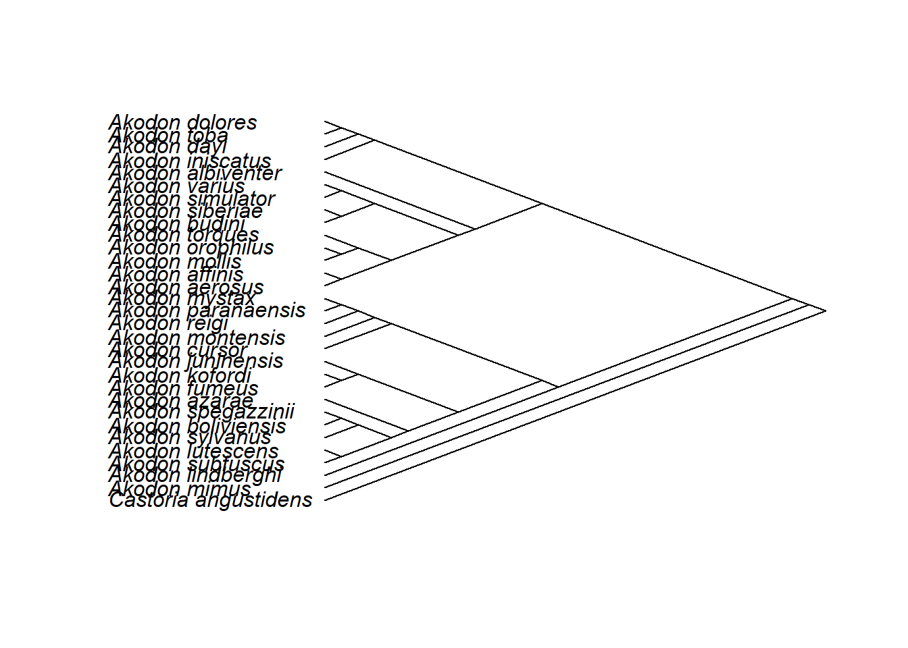
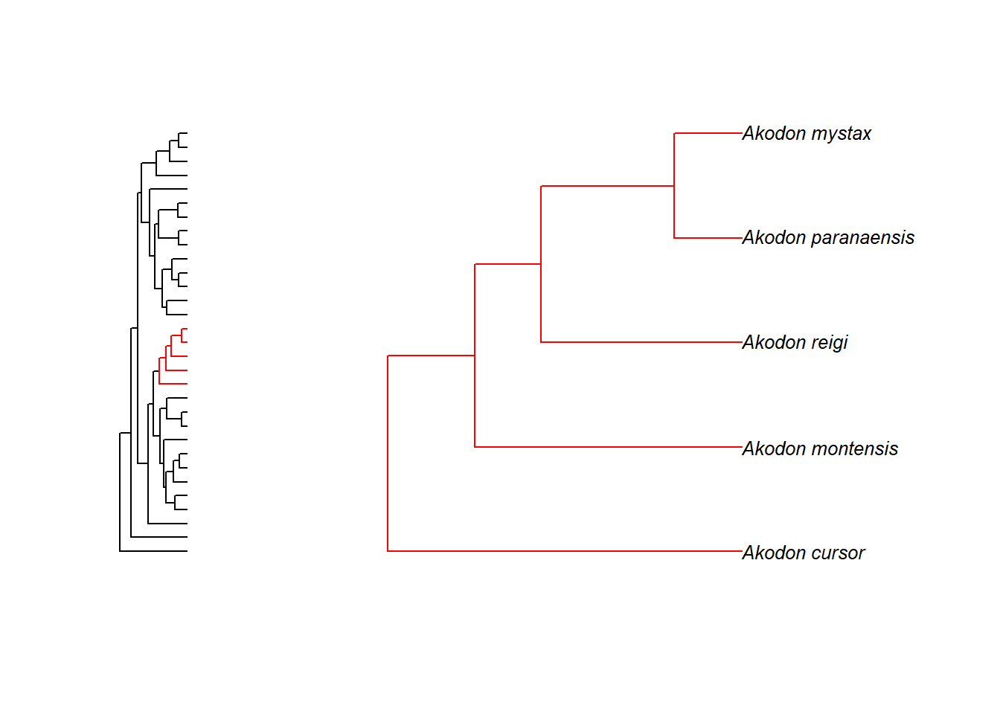
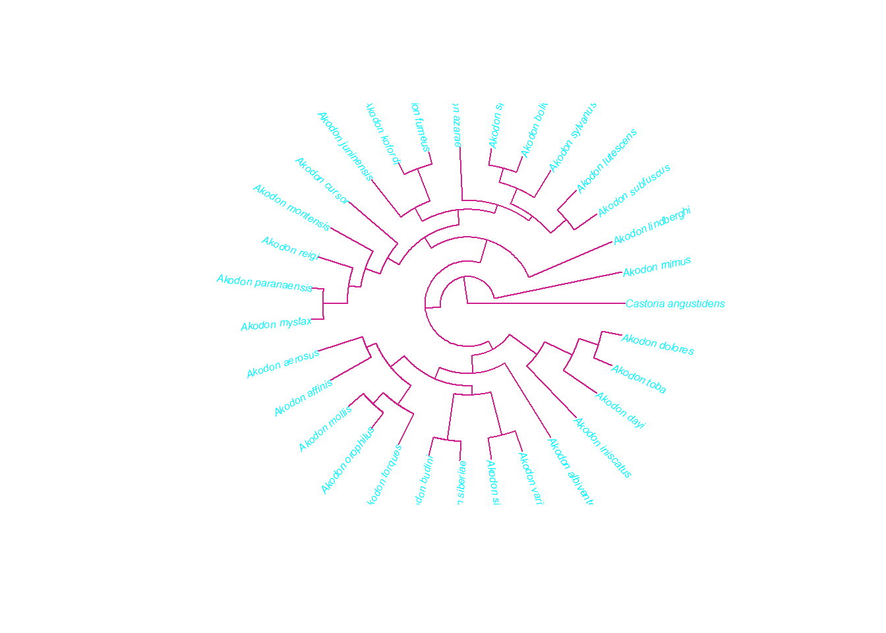
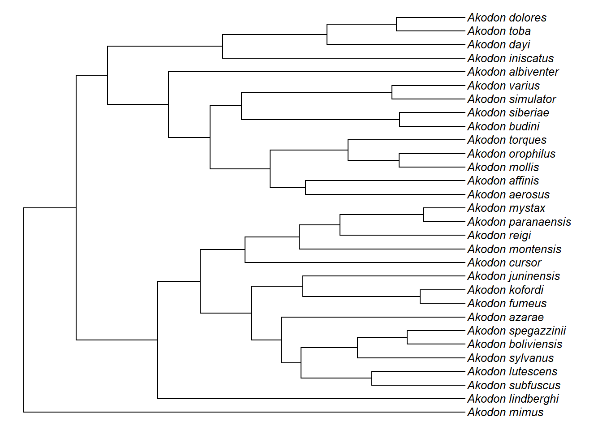
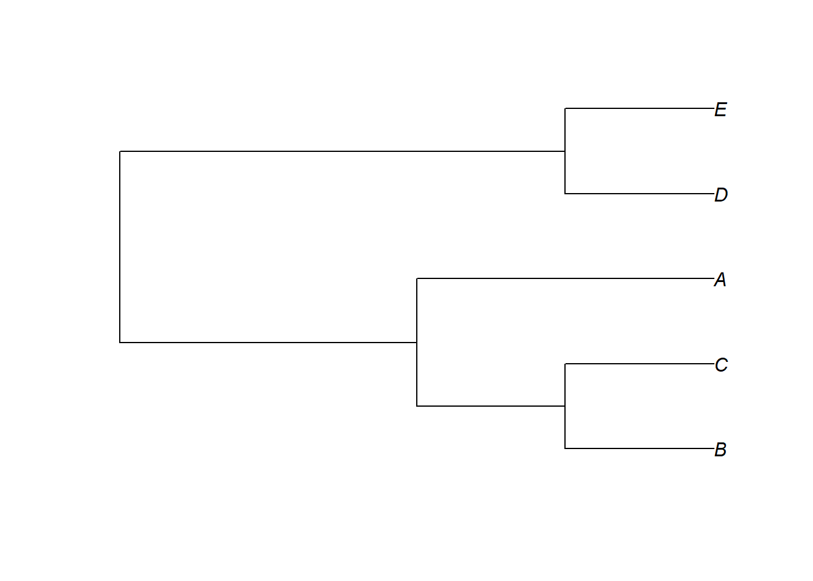
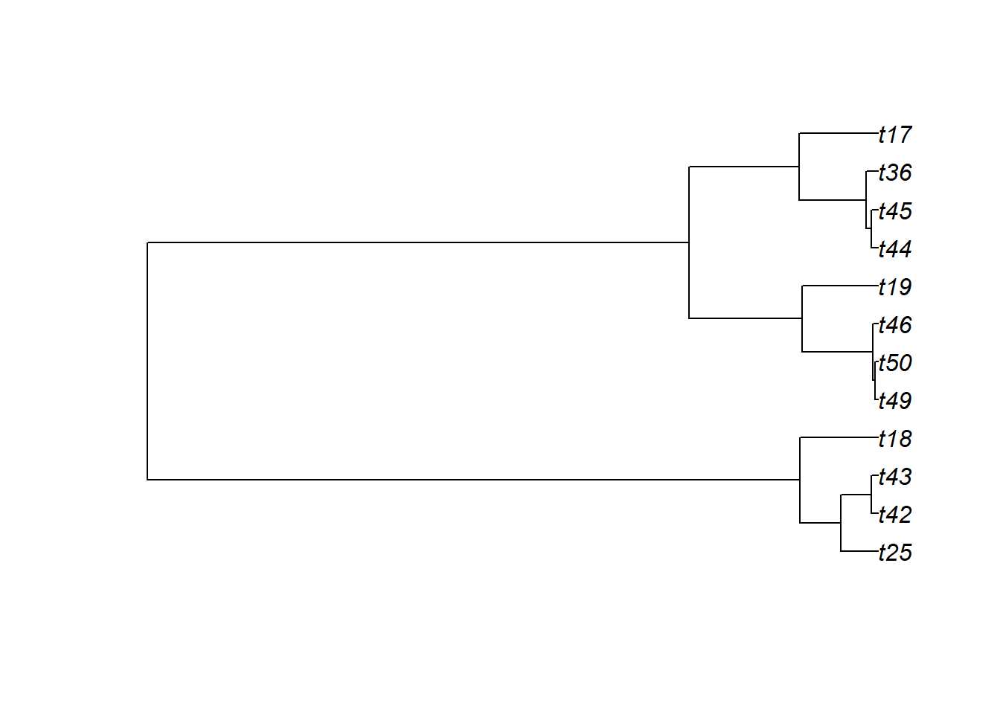

# Lendo e manipulando árvores filogenéticas no R

É aconselhável criar um único diretório contendo a(s) árvore(s) e os dados fenotípicos, e informar ao R de qual diretório os arquivos devem ser lidos. Árvores filogenéticas podem ser importadas facilmente para dentro do ambiente R através de funções como read.tree e read.nexus do pacote *ape*.

Neste capítulo, vamos explorar algumas maneiras de representar graficamente as árvores filogenéticas e manipulá-las. Para entender mais sobre a estrutura da árvore em formato phylo volte ao [Capítulo 2](#cap2) do manual.

Vamos ler uma árvore filogenética do gênero de roedores neotropicais *Akodon* e representá-la graficamente.


```r
require(ape)
#> Le chargement a nécessité le package : ape
akodon.tree<-read.tree(file="dadospcm/akodon.tree")
akodon.tree
#> 
#> Phylogenetic tree with 31 tips and 30 internal nodes.
#> 
#> Tip labels:
#>   Castoria_angustidens, Akodon_mimus, Akodon_lindberghi, Akodon_subfuscus, Akodon_lutescens, Akodon_sylvanus, ...
#> Node labels:
#>   474, 475, 476, 477, 479, 480, ...
#> 
#> Rooted; includes branch lengths.
# Existem muitas formas de plotar a árvore
plot(akodon.tree)
```


```r
# cladograma orientado pra esquerda
plot(akodon.tree, type = "c", use.edge.length = FALSE,direction="l")
```


```r
# nomes alinhados à esquerda
plot(akodon.tree, type = "c", use.edge.length = FALSE,direction="l",adj=0)
```



```r
# visualizar partes da árvore com zoom
zoom(akodon.tree, 13:17, subtree = FALSE, cex = 0.8)
```



```r
par(mfrow=c(1,1))
# mudando cores
plot(akodon.tree, type = "fan", edge.color = "violetred", tip.color = "turquoise1",
 cex = 0.5)
```



```r
# com o pacote phytools
require(phytools)
#> Le chargement a nécessité le package : phytools
#> Le chargement a nécessité le package : maps
plotTree(akodon.tree,ftype="i",fsize=0.8,lwd=1)
```


```r
# filograma arredondado
roundPhylogram(akodon.tree)
```


```r
# cladograma desenraizado (unrooted)
plot(unroot(akodon.tree),type="unrooted",cex=0.8,use.edge.length=FALSE,lab4ut="axial")
```


```r
# árvore circular (fan tree)
plotTree(akodon.tree,type="fan",fsize=0.8,lwd=1,ftype="i")
```


```r
# Legenda dos comprimento de ramos
{plotTree(akodon.tree,ftype="i",fsize=0.8,lwd=1,mar=c(3.0,0.1,0.1,0.1))
axisPhylo()}
```


## Extraindo subclados ou espécies da árvore

Podemos remover ou manter apenas determinadas espécies ou subclados da árvore. Pra isso, as espécies devem estar identificadas pelos seus nomes (tip labels) ou os subclados pelo nome ou número do nó que identifica o ancestral comum mais recente do subclado. Abaixo estão exemplificadas as duas formas.


```r
akodon.tree$tip.label
# Exemplo: identificar as espécies do gênero com ocorrência no sul do Brasil
sul.especies<-
c("Akodon_paranaensis","Akodon_azarae","Akodon_reigi","Akodon_montensis","Cast
oria_angustidens")
# remover essas espécies da árvore
akodon.drop<-drop.tip(akodon.tree,sul.especies)
akodon.drop
plotTree(akodon.tree,ftype="i",fsize=0.8,lwd=1)
```


```r
plotTree(akodon.drop,ftype="i",fsize=0.8,lwd=1)
```


```r
# ou manter apenas essas espécies na árvore
akodon.drop1<-drop.tip(akodon.tree,setdiff(akodon.tree$tip.label,sul.especies))
akodon.drop1
plotTree(akodon.drop1,ftype="i",fsize=0.8,lwd=1)
```


```r
# extrair um subclado da árvore
{plotTree(akodon.tree,ftype="i",fsize=0.8,lwd=1)
nodelabels()}
```


```r
clado1<-extract.clade(akodon.tree,node=35)
plotTree(clado1,ftype="i",fsize=0.8,lwd=1)
```


```r
# remover o clado
akodon.noclado1<-drop.tip(akodon.tree,clado1$tip.label)
akodon.noclado1
plotTree(akodon.noclado1,ftype="i",fsize=0.8,lwd=1)
```


```r
# função interativa do phytools para remover clados
akodon.col<-collapseTree(akodon.tree)
```


```r
plotTree(akodon.col,ftype="i",fsize=0.8,lwd=1)
```



## Incerteza filogenética

Uma árvore filogenética é uma hipótese sobre as relações de parentesco entre aquelas espécies. Assim, é recomendável avaliar a incerteza resultante do uso de hipóteses alternativas. Uma das maneiras de fazer isso é repetindo as análises de interesse para um conjunto de árvores (hipóteses).

### Politomias

Uma das fontes de incerteza filogenética são as politomias. Algumas das funções implementando métodos comparativos no R, que veremos, vão aceitar ávores com politomias, outras funções não vão. Podemos considerar incerteza filogenética ao resolver aleatoriamente as politomias um grande número de vezes, e considerar todas as hipóteses alternativas nos nossos testes estatísticos. Uma das maneiras mais simples de resolver politomias no R é usando a função multi2di do pacote *ape*.

```r
ex<-read.tree(text="((A,B,C),(D,E));")
plot(ex)
```


```r
is.binary(ex)
# resolver ao acaso uma única vez
ex1<-multi2di(ex)
plot(ex1)
```



```r
is.binary(ex1)
```
Lembre-se que ao resolver apenas 1 vez ao acaso não existe avaliação de incerteza filogenética, é preciso repetir o processo um determinado número de vezes, que vai depender de quantas instâncias de politomia estiverem presentes na árvore, e quantas espécies estiverem nas politomias. Existem outros métodos que permitem gerar múltiplas árvores com as politomias resolvidas ao acaso. Por exemplo: [sunplin](https://bioinfo.inf.ufg.br/sunplin/)- @rangel2015.

### Multiplas árvores
Múltiplas filogenias são úteis quando queremos incorporar incerteza filogenética, por  exemplo, replicando as mesmas análises em múltiplas árvores.
Árvores múltiplas pertencem ao objeto de classe multiPhylo, que é uma lista de  filogenias da classe phylo. Muitas funções podem prontamente ser aplicadas tanto para phylo como para multiPhylo. Algumas vão exigir a replicação em cada filogenia separada.
Vamos juntar as árvores que criamos até aqui para exemplificar um objeto multiPhylo.

```r
akodon.trees<-c(akodon.tree,akodon.drop,akodon.drop1,clado1,akodon.noclado1)
akodon.trees
class(akodon.trees)
print(akodon.trees,details=TRUE)
str(akodon.trees[1])
```

Um exemplo para uso de funções em múltiplas árvores, uma por vez, exemplificado com o recorte de uma parte da árvore.

```r
# Extraindo clados de múltiplas árvores
trees<-pbtree(n=50,nsim=100)
trees
plot(trees[[1]])
```


```r
tree_cortado<- vector(mode = "list", length(trees))
for(i in 1:length(trees)){
 tree_cortado[[i]]<-keep.tip(trees[[i]], tip=trees[[1]]$tip.label[1:12])
}
tree_cortado
plot(tree_cortado[[1]])
```



