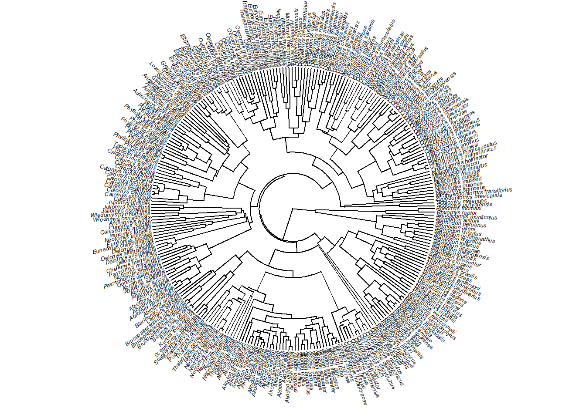
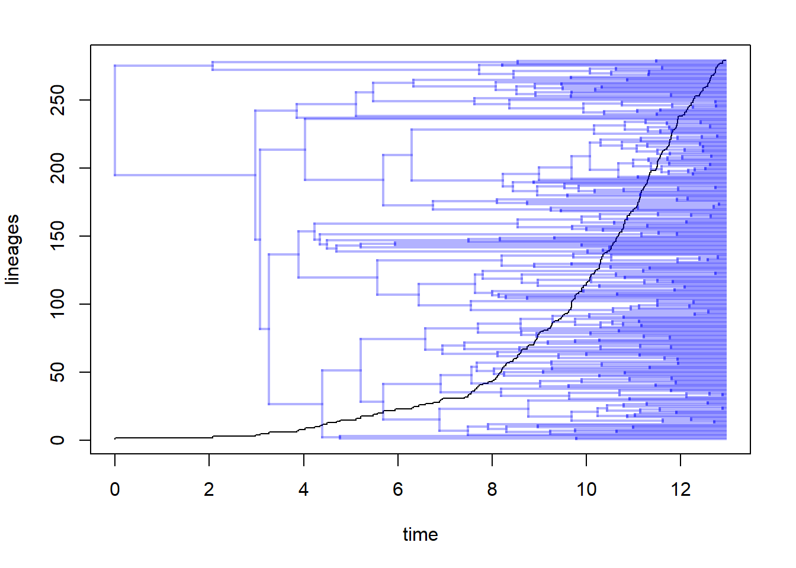
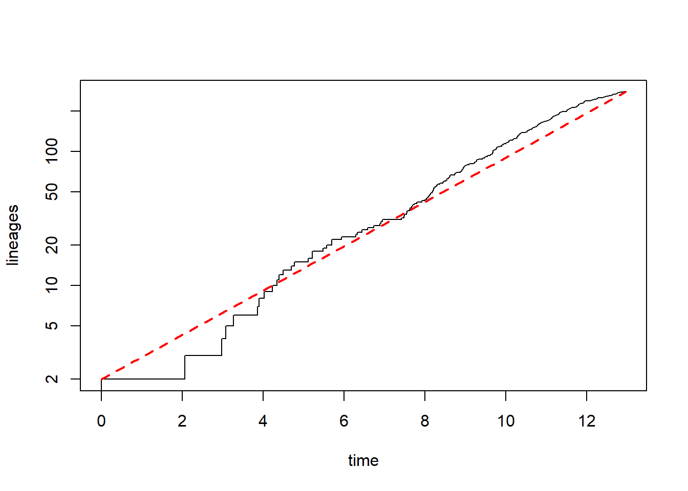
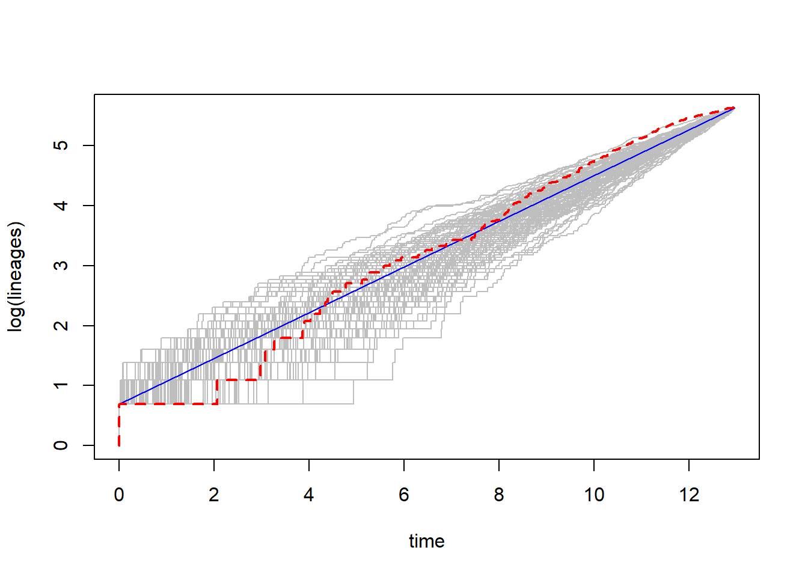
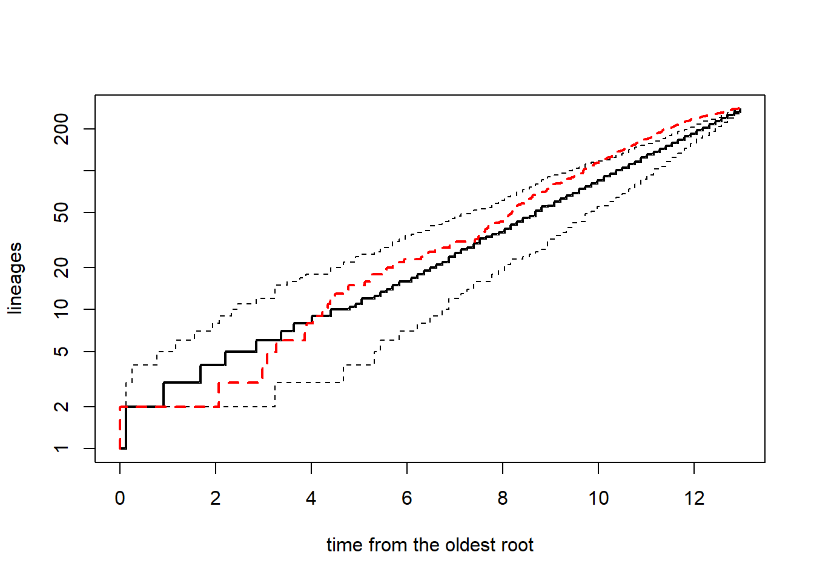
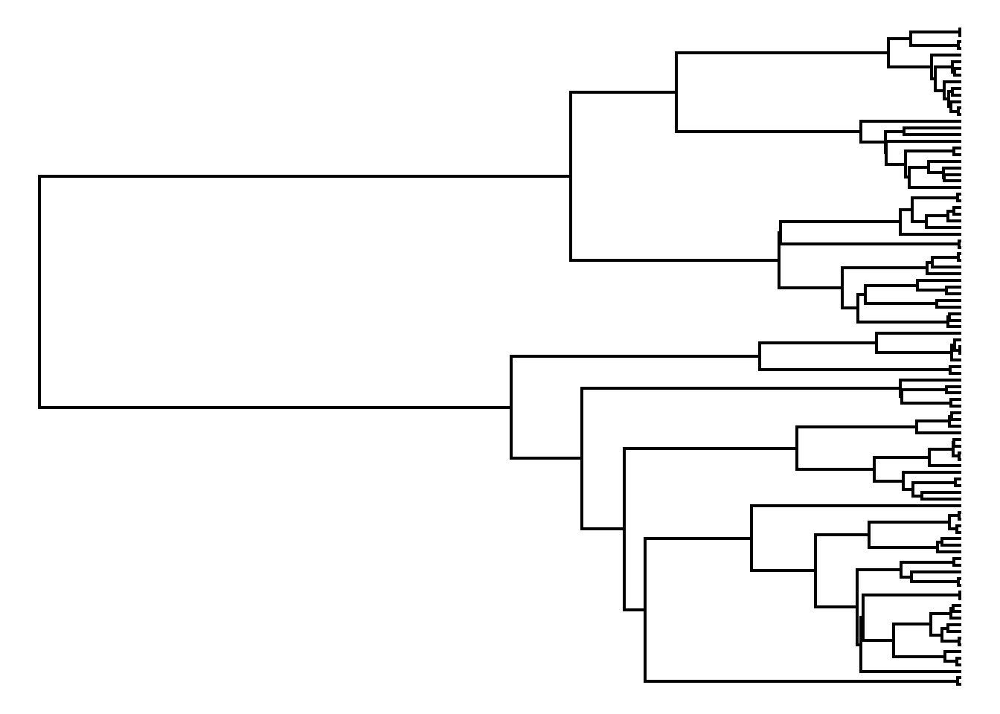
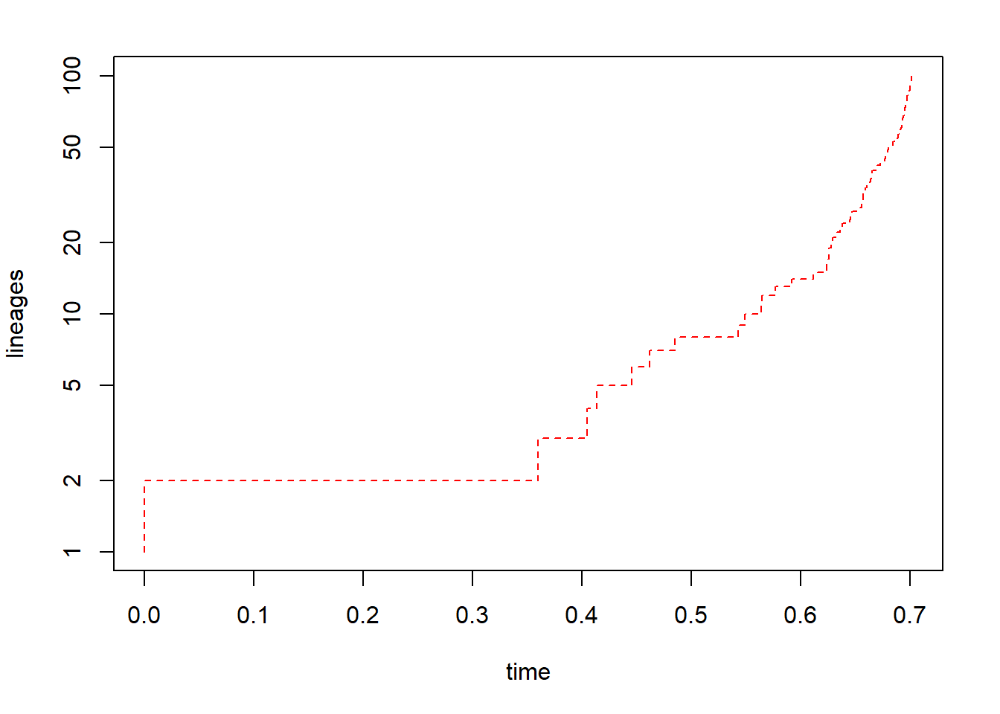
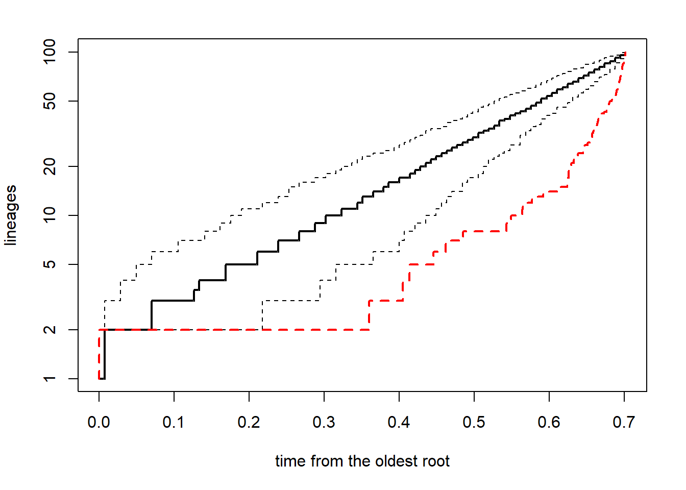

# Diversificação de linhagens

Esse exemplo implementa os gráficos de acúmulo de linhagens ao longo do tempo (*lineage through time plots*) e a estatística γ. Aqui, estamos assumindo especiação constante ao longo do tempo e entre linhagens (*pure-birth*), e nenhuma extinção.

Carregar hipótese filogenética.

```r
require(ape)
#> Le chargement a nécessité le package : ape
require(geiger)
#> Le chargement a nécessité le package : geiger
#> Le chargement a nécessité le package : phytools
#> Le chargement a nécessité le package : maps
require(phytools)
# Filogenia
tree<-read.nexus("dadospcm/sigmodontinae-tree.tre")
plotTree(tree,fsize=0.4,ftype="i",type="fan",lwd=1)
```


A árvore tem 279 espécies, de um total de 400 (70%). Idealmente deveria haver 100% de amostragem.

*Lineage through time plots*.

```r
# LTT plot
par(mfrow=c(1,1),mar=c(5,4,2,2))
obj.ltt<-ltt(tree,log.lineages=FALSE)
obj.ltt
# Tree background
plot(obj.ltt,show.tree=TRUE,log.lineages=FALSE)
```



Sob *pure-birth* (só especiação) o número de linhagens deve crescer exponencialmente com o tempo. Isso se traduz em uma expectativa linear em escala semi-logarítmica: o eixo vertical em log e o horizontal em escala linear.

```r
{plot(obj.ltt,log.lineages=FALSE,log="y",ylim=c(2,Ntip(tree)))
# comparando com o que seria esperado sob pure-birth (linha reta)
h<-max(nodeHeights(tree)) # idade máxima da arvore
x<-seq(0,h,by=h/100)
b<-(log(Ntip(tree))-log(2))/h # birth-rate
lines(x,2*exp(b*x),col="red",lty="dashed",lwd=2)}
```



É possível comparar o LTT observado com múltiplas simulações de LTT sob um modelo *pure-birth* assumindo o mesmo período de tempo e resultando no mesmo número de espécies que a nossa árvore de interesse.

```r
trees<-pbtree(n=Ntip(tree),scale=h,nsim=100,quiet=TRUE) # nsim=999
obj.trees<-ltt(trees,plot=FALSE)
{plot(obj.trees,col="grey")
lines(c(0,h),log(c(2,Ntip(tree))),col="blue")
# arvore original
ltt(tree,add=TRUE,col="red",lty="dashed",lwd=2)}
```



```r
# Intervalo de confiança 95%
{ltt95(trees,log=TRUE)
plot(obj.ltt,add=TRUE,col="red",lty="dashed",lwd=2,log.lineages=FALSE)}
```



Estatística γ.

```r
obj.ltt<-ltt(tree,log.lineages=FALSE,plot=FALSE)
obj.ltt
gammatest(obj.ltt)
```

Como exemplo, vamos simular uma árvore que retorne um gamma positivo.

```r
# Exemplo de gamma positivo
coal.tree<-rcoal(n=100)
plotTree(coal.tree,ftype="off")
```



```r
par(mfrow=c(1,1),mar=c(5,4,2,2))
obj<-ltt(coal.tree,log.lineages=FALSE,log="y",col="red",lty="dashed")
```



```r
obj
# comparação com pure-birth
trees<-pbtree(n=100,nsim=200,scale=max(nodeHeights(coal.tree)))
{ltt95(trees,log=TRUE)
ltt(coal.tree,add=TRUE,log.lineages=FALSE,col="red",lwd=2,lty="dashed")}
```



