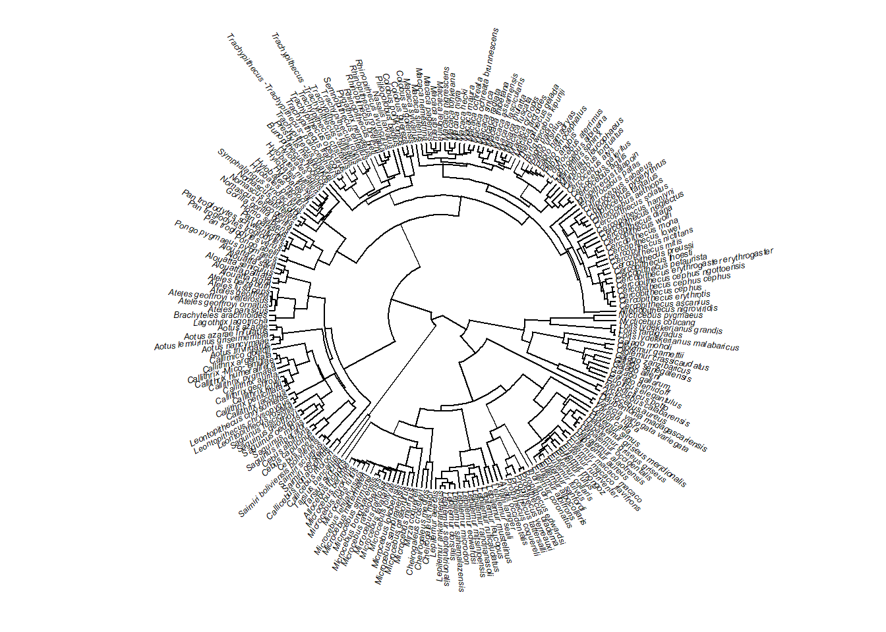
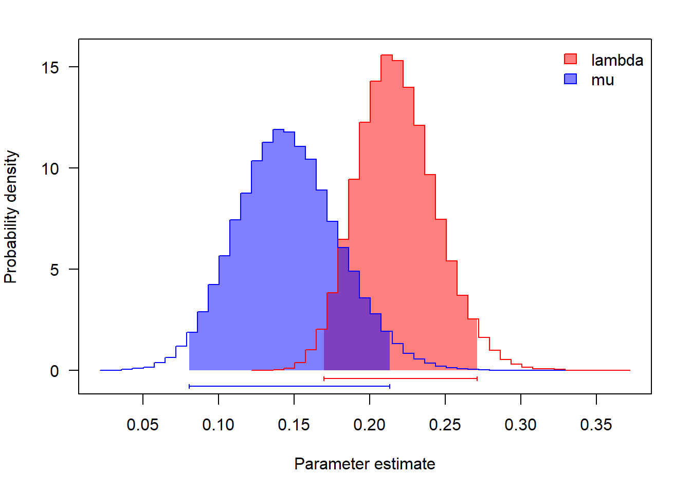
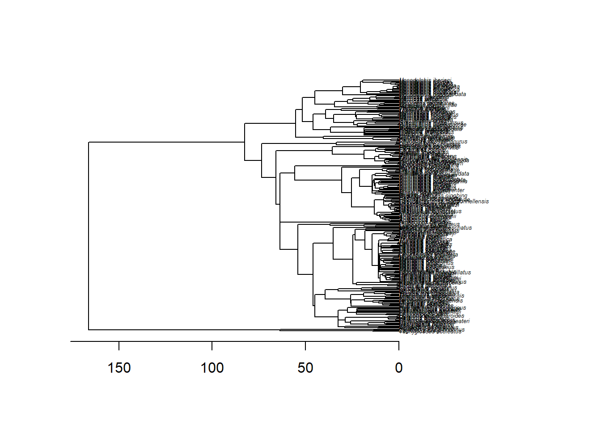
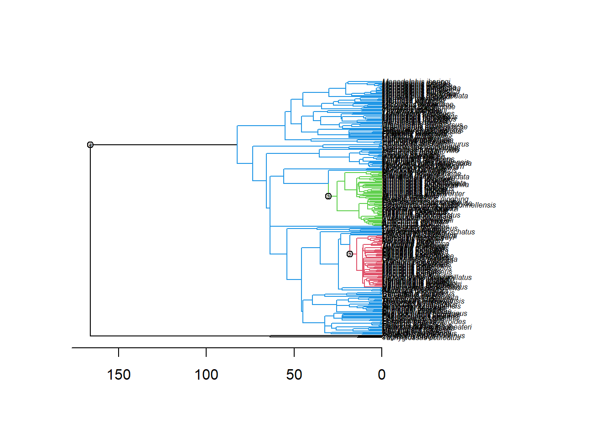
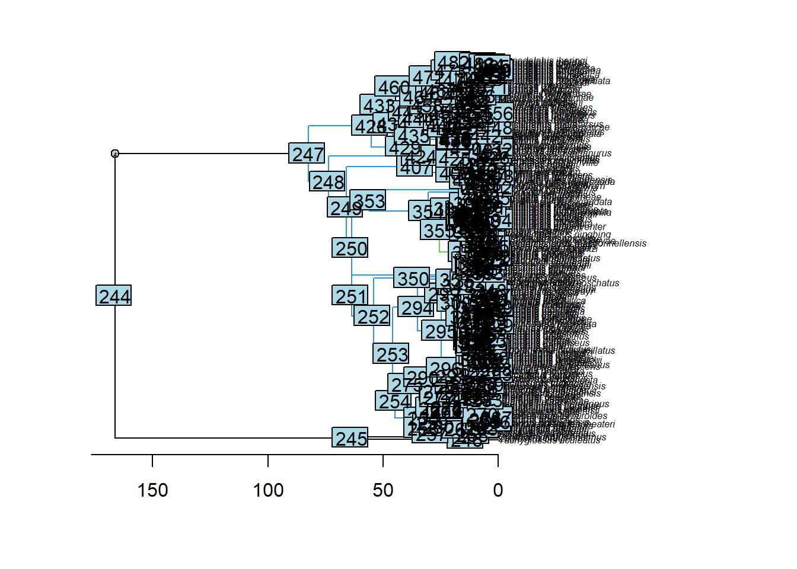
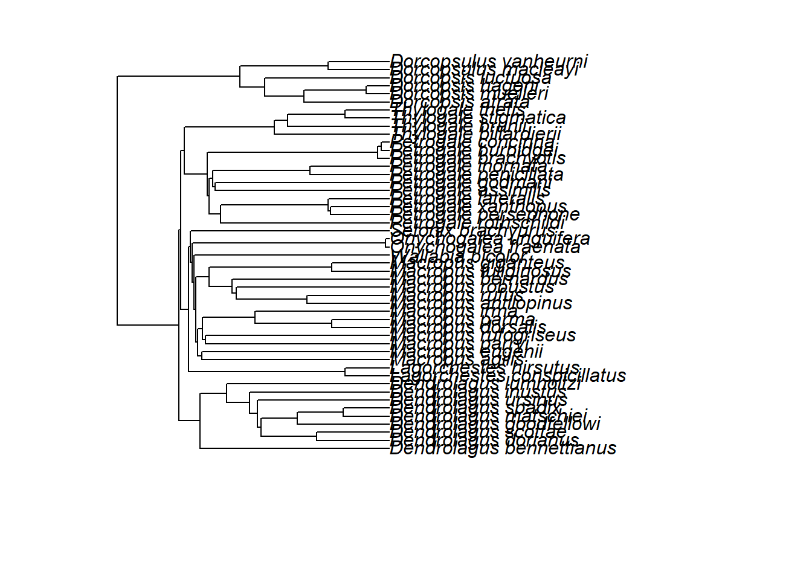
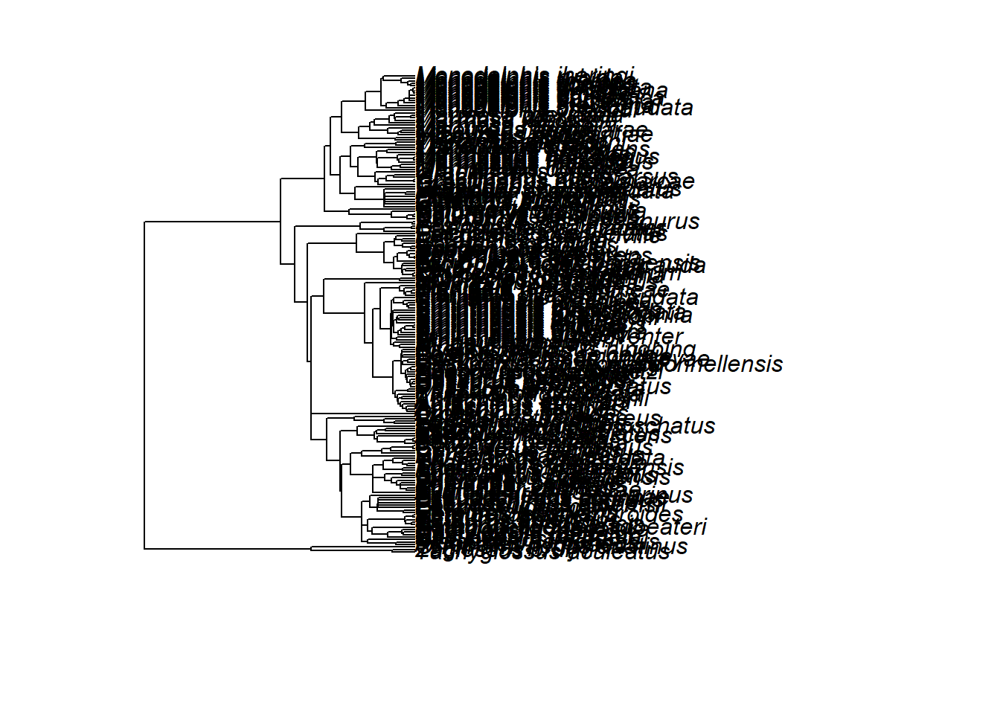

# Taxas de especiação e extinção constantes e variáveis

## Diversificação constante

Primeiro, vamos carregar alguns dados e calcular uma diversificação
líquida simples, esperada sobr um modelo *pure-birth* [@magallon2001].


```r
require(ape)
#> Le chargement a nécessité le package : ape
require(phytools)
#> Le chargement a nécessité le package : phytools
#> Le chargement a nécessité le package : maps
# Filogenia
tree<-read.tree("dadospcm/primate-tree.txt")
plotTree(tree,fsize=0.4,ftype="i",type="fan",lwd=1)
```



```r
# Número de espécies
n_sp<-length(tree$tip.label)
# Stem age
stem_age<-max(nodeHeights(tree))
# Diversificação (Magallon & Sanderson 2001)
r1<-log(n_sp)/stem_age
# Com essa diversificação obtemos o número de espécies visto na árvore
r1*stem_age
log(n_sp)
```

Agora, vamos estimar extinção constante com um modelo *birth-death*. No pacote *ape*, a função birthdeath estima taxas de extinção e especiação em uma filogenia (método de @nee1994). As estimativas são confiáveis se as premissas do modelo forem reais (especiação e extinção constantes no tempo). O método também assume uma filogenia completa. *b* é a taxa de especiação e *d* é a taxa de extinção.


```r
#nee<-birthdeath(tree)
```

A árvore contem algumas politomias. Vamos resolver as politomias e
tentar novamente.


```r
tree<-multi2di(tree)
is.binary(tree)
nee<-birthdeath(tree)
nee
```

Por motivos computacionais, a função birthdeath estima os parâmetros
derivados b-d e d/b (a diferença entre especiação e extinção (*net
diversification*) e a razão entre extinção e especiação (*relative
extinction rate*), respectivamente). Para encontrar b e d podemos usar a função bd do pacote *phytools*:


```r
bd(nee)
```

As unidades dos valores dependem da unidade do comprimento dos ramos (ln para número de espécies).Só é possível comparar árvores diferentes quando o comprimento dos ramos está na mesma unidade.

Pacote *diversitree*. O pacote diversitree possui múltiplas funções para realizar vários tipos de análises de diversificação com filogenias. Uma das vantagens do diversitree é que ele permite levar em consideração a incompletude no número de espécies amostradas. Na nossa filogenia dos primatas, existem 226 espécies amostradas de um total de aprox. 300 (o número variava de 190 até 350 da última vez que conferi; vamos considerar 300 para exemplo). Isso é cerca de 75% de espécies presentes. O diversitree também permite ajustar modelos pure-birth (Yule) e birth-death (BD) e compará-los.


```r
require(diversitree)
#> Le chargement a nécessité le package : diversitree
# Yule (pure-birth -- somente especiação)
modelo.pb<-make.yule(tree,sampling.f = 226/300)
param.pb<-find.mle(modelo.pb,x.init=0.1) # Estimar os valores dos parâmetros por ML # x.init é um valor arbitrário para iniciar o otimização
param.pb
```

lambda = taxa de especiação; mu = taxa de extinção.


```r
# Modelo birth-death (especiação + extinção)
modelo.bd<-make.bd(tree,sampling.f = 226/300)
param.bd<-find.mle(modelo.bd,x.init=c(0.1,0.05))
param.bd
```

Comparar modelos.


```r
anova(param.bd,pure.birth=param.pb)
```

O modelo que incluí extinção (birth-death) aumentou significativamente o seu ajuste em comparação com o modelo *pure-birth*. Esse é essencialmente um sinal de que a extinção é importante (o parâmetro adicional *d* se justifica).

MCMC.O pacote *diversitree* também permite rodar analises bayesianas
para estimar os parâmetros de diversificação usando a distribuição
posterior probabilidades.


```r
bd.amostras <- mcmc(modelo.bd, param.bd$par, nsteps = 1e+05, lower = c(0, 0),
 upper = c(Inf,Inf), w = c(0.1, 0.1), fail.value = -Inf,
 print.every = 10000)
# visualizar distribuição
postSamples<-bd.amostras[c("lambda", "mu")]
par(mfrow=c(1,1),mar=c(5,4,2,2))
profiles.plot(postSamples,col.line=c("red", "blue"),las=1,legend ="topright")
```



## Diversificação variando no tempo (*time-dependent*)

Carregar dados.


```r
require(ape)
require(phytools)
require(geiger)
#> Le chargement a nécessité le package : geiger
# Arvore marsupiais
tree<-read.tree("dadospcm/marsupial-tree.tre")
{plot(tree,cex=0.4)
axisPhylo()}
```



O *RPANDA* [@morlon2016] é um pacote que permite ajustar modelos com
taxas de especiação e/ou extinção variáveis, e comparar os modelos
usando verossimilhança.


```r
require(RPANDA)
#> Le chargement a nécessité le package : RPANDA
#> Le chargement a nécessité le package : picante
#> Le chargement a nécessité le package : vegan
#> Le chargement a nécessité le package : permute
#> Le chargement a nécessité le package : lattice
#> This is vegan 2.6-4
#> 
#> Attachement du package : 'vegan'
#> L'objet suivant est masqué depuis 'package:phytools':
#> 
#>     scores
#> Le chargement a nécessité le package : nlme
```

Nós vamos ajustar modelos com combinações de lambda e mu constantes e variáveis. Os modelos podem ser consultados no help do *RPANDA*.


```r
lambda.cst <- function(t,y){y[1]} # lambda constante
lambda.var <- function(t,y){y[1]*exp(y[2]*t)} # lambda com variação exponencial (em função do tempo t)
mu.cst <- function(t,y){y[1]}
mu.var <- function(t,y){y[1]*exp(y[2]*t)}
```

Ajustando os modelos para a árvore completa.


```r
# birth-death especiação e extinção constante
bcdc<-fit_bd(tree,tot_time=max(branching.times(tree)),f.lamb=lambda.cst,f.mu=mu.cst,lamb_par=0.01,mu_par=0.001,cst.lamb=TRUE,cst.mu=TRUE)
bcdc$model<-"birth-death taxa de especiação e extinção constantes"
bcdc
# birth-death especiação exponencial e extinção constante
bvdc<-fit_bd(tree,tot_time=max(branching.times(tree)),f.lamb=lambda.var,f.mu=mu.cst,lamb_par=c(0.05,0.01),mu_par=0.001,expo.lamb=TRUE,cst.mu=TRUE)
bvdc$model<-"birth-death taxa de especiação exponencial e extinção constante"
# birth-death especiação constante e extinção exponencial
bcdv<-fit_bd(tree,tot_time=max(branching.times(tree)),f.lamb=lambda.cst,f.mu=mu.var,lamb_par=0.01,mu_par=c(0.005,0.001),cst.lamb=TRUE,expo.mu=TRUE)
bcdv$model<-"birth-death taxa de especiação constante e extinção exponencial"
# birth-death especiação e extinção exponencial
bvdv<-fit_bd(tree,tot_time=max(branching.times(tree)),f.lamb=lambda.var,f.mu=mu.var,lamb_par=c(0.05,0.01),mu_par=c(0.005,0.001),expo.lamb=TRUE,expo.mu=TRUE)
bvdv$model<-"birth-death taxa de especiação e extinção exponencial"
```

Comparando os modelos.


```r
aic.scores<-setNames(c(bcdc$aicc,bvdc$aicc,bcdv$aicc,bvdv$aicc),
 c("bcdc","bvdc","bcdv","bvdv"))
aic.scores
aic.w(aic.scores)
```

Resultados um pouco ambíguos, mas sugerem que taxas constantes são
improváveis.

É possível ajustar os modelos para toda a árvore, como acima, ou definir
partes da árvore a priori (clados) e testar diferenças nas taxas entre
clados. Se não temos uma hipótese a priori de quais clados tem
diversificação mais rápida, podemos identificar mudanças rápidas olhando
pra árvore, ou usando métodos como o MEDUSA ou o BAMM para detectar
mudanças na diversificação em hipóteses a priori.

## Diversificação variando entre clados (*clade-dependent*)

O exemplo implementa o MEDUSA [@alfaro2009].


```r
mar<-medusa(tree)
mar
plot(mar)
```



Pelo menos dois grandes 'shifts' de diversificação podem ser percebidos.
Um no clado dos Macropodidae (cangurus e afins - nó 301) e outro no
clado dos Dasyuromorpha (marsupiais carnívoros - nó 355). r= net
diversification rate. Agora podemos hipotetizar, como exemplo, que o
clado dos cangurus e aliados (Macropodidae) parece ter se diversificado
mais rapidamente.


```r
par(mfrow=c(1,1),mar=c(5,4,2,2))
{plot(mar)
nodelabels()}
```



```r
macropodidae.tree <- extract.clade(tree, 301)
plot(macropodidae.tree)
```



```r
resto.tree<-drop.tip(tree,macropodidae.tree$tip.label)
plot(resto.tree)
```



## Diversificação variando no tempo e entre clados

Vamos usar RPANDA para ajustar modelos com taxas variáveis entre clados.
Para facilitar, vamos unir os modelos em uma função.


```r
fit.multi.rpanda <- function(tree){
 bcdc<-fit_bd(tree,tot_time=max(branching.times(tree)),f.lamb=lambda.cst,f.mu=mu.cst,lamb_par=0.01,mu_par=0.001,cst.lamb=TRUE,cst.mu=TRUE)
 bvdc<-fit_bd(tree,tot_time=max(branching.times(tree)),f.lamb=lambda.var,f.mu=mu.cst,lamb_par=c(0.05,0.01),mu_par=0.001,expo.lamb=TRUE,cst.mu=TRUE)
 bcdv<-fit_bd(tree,tot_time=max(branching.times(tree)),f.lamb=lambda.cst,f.mu=mu.var,lamb_par=0.01,mu_par=c(0.005,0.001),cst.lamb=TRUE,expo.mu=TRUE)
 bvdv<-fit_bd(tree,tot_time=max(branching.times(tree)),f.lamb=lambda.var,f.mu=mu.var,lamb_par=c(0.05,0.01),mu_par=c(0.005,0.001),expo.lamb=TRUE,expo.mu=TRUE)
 return(list("bcdc"=bcdc,"bvdc"=bvdc,"bcdv"=bcdv,"bvdv"=bvdv))
 }
macropodidae_panda<-fit.multi.rpanda(macropodidae.tree)
resto_panda<-fit.multi.rpanda(resto.tree)
```

Comparando modelos.


```r
# Extraindo aicc
macro_aic<-numeric(4) #vetor vazio
resto_aic<-numeric(4)
names(macro_aic)<-c("bcdc", "bvdc", "bcdv", "bvdv")
names(resto_aic)<-names(macro_aic)
for(i in 1:4) {
 macro_aic[i]<-macropodidae_panda[[i]]$aicc
 resto_aic[i]<-resto_panda[[i]]$aicc
}
aic.w(macro_aic)
aic.w(resto_aic)
```

Novamente os resultados são um pouco inconclusivos. Parece haver maior suporte para modelos com taxas variáveis do que constantes. Para o clado Macropodidae uma variação exponencial nas taxas de especiação parece bem provável, enquanto que para o resto da árvore, uma variação em ambas as taxas (especiação e extinção) é mais provável.

Podemos plotar as taxas de especiação, extinção, e diversificação (b-d) ao longo do tempo para os modelos mais prováveis de cada clado.


```r
plot_fit_bd(macropodidae_panda$bvdc,max(branching.times(macropodidae.tree)))
plot_fit_bd(resto_panda$bvdv,max(branching.times(resto.tree)))
plot(macropodidae.tree)
plot(resto.tree)
```

## Exercício - Diversificação dependente de variável ambiental

RPANDA pode ser usado para ajustar modelos de diversificação dependente de variável ambiental (fit_env). Como variável adicional, esse modelo requer uma estimativa da variação em uma variável ambiental de interesse ao longo do tempo. Zachos et al (2008) fornecem uma estimativa de variação de temperatura ao longo do Cenozóico baseada em isótopos de oxigênio.

Baseado nos dados: 
Árvore para roedores sigmodontíneos:
sigmodontinae-tree.tre 
Dados de temperatura, duas colunas com tempo e
temperatura: 
Cenozoic_Temp.txt

Ajuste um modelo com variação nas taxas de especiação dependentes da
temperatura, sem dependência temporal e sem extinção:

lambda.env<-function(t,x,y){y[1]*exp(y[2]*x)} 
e
mu.zero<-function(t,x,y){0}

Com os parâmetros iniciais:

lamb_par_init<-c(0.10,0.01)

mu_par_init<-c()

O modelo deve ser ajustado com a função fit_env do pacote RPANDA. Faça um gráfico dos resultados com plot_fit_env e interprete os resultados.
