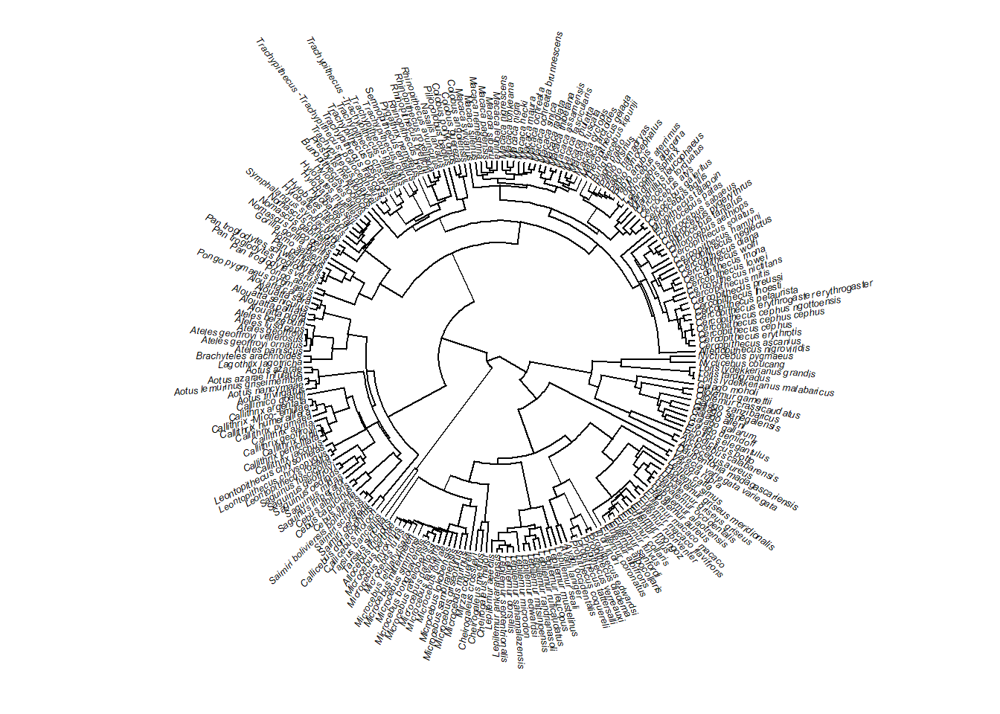
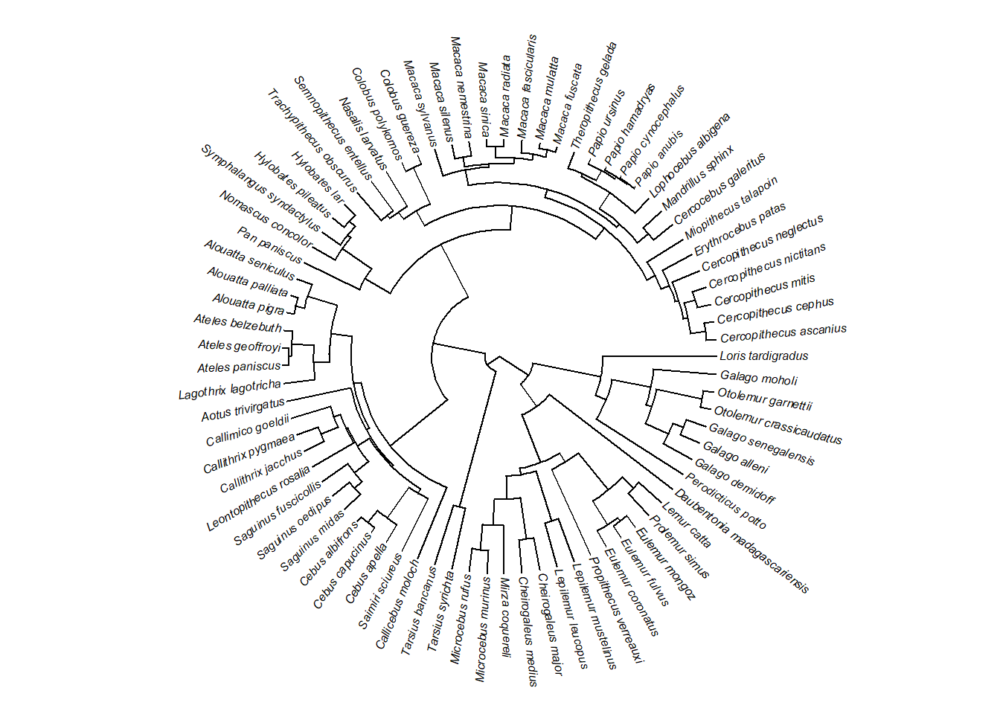
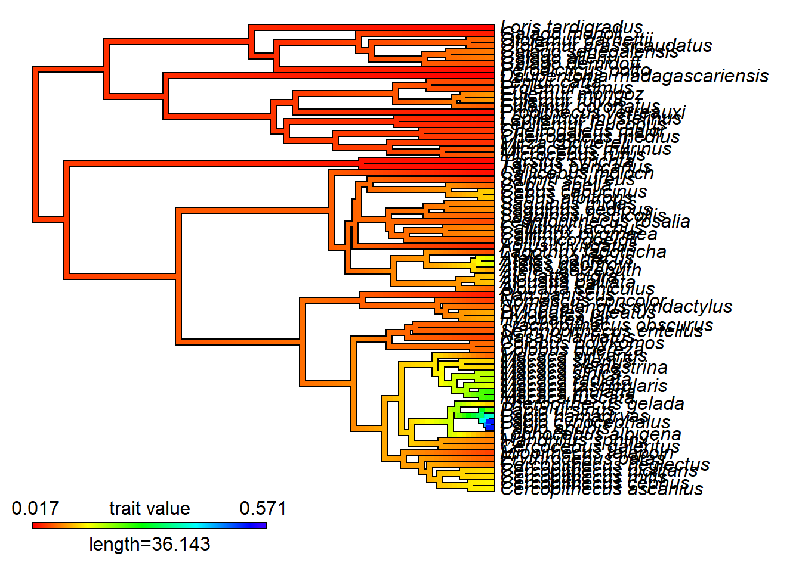
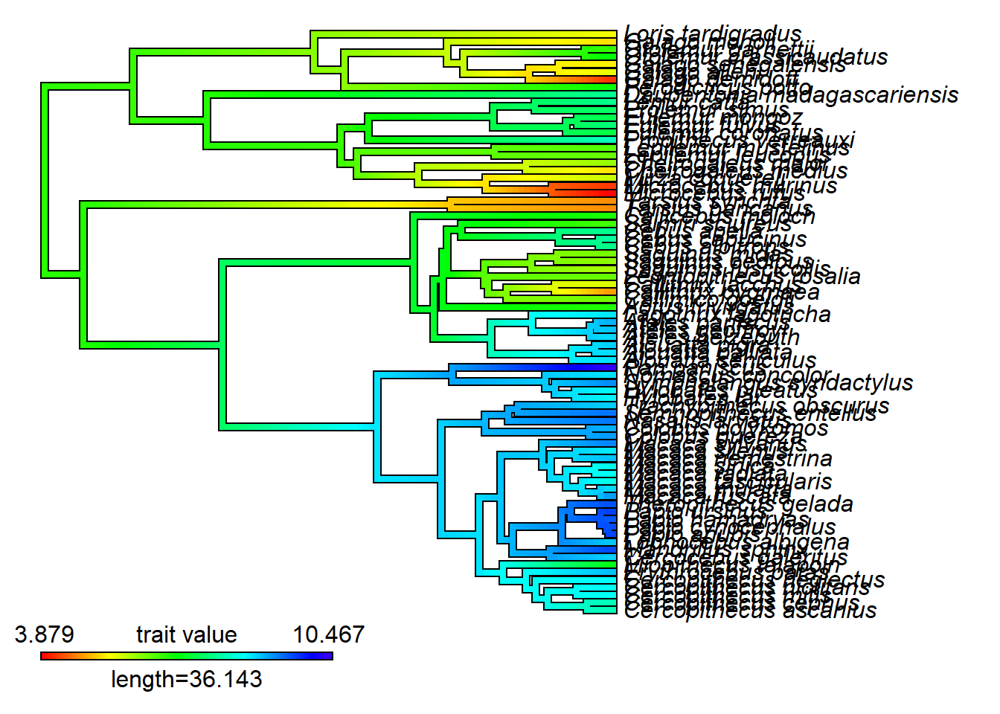
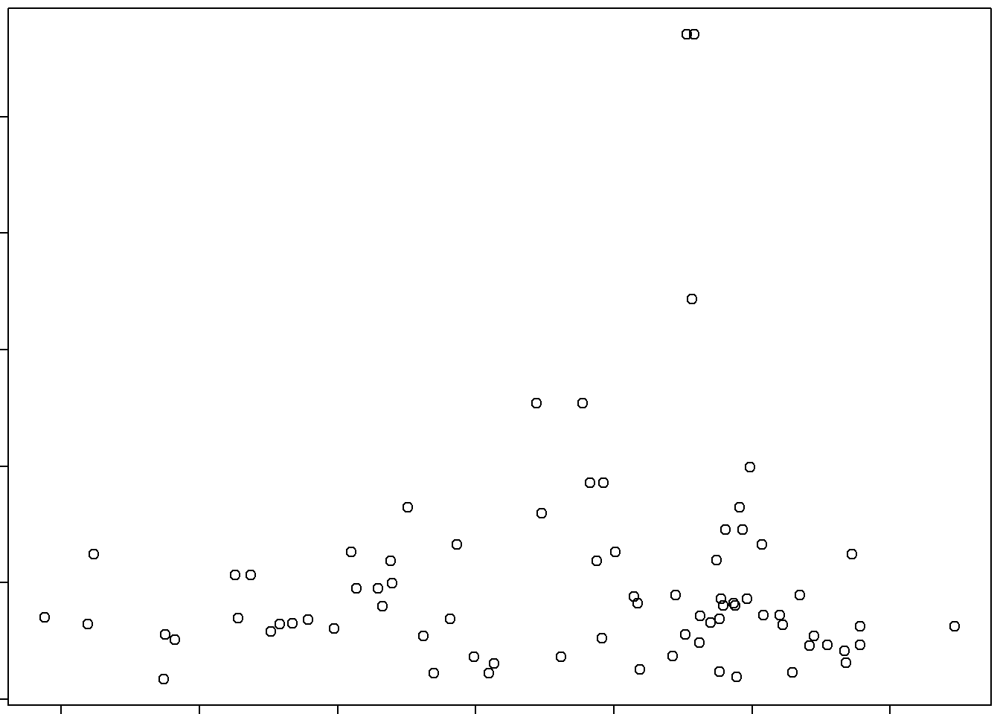

# Diversificação baseada em terminais (*tip-speciation*)

Uma das medidas mais comuns de taxa de especiação/diversificação nos terminais (tipDR) é a de @jetz2012, que é o inverso da medida equal splits de @redding2006. Veja também uma outra medida de diversificação em terminais no ClaDS @maliet2019.

Carregar dados.


```r
require(ape)
#> Le chargement a nécessité le package : ape
require(phytools)
#> Le chargement a nécessité le package : phytools
#> Le chargement a nécessité le package : maps
require(picante)
#> Le chargement a nécessité le package : picante
#> Le chargement a nécessité le package : vegan
#> Le chargement a nécessité le package : permute
#> Le chargement a nécessité le package : lattice
#> This is vegan 2.6-4
#> 
#> Attachement du package : 'vegan'
#> L'objet suivant est masqué depuis 'package:phytools':
#> 
#>     scores
#> Le chargement a nécessité le package : nlme
require(geiger)
#> Le chargement a nécessité le package : geiger
# Filogenia
tree<-read.tree("dadospcm/primate-tree.txt")
plotTree(tree,fsize=0.4,ftype="i",type="fan",lwd=1)
```



```r
# Atributos
dados<-read.table("dadospcm/primate-data.txt",h=T,row.names=1)
# Recortar filogenia
match.species<-treedata(tree,dados)
tree<-match.species$phy
plotTree(tree,fsize=0.5,ftype="i",type="fan",lwd=1)
```



DR.


```r
ES = evol.distinct(tree, type = "equal.splits")$w
DR = 1/ES
# Plot
names(DR)=tree$tip.label
contMap(tree,DR)
```



O tamanho corporal influencia a diversificação?


```r
# Massa corporal
massa<-dados$AdultBodyMass_g
names(massa)=rownames(dados)
contMap(tree,log(massa))
```



```r
# Correlação
cor(DR,log(massa))
plot(log(massa),DR)
```


