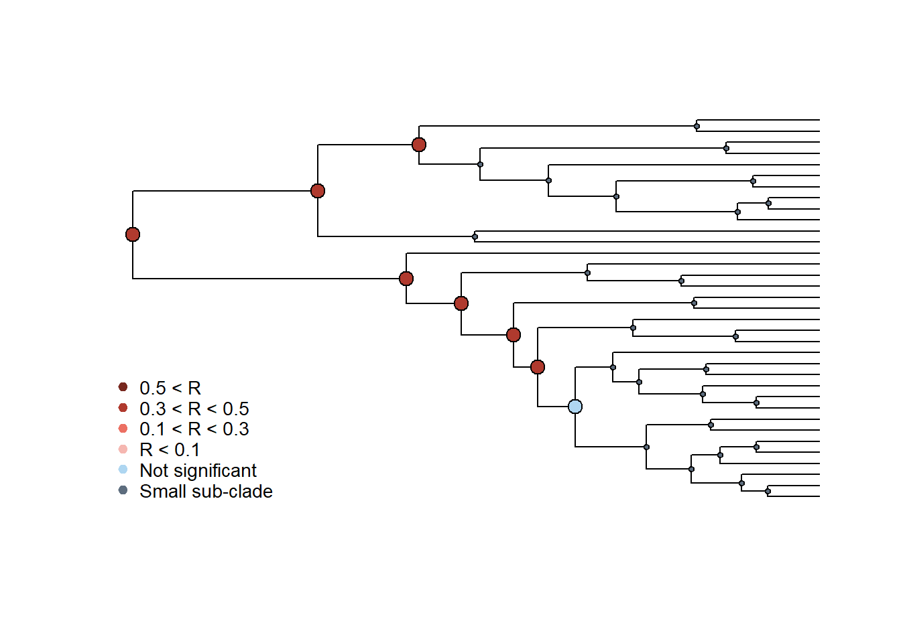
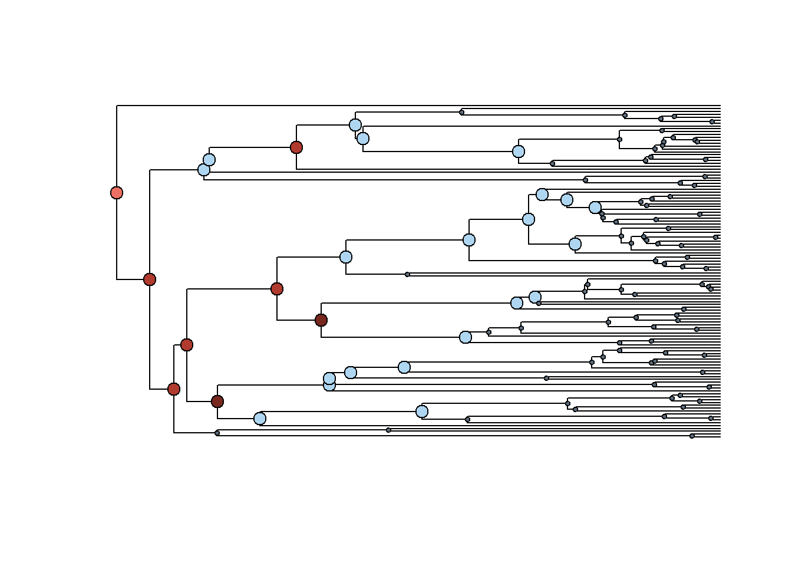
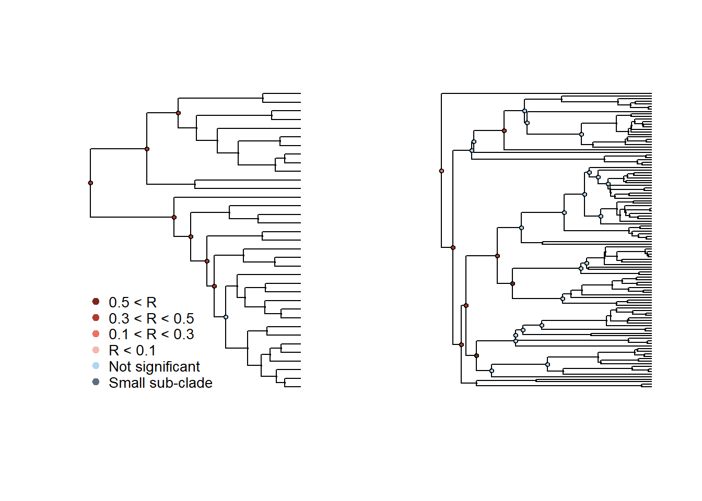

# Co-diversificação

Análises cofilogenéticas investigam a associação/dependência entre a diversificação de dois clados, normalmente um clado de parasitas e um clado de hospedeiros; para uma revisão veja @perez-lamarque-morlon2022. Aqui, usaremos um teste baseado em Mantel para testar o sinal filogenético na associação entre dois clados [@perez-lamarque-morlon2022]. Vamos carregar dados de associação entre coronavirus (parasitas) e mamíferos (hospedeiros) de @maestricovpreprint.

Carregar dados.


```r
# Carregar árvore de Coronaviridae
require(ape)
#> Le chargement a nécessité le package : ape
cov_tree<-read.nexus("dadospcm/combined_alignment_cov_trimal_tree_35.tre")
# Carregar matriz de associação
hosts_matrix<-read.table("dadospcm/association_matrix.txt")
# Carregar árvore de mamíferos hospedeiros
hostmammaltree<-read.tree("dadospcm/hostsMammalTree.tre")
```

Sinal filogenético na associação, com permutações mantendo constante o número de parceiros.


```r
require(RPANDA)
#> Le chargement a nécessité le package : RPANDA
#> Le chargement a nécessité le package : picante
#> Le chargement a nécessité le package : vegan
#> Le chargement a nécessité le package : permute
#> Le chargement a nécessité le package : lattice
#> This is vegan 2.6-4
#> Le chargement a nécessité le package : nlme
psuni_n<-phylosignal_network(hosts_matrix, tree_A = cov_tree, 
 tree_B = hostmammaltree, 
 method = "GUniFrac", 
 correlation = "Pearson", 
 nperm=1000, permutation = "nbpartners")
psuni_n
```

Coronavirus próximos filogenéticamente tendem a se associar (infectar) mamíferos proximos filogenéticamente (r=0.377) e vice-versa (r=0.295).

Também podemos testar se parasitas proximamente relacionados tendem a infectar um *número* de hospeiros similar.


```r
# Sinal filogenético no número de parceiros
npart_cov<-phylosignal_network(hosts_matrix, 
 tree_A = cov_tree, 
 method = "degree", 
 correlation = "Pearson", nperm = 1000)
npart_mammals<-phylosignal_network(t(hosts_matrix), 
 tree_A = hostmammaltree, 
 method = "degree", 
 correlation = "Pearson", nperm = 1000)
npart_cov
npart_mammals
```

Coronavirus próximos filogenéticamente tendem a infectar um número de hospeiros similar, porém, mamíferos proximos filogenéticamente não tendem a hospedar um número similar de coronavirus. Isso sugere que a especificidade de coronavírus em relação aos seus hospedeiros é conservada evolutivamente, enquanto que a suscetibilidade dos hospedeiros aos coronavírus não é.

Por fim, podemos testar em que escala filogenética o sinal é mais forte.


```r
# Calcular sinal filogenético por subclados
# Para parasitas
results_clade_A <- phylosignal_sub_network(hosts_matrix, 
 tree_A = cov_tree, 
 tree_B = hostmammaltree, 
 method = "GUniFrac", 
 correlation = "Pearson", 
 nperm=1000,minimum=10, degree=F,
 permutation = "shuffle")
plot_phylosignal_sub_network(tree_A = cov_tree, results_clade_A,
 network = hosts_matrix)
```



```r
# Para hospedeiros
results_clade_B <- phylosignal_sub_network(t(hosts_matrix), 
 tree_A = hostmammaltree, 
 tree_B = cov_tree, 
 method = "GUniFrac", 
 correlation = "Pearson", 
 nperm=1000, 
 minimum=10, degree=F,
 permutation = "shuffle")
plot_phylosignal_sub_network(tree_A = hostmammaltree, results_clade_B,
 network = t(hosts_matrix),
 legend=FALSE,where = "topleft")
```



```r
# Plot conjunto 
layout(matrix(c(1,2),1,2),widths=c(0.5,0.5),heights=c(0.1,0.1))
plot_phylosignal_sub_network(tree_A = cov_tree, results_clade_A,
 network = hosts_matrix)
plot_phylosignal_sub_network(tree_A = hostmammaltree, results_clade_B,
 network = t(hosts_matrix),
 legend=FALSE,where = "topleft")
```



Em geral, o sinal filogenético é mais forte nos nós mais antigos das duas filogenias.
