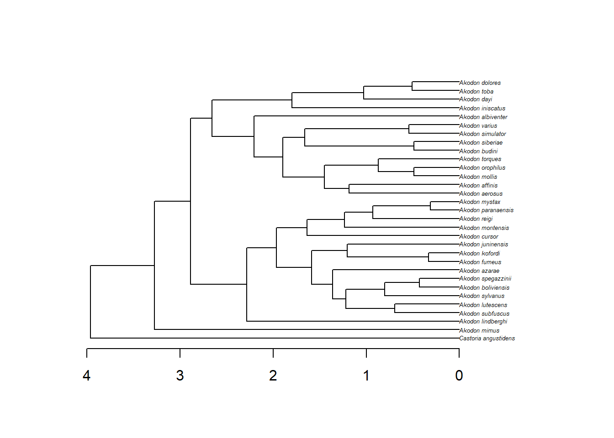
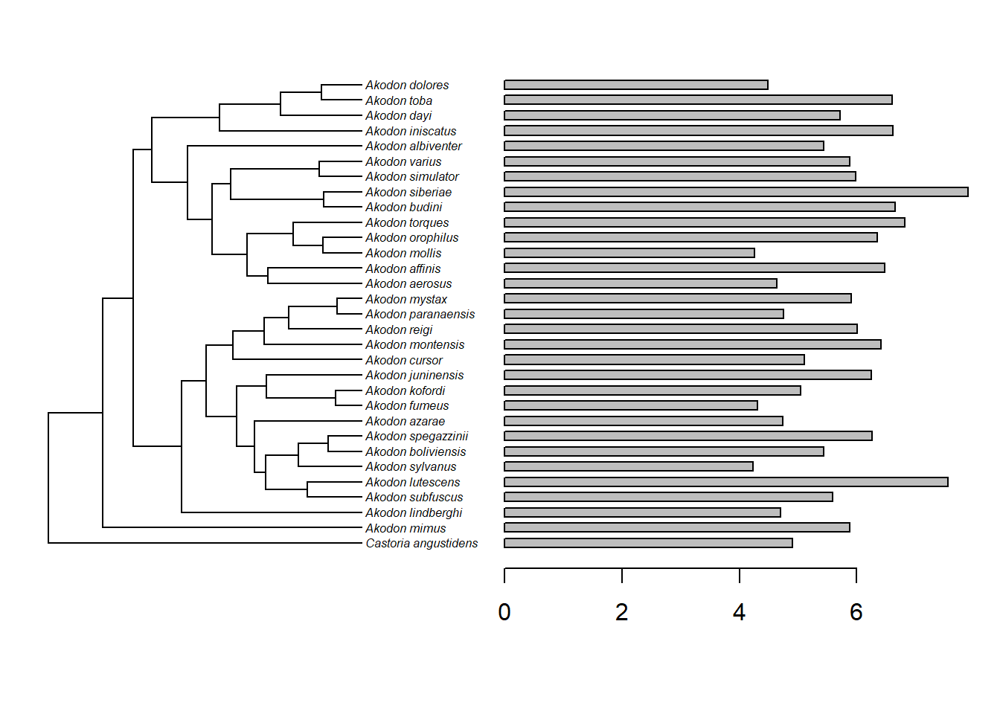

# Sinal filogenético

Sinal filogenético é meramente um padrão que mostra se espécies mais próximas filogenéticamente têm fenótipos mais similares do que espécies mais distantes filogenéticamente. A magnitude do sinal filogenético é, portanto, útil para percebermos quão forte é essa tendência de espécies similares fenotipicamente estarem próximas filogenéticamente.

Existem vários métodos para calcular sinal filogenético. Vamos explorar aqui a estatística K @blomberg2003, o lambda de Pagel @pagel1999, e a curva PSR @diniz-filho2012.

Vamos investigar a magnitude do sinal filogenético no comprimento do crânio de um gênero de roedores sul-americanos.


```r
# Carregar dados fenotípicos
dados<-read.table("dadospcm/akodon.txt",h=T)
dados
# A função attach permite obter cada coluna dos dados
attach(dados)
# Vamos (re)atribuir os nomes das espécies
skull_length<-setNames(skull_length,species)
skull_length

# Carregar árvore
require(ape)
#> Le chargement a nécessité le package : ape
tree<-read.tree("dadospcm/akodon.tree")
{plot(tree,cex=0.4)
axisPhylo()}
```



É importante conferir a correspondência entre as espécies na filogenia e nos dados. Todas as espécies precisam estar tanto na árvore como nos dados, e também tem que existir correspondência exata nos nomes. Existem algumas funções, como a name.check e a treedata, do pacote *geiger*, que fazem essa conferência.


```r
require(geiger)
#> Le chargement a nécessité le package : geiger
#> Le chargement a nécessité le package : phytools
#> Le chargement a nécessité le package : maps
name.check(tree,dados,data.names=species)
#> [1] "OK"
```

É importante visualizar a distribuição no atributo na filogenia.


```r
require(phytools)
plotTree.barplot(tree,skull_length,
 args.plotTree=list(fsize=0.5,ftype="i"))
```



## Estatística K

K=1 indica que espécies próximas são tão parecidas quanto prevê o modelo Browniano de evolução K\<1 indica sinal filogenético menor do que esperado pelo modelo Browniano de evolução K\>1 indica sinal filogenético maior do que esperado pelo modelo Browniano de evolução


```r
require(phytools)
phylosig(tree,skull_length,method = "K",test = TRUE)
#> 
#> Phylogenetic signal K : 0.336983 
#> P-value (based on 1000 randomizations) : 0.669
```

## Lambda de Pagel

λ=0 indica ausência de sinal filogenético (sinal esperado em uma filogenia estrela) λ=1 indica sinal filogenético correspondente ao modelo Browniano


```r
phylosig(tree,skull_length,method = "lambda",test = TRUE)
#> 
#> Phylogenetic signal lambda : 7.95528e-05 
#> logL(lambda) : -42.2205 
#> LR(lambda=0) : -0.000914493 
#> P-value (based on LR test) : 1
```

## Curva PSR

A regressão de autovetores filogenéticos (*phylogenetic eigenvector regression* - PVR) [@diniz-filho1998] pode ser usada para estimar a quantidade de sinal filogenético nos dados, além de permitir a partição da variância entre a filogenia e demais causas, como veremos no capítulo sobre regressão filogenética. A PVR funciona com uma regressão do fenótipo contra um conjunto de autovetores filogenéticos extraídos por uma análise de coordenadas principais de uma matriz de distâncias filogenéticas. O R² da regressão entre o fenótipo e os autovetores filogenéticos funciona como uma medida de sinal filogenético. No entanto, se todos os autovetores forem usados, o R² inevitavelmente alcança 1, e se alguns autovetores forem omitidos, parte da filogenia é ignorada [@rohlf2001]. No entanto, @diniz-filho2012 descobriu que se PVRs sucessivas forem feitas, adicionando um autovetor filogenético por vez como preditor, e depois os R²s de cada regressão forem plotados contra os autovalores cumulativos (%), uma relação linear (linha de 45º) é obtida sob um modelo Browniano de evolução. Essa abordagem, chamada de PSR (phylogenetic signal-representation) permite estimar o sinal filogenético e oferece a habilidade de visualizar o padrão de acúmulo de variação do fenótipo (acelaração e desaceleração de taxas) ao longo do tempo, em comparação com o modelo Browniano de evolução [@diniz-filho2012a] e outros modelos, como OU [@maestri2017].

O exemplo abaixo calcula e representa graficamente a curva PSR.


```r
#install.packages("PVR")
require(PVR)
#> Le chargement a nécessité le package : PVR
#> PVR 0.3 loaded
# Decomposição de matriz de distância filogenética
pvr_obj<-PVRdecomp(tree)
# Regressão de autovetores filogenéticos
pvr_reg<-PVR(pvr_obj,tree,skull_length)
# Sinal Filogenético com Cuva PSR
psr_obj<-PSR(pvr_obj,trait=skull_length,
null.model=TRUE,Brownian.model=TRUE,times=10)
psr_obj
#PSRplot(psr_obj,info="both")
```

::: {.alert .alert-danger role="alert" style="color: black;"}
É comum encontrar menções de que regressões ou outras análises foram corrigidas pela filogenia porque um sinal filogenético foi encontrado nas variáveis brutas. No entanto, o uso de regressão filogenética deve estar associado aos resíduos do modelo de interesse apresentarem sinal filogenético [@revell2010].
:::

## Exercício - Árvores e sinal filogenético

Carregue uma árvore filogenética para o seu grupo de estudo e observe a estrutura dela. Represente a árvore graficamente de diferentes formas. Se você tiver variáveis fenotípicas para o seu grupo de estudo, tente carregar no R e testar o sinal filogenético.
