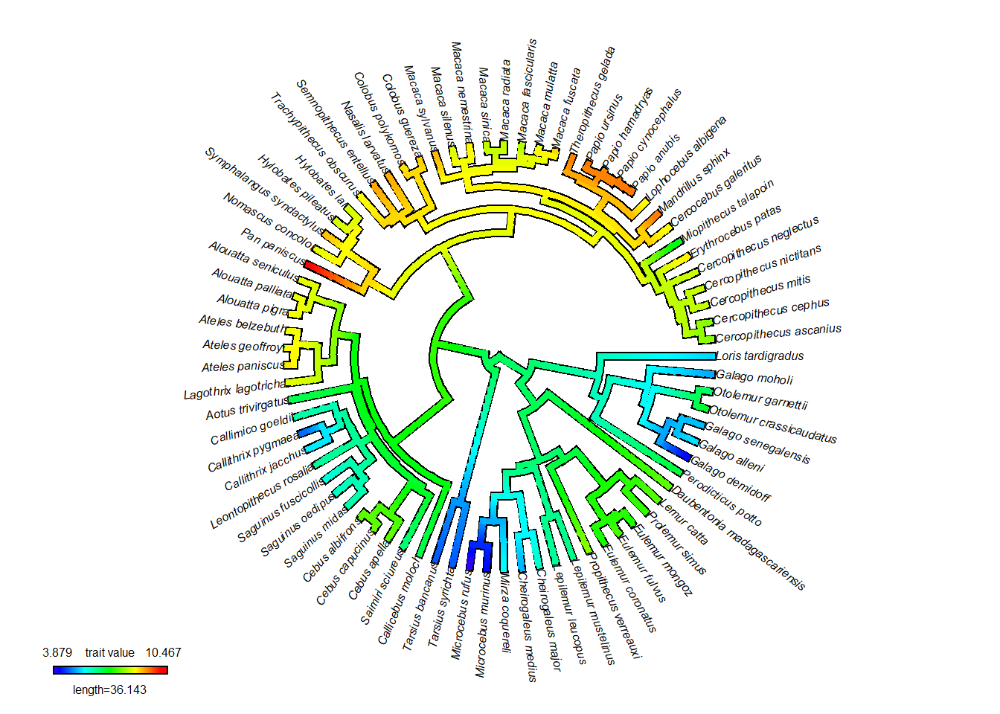
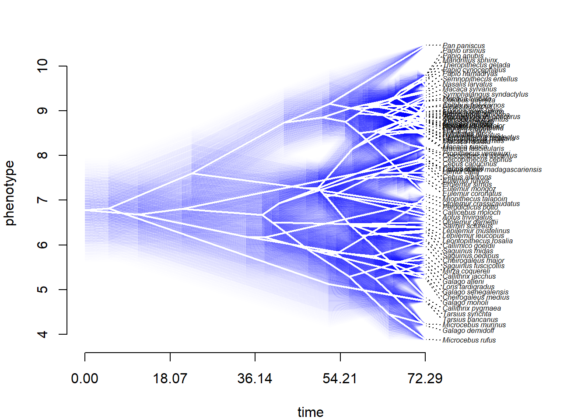
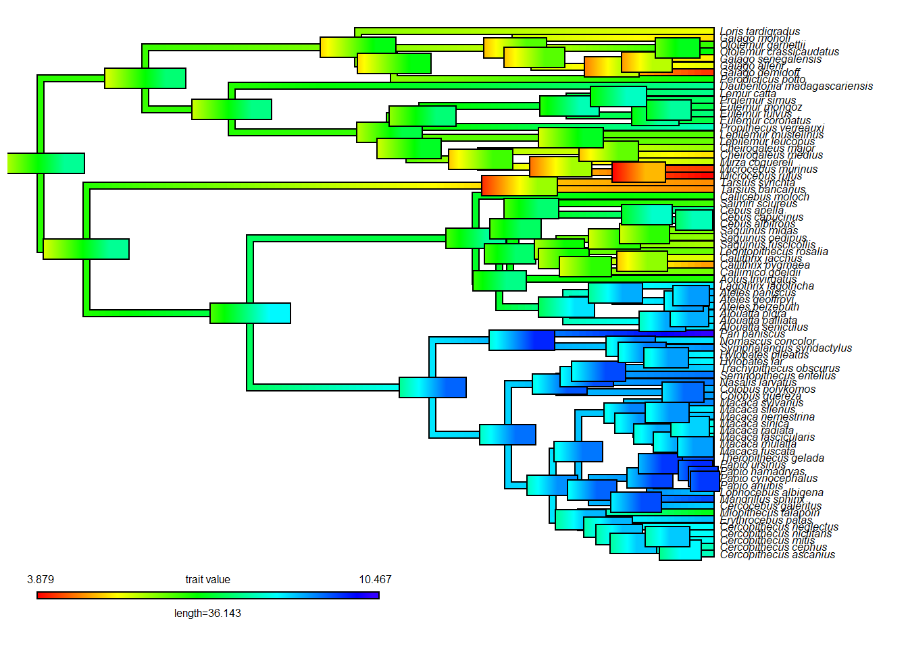
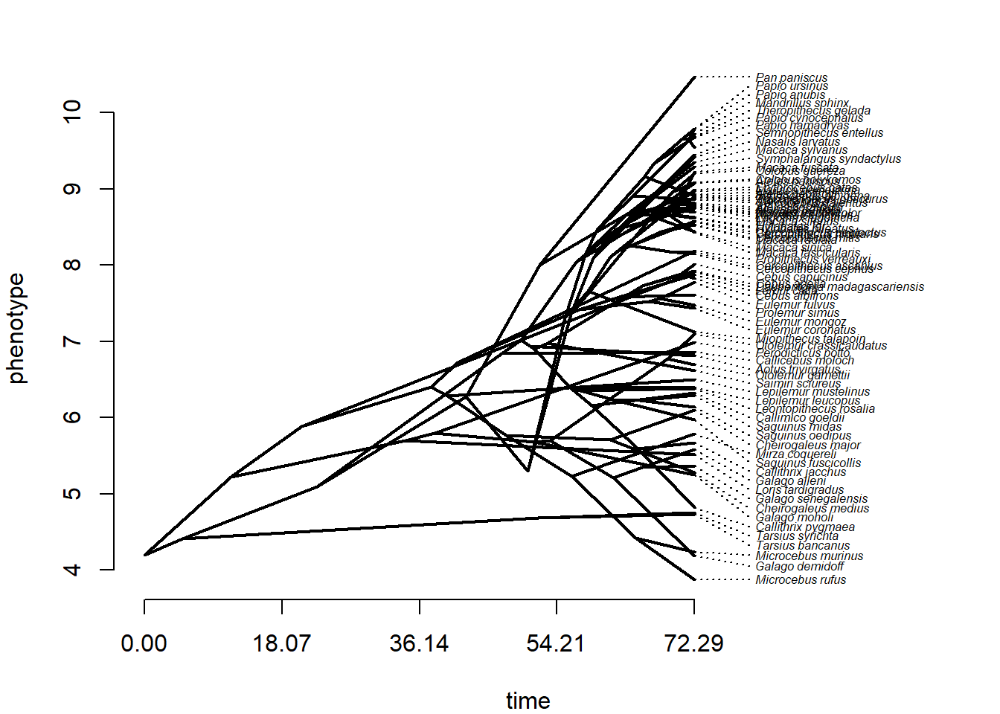

# Modelos para evolução de fenótipos contínuos

Existem vários modelos de evolução de atributos contínuos univariados. Os modelos macroevolutivos mais comuns são o Browniano (BM), o modelo de Ornstein-Uhlenbeck (OU) e o modelo Early-Burst (EB). Sobre ajuste de modelos evolutivos, leia [@hansen-martins1996, @hansen1997, @butler-king2004].

No exemplo, a função fitContinuous do pacote *geiger* vai ser usada para ajustar os modelos. O método é baseado em verossimilhança (*likelihood*), e os resultados vão retornar o valor de máxima verossimilhança (*maximum likelihood*) como estimativa para os parâmetros. Diferentes modelos podem ser comparados, desde que sobre os mesmos dados. Vamos carregar vários atributos fenotípicos para 77 espécies de Primatas.

```r
require(phytools)
#> Le chargement a nécessité le package : phytools
#> Le chargement a nécessité le package : ape
#> Le chargement a nécessité le package : maps
require(geiger)
#> Le chargement a nécessité le package : geiger
# Carregar dados
dados<-read.table("dadospcm/primate-data.txt",h=T,row.names=1)
dados
# Carregar filogenia
tree<-read.tree("dadospcm/primate-tree.txt")
plot(tree)
```


```r
plotTree(tree,fsize=0.4,ftype="i",type="fan",lwd=1)
```


Conferir correspondência entre espécies nos dados e na filogenia.

```r
match.species<-treedata(tree,dados)
names(match.species)
tree<-match.species$phy
str(tree)
plotTree(tree,fsize=0.5,ftype="i",type="fan",lwd=1)
```


```r
bodymass<-dados[,1]
bodymass<-setNames(bodymass,rownames(dados))
bodymass
```

## Modelos evolutivos contínuos
### Modelo Browniano
O modelo Browniano estima a taxa de evolução σ2 (sigsq no output), e o valor do atributo na raiz X(0) (z0 no output). Outras estimativas do output são o likelihood (lnL) do modelo, o AIC/AICc e o número de parâmetros (k na literatura) do modelo.

```r
BM<-fitContinuous(tree,log(bodymass),model="BM")
BM
```

### Modelo de Ornstein-Uhlenbeck
O modelo OU estima um parâmetro adicional, α ou alpha, que é a força de atração para a média do ótimo, μ ou θ.

```r
OU<-fitContinuous(tree,log(bodymass),model="OU")
OU
```

### Modelo de Early-Burst/Late-Burst
No modelo EB o parâmetro *a* é a taxa de mudança através do tempo. O valor de *a* é normalmente menor ou igual a 0. Quando a é negativo, as taxas de evolução decrescem com o tempo. Se a é próximo de 0, a evolução é aproximadamente Browniana.

```r
EB<-fitContinuous(tree,log(bodymass),model="EB")
EB
```

### Comparação de modelos
Nós podemos comparar o ajuste dos modelos usando um critério de informação, como o AIC. Existe debate sobre quão grande deve ser a diferença no AIC para definir um único "melhor" modelo, variando de 2-10 unidades. É comum usar 4 unidades, então EB não tem um ajuste muito melhor do que BM ou OU nos dados do exemplo.

```r
BM$opt$aicc
OU$opt$aicc
EB$opt$aicc
aic.scores<-setNames(c(BM$opt$aicc,OU$opt$aicc,EB$opt$aicc),
 c("BM","OU","EB"))
aic.scores
aicw(aic.scores) # Delta AICc e AICc weights
```

## Reconstrução ancestral de dados contínuos
Vamos estimar o tamanho corporal ancestral para primatas, sob um modelo Browniano de evolução.
As funções ace (ape) e fastAnc (phytools), entre outras, implementam reconstrução ancestral via *maximum likelihood* (encontrando os estados com verossimilhança máxima de terem surgido sob o modelo escolhido).

```r
rec<-fastAnc(tree,log(bodymass),vars=TRUE,CI=TRUE)
rec
print(rec,printlen=10)
{plotTree(tree,fsize=0.5,ftype="i",type="fan",lwd=1)
nodelabels()}
```


```r
# Visualizando a reconstrução
rec.map<-contMap(tree,log(bodymass))
```


```r
rec.map
# customizando
rec.map<-setMap(rec.map,invert=TRUE) # inverte cores
plot(rec.map,type="fan",fsize=0.5)
```



```r
# Modo fenograma 'traitgram'
par(mfrow = c(1, 1),mar=c(4, 4, 2, 2))
phe<-phenogram(tree,log(bodymass),ftype="i",fsize=0.5)
```


```r
# Incerteza (CI 95%) nas estimativas dos nós
fancyTree(tree,type="phenogram95",x=log(bodymass),ftype="i",fsize=0.5) # pode demorar
```



```r
# Adicionando barra de erros com cores
rec.map<-contMap(tree,log(bodymass),fsize=0.5,ftype="i")
errorbar.contMap(rec.map)
```



Uma crítica comum a reconstrução ancestral é que a incerteza ao redor do nós pode ser grande. No entanto, se o modelo evolutivo está correto, as estimativas são confiáveis (95% de chance de o valor estimado incluir o valor 'real'). Em teoria, é possível corrigir a estimativa se o valor de algum nó é conhecido (e.g., fóssil), como no exemplo abaixo.

```r
# Reconstrução com valores de nós conhecidos
rec$ace # estados ancestrais estimados
anc.states<-rec$ace[as.character(c(78,80,82))]
anc.states # valores estimados para nós 78 (raiz), 80 e 82
anc.a<-c(4.2,5.1,5.3) # valores conhecidos
names(anc.a)=names(anc.states)
anc.a
rec.1<-fastAnc(tree,x=log(bodymass),anc.states=anc.a,vars=TRUE,CI=TRUE)
print(rec.1,printlen=10)
# Comparando com a reconstrução original
print(rec,printlen=10)
# Visualizando reconstrução com nós conhecidos
# lista contendo valores terminais + estimados com fastAnc
X<-c(log(bodymass),rec.1$ace)
par(mfrow = c(1, 1),mar=c(4, 4, 2, 2))
phenogram(tree,X,ftype="i",fsize=0.5)
```



## Exercício - Modelos contínuos e variação intraespecífica
Carregue os dados:
primate-data-erro.txt
primate-tree.txt
Estime o sinal filogenético com a estatística K, e ajuste e compare os modelos BM, OU e EB para os dados considerando a variação intraespecífica.
O arquivo de dados contém log de massa corporal para dez indivíduos de cada espécie de primata. Faça uma média de tamanho corporal por espécie e calcule o erro padrão da 
média.
Descubra (leia a documentação das funções ?phylosig e ?fitContinuous) como incorporar o erro padrão no cálculo de sinal filogenético e ajuste de modelos.
Você pode usar a função apply para calcular a média e o desvio padrão da média (SD). O erro padrão da média (uma medida de quão precisa é a estimativa da média) pode ser obtido através da fórmula SD/√N (N=tamanho da amostra) = se<-sd/sqrt(10).
