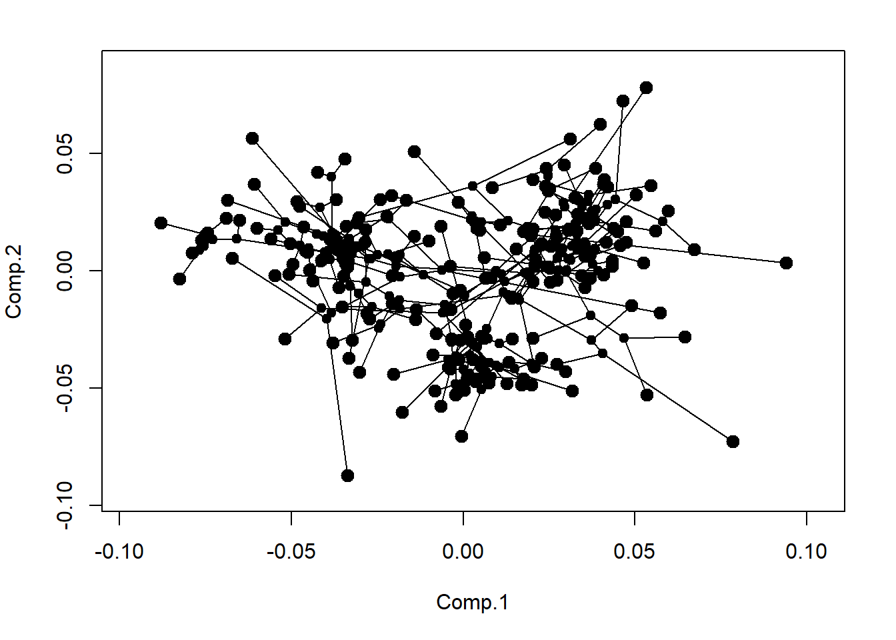
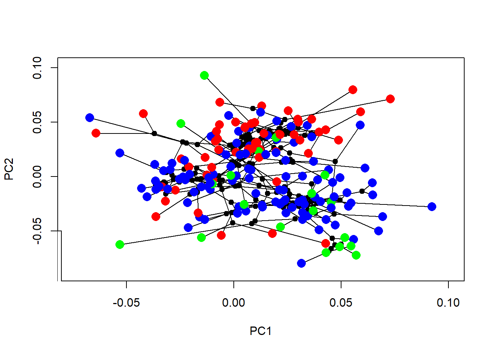
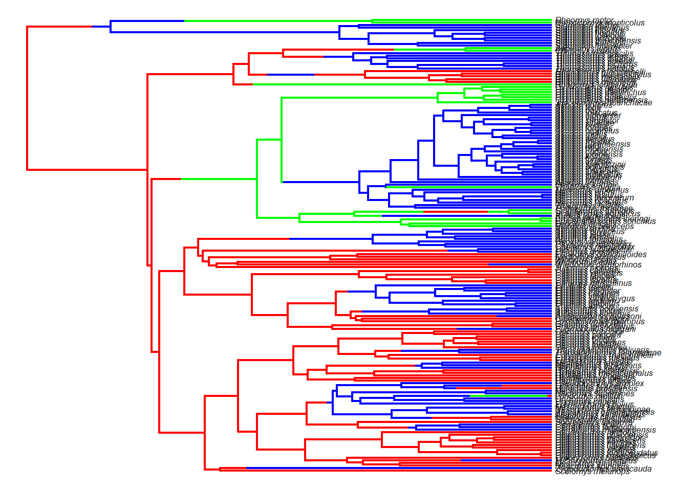

# Métodos filogenéticos multivariados

A evolução morfológica é inerentemente multivariada [Capítulo 3](#cap3). Contudo, variáveis resposta multivariadas representam um desafio analítico, especialmente para dados altamente multidimensionais. Neste capítulo, vamos explorar alguns métodos que permitem responder questões biológicas interessantes quando o nosso fenótipo de interesse é multivariado.

Primeiro, vamos carregar uma matriz resposta multivariada e uma filogenia. No exemplo, a matriz contém 26 colunas com coordenadas de Procrustes que descrevem a forma da mandíbula de 176 espécies de roedores sigmodontineos.


```r
require(ape)
#> Le chargement a nécessité le package : ape
require(geiger)
#> Le chargement a nécessité le package : geiger
#> Le chargement a nécessité le package : phytools
#> Le chargement a nécessité le package : maps
require(phytools)
require(geomorph)
#> Le chargement a nécessité le package : geomorph
#> Le chargement a nécessité le package : RRPP
#> Le chargement a nécessité le package : rgl
#> Le chargement a nécessité le package : Matrix
# Carregar dados
dados<-read.table("dadospcm/sigmodontinae-shape.txt",h=T,row.names=1)
head(dados)
diet<-as.factor(dados$Diet) # A dieta é um código (Onivoro-1; Herbivoro-2; Insetivoro-3)
names(diet)=rownames(dados)
forma<-dados[,3:28]
forma
# Carregar filogenia
tree<-read.nexus("dadospcm/sigmodontinae-tree.tre")
plotTree(tree,fsize=0.4,ftype="i",type="fan",lwd=1)
```


```r
# Match Species
match.species<-treedata(tree,dados)
tree<-match.species$phy
str(tree)
plotTree(tree,fsize=0.5,ftype="i",type="fan",lwd=1)
```


## Sinal filogenético


```r
physignal(as.matrix(forma),tree)
```

## Filomorfoespaço


```r
# Phylomorphospace
PCA<-princomp(forma)
par(mfrow=c(1,1),mar=c(5,4,2,2))
phylomorphospace(tree,PCA$scores[,1:2],label="off",control=list())
```



```r
# terminais com cores
{phylomorphospace(tree,PCA$scores[,1:2],label="off",control=list(col.node=NULL))
cores<-setNames(c("blue","red","green"),levels(diet))
col.group<-cores[match(diet,names(cores))]
points(PCA$scores[,1],PCA$scores[,2],col=col.group,pch=16,cex=1.7)
legend(-0.10,-0.06,legend=c("On","Hb","In"),pch=19,col=c("blue","red","green"))}
```


```r
# 3D
#phylomorphospace3d(tree,PCA$scores[,1:3],control=list(ftype="off"))
```

## PCA filogenética


```r
pPCA<-phyl.pca(tree,forma,method="lambda",opt="REML")
{phylomorphospace(tree,pPCA$S[,1:2],label="off")
points(pPCA$S[,1],pPCA$S[,2],col=col.group,pch=16,cex=1.7)
legend(-0.10,-0.05,legend=c("On","Hb","In"),pch=19,col=c("blue","red","green"))}
```



## PGLS


```r
# PGLS Multivariada
# Ajuste de formato da matriz para tornar compatível com o geomorph
forma.array<-arrayspecs(forma,p=13,k=2) # transformação em array
forma<-two.d.array(forma.array) # transformar de volta em matriz 2D
# PGLS
fit.pgls<-procD.pgls(forma~diet,tree)
summary(fit.pgls)
```

## Comparação de taxas evolutivas


```r
forma.array<-arrayspecs(forma,p=13,k=2) # transformação em array
compare.evol.rates(forma.array,tree,diet)
```

## Modelos contínuos multivariados

O pacote mvMORPH [@clavel2015] permite ajustar modelos evolutivos (e.g. BM,OU,EB) onde a variável de interesse é multivariada, e comparar os modelos usando verosimilhança (*likelihood*) e AIC. De forma mais acentuada do que no caso univariado, o número de parâmetros estimados pelo modelo pode ser um problema quando a variável de interesse é multi-dimensional (*highly-dimensional datasets*), como no caso de dados obtidos por morfometria geométrica. A confiabilidade do ajuste de modelos para Componentes Principais (PCs) individuais é baixa e pode ser enganosa, levando ao suporte incorreto para EB e OU [@uyeda2015]. A confiabilidade do ajuste de modelos para um *conjunto* de PCs selecionados sob algum critério ainda é debatida. Atualmente, não existem métodos totalmente adequados (extensões diretas de métodos univariados) para ajustar modelos complexos para dados multidimensionais [@adams&collyer2018], porém veja os modelos com verossimilhança penalizada @clavel2019, @clavel-morlon2020.

Como exemplo, e para reduzir o tempo computacional, vamos considerar os dois primeiros componentes principais da forma PCA$scores[,1:2]. Vamos trabalhar com modelos que são análogos ao univariados: 
1. BM1 - Browniano taxa única 
2. BMM - Browniano múltiplas taxas 
3. EB - Early Burst (taxas evolutivas desaceleram com o tempo) 4. OU1 - OU com único ótimo adaptativo 
5. OUM - OU com múltiplos ótimos


```r
require(mvMORPH)
#> Le chargement a nécessité le package : mvMORPH
#> Le chargement a nécessité le package : corpcor
#> Le chargement a nécessité le package : subplex
#> ##
#> ## mvMORPH package (1.1.7)
#> ## Multivariate evolutionary models
#> ##
#> ## See the tutorials: browseVignettes("mvMORPH")
#> ##
#> ## To cite package 'mvMORPH': citation("mvMORPH")
#> ##
#> 
#> Attachement du package : 'mvMORPH'
#> L'objet suivant est masqué depuis 'package:geiger':
#> 
#>     aicw
# Árvore filogenética com reconstrução em formato SIMMAP
anc.tree<-make.simmap(tree,diet,model="ER",nsim=1)
#> Done.
anc.tree
plot(anc.tree,cores,fsize=0.5,ftype="i")
```



```r
# Ajuste modelos evolutivos multivariados
# BM taxa única
multi.BM1<-mvBM(anc.tree,PCA$scores[,1:2],model="BM1")
multi.BM1
# BM múltiplas taxas
multi.BMM<-mvBM(anc.tree,PCA$scores[,1:2],model="BMM")
multi.BMM
multi.BMM$param$nparam
# Early-Burst
multi.EB<-mvEB(anc.tree,PCA$scores[,1:2])
multi.EB
# OU otimo unico
multi.OU1<-mvOU(anc.tree,PCA$scores[,1:2],model="OU1")
multi.OU1
# OU otimos multiplos
multi.OUM<-mvOU(anc.tree,PCA$scores[,1:2],model="OUM")
multi.OUM
```

Comparando modelos.


```r
# Comparando modelos
aic.scores<-
setNames(c(multi.BM1$AICc,multi.BMM$AICc,multi.EB$AICc,multi.OU1$AICc,multi.OUM$AICc),
c("BM1","BMM","EB","OU1","OUM"))
aic.scores
aicw(aic.scores) # Delta AICc e AICc weights
aic.w(aic.scores)
```

## Exercício - Modelos multivariados

Com os mesmos dados de forma e dieta para roedores sigmodontíneos:
sigmodontinae-shape.txt 
sigmodontinae-tree.tre 
Simule 10 estimativas de estado ancestral para o caráter dieta. Usando 2 componentes principais da forma da mandíbula, ajuste modelos (com mvMORPH) brownianos com múltiplas taxas (BMM) e OU com múltiplos ótimos (OUM) usando os regimes reconstruídos em cada uma das 10 simulações. Calcule a média de AICc para cada simulação e compare o ajuste entre todos os modelos (BM1,BMM,EB,OU1,OUM). 
Você pode usar, por exemplo:

list.AIC<-matrix(NA,length(trees),2)
for(i in 1:length(trees)){
fit.BMM<-mvBM(trees[[i]],PCA$scores[,1:2],model="BMM")
fit.OUM<-mvOU(trees[[i]],PCA$scores[,1:2],model="OUM")
list.AIC[i,1]<-fit.BMM$AICc
list.AIC[i,2]<-fit.OUM$AICc
} 

E a função apply para calcular a média do AICc.
