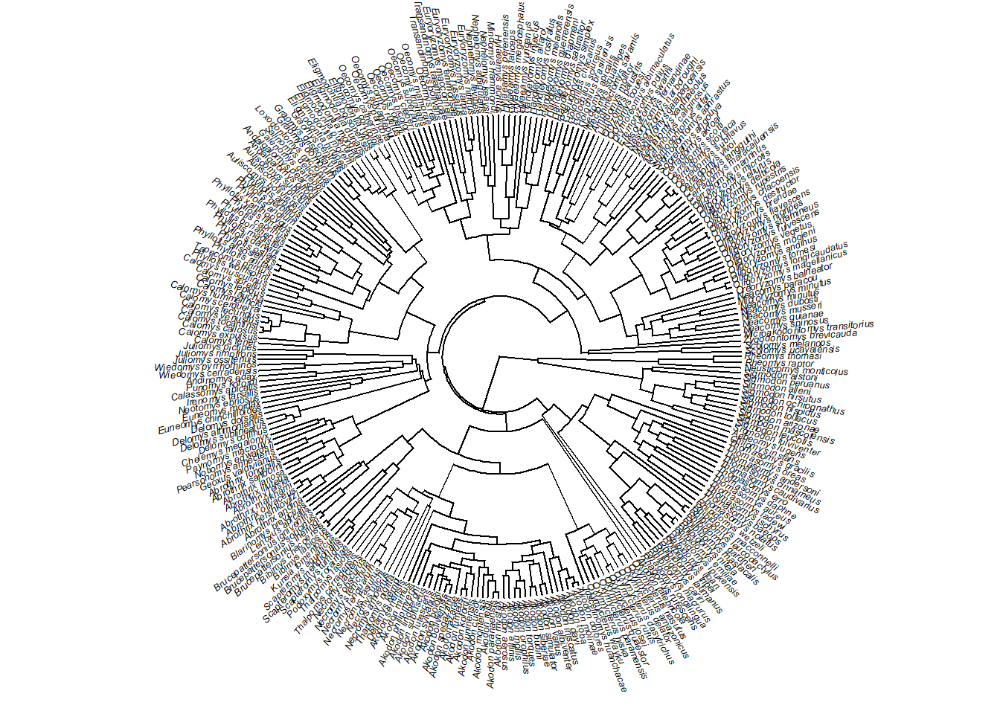
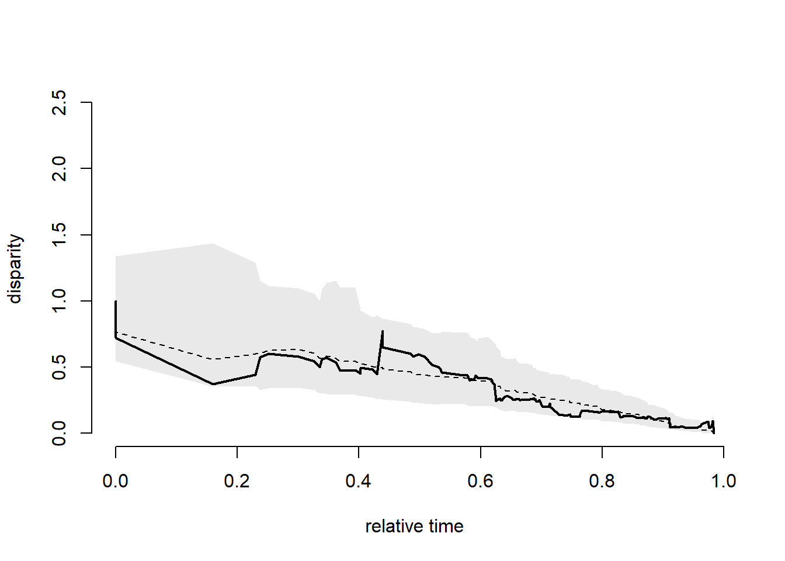
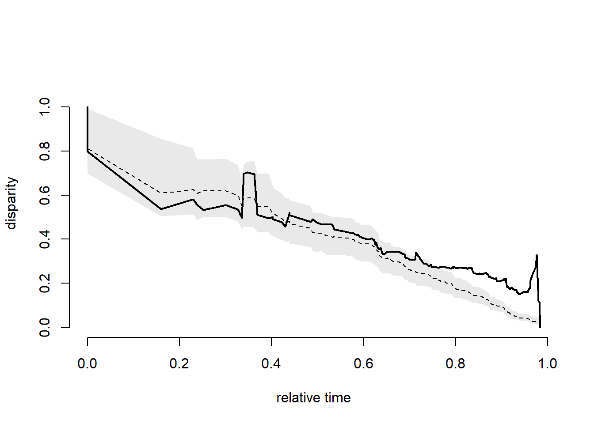

# Disparidade fenotípica ao longo do tempo

Esse exemplo implementa a análise de disparidade morfológica ao longo do tempo (*Disparity through time plots*) de @harmon2003.

Carregar dados.


```r
require(ape)
#> Le chargement a nécessité le package : ape
require(geiger)
#> Le chargement a nécessité le package : geiger
#> Le chargement a nécessité le package : phytools
#> Le chargement a nécessité le package : maps
require(phytools)
# Filogenia
tree<-read.nexus("dadospcm/sigmodontinae-tree.tre")
plotTree(tree,fsize=0.4,ftype="i",type="fan",lwd=1)
```



```r
# Dados morfológicos
dados<-read.table("dadospcm/sigmodontinae-atributos.txt",h=T,row.names=1)
head(dados)
size<-dados$Size
names(size)=rownames(dados)
size
```

*Disparity through time plots*.


```r
# Tamanho
dtt.size<-dtt(tree,size,nsim=999,calculateMDIp = TRUE)
```



```r
dtt.size$MDI
dtt.size$MDIpVal
# DTT multivariado
dados<-read.table("dadospcm/sigmodontinae-shape.txt",h=T,row.names=1)
head(dados)
diet<-as.factor(dados$Diet) # A dieta é um código (Onivoro-1; Herbivoro-2; Insetivoro-3)
names(diet)=rownames(dados)
forma<-dados[,3:28]
forma
dtt.shape<-dtt(tree,as.matrix(forma),nsim=999,calculateMDIp = TRUE)
```



```r
dtt.shape$MDI
dtt.shape$MDIpVal
```
